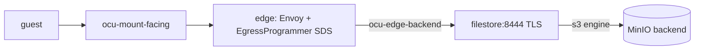

<!-- SPDX-License-Identifier: FSL-1.1-Apache-2.0 -->
<!-- Copyright (c) 2025 Open Computer Use Contributors -->

# deploy/ — component-04 stand-up for the Phase-2 assembly builder

This directory stands up the storage broker (component-04) as an isolated
**component**, not as the assembled app. It exists for the engineer who will
wire ocu-filestore into the Phase-2 app-compose: it shows exactly what the
component exposes at its south face, how to bring it up against a real
object-store backend, and where the live edge takes over from the test harness.

What you get here is the broker's own TLS south face plus a real MinIO backend
the s3 engine writes through. There is no guest and no edge in this compose. The
component-test presents the Bearer the live edge would inject, which is the
honest component boundary — enough to prove the broker end to end without
pretending to be the app.

## Bring it up

The base compose builds the broker image, waits for the broker and MinIO
healthchecks, and provisions the backing bucket once. Run it from the repo root
so the file-relative paths resolve correctly:

```bash
OCU_FILESTORE_TLS_CERT_DIR=/abs/path/to/certs \
  docker compose -f deploy/docker-compose.yml up -d --build --wait
```

The cert directory must hold `tls-cert.pem` and `tls-key.pem` whose leaf SAN
covers **both** `filestore` and `ocu-filestore` — the two names the broker
answers to on the backend network. A manual bring-up supplies its own cert; the
component-test mints a throwaway one (see below).

To run the gated component-test instead of a manual bring-up, hand the whole
job to Go:

```bash
OCU_COMPOSE_IT=1 go test ./internal/composeit/...
```

Without `OCU_COMPOSE_IT=1` the slice loud-skips, so a plain `go test ./...`
without Docker still passes. When the gate is set, `composeit_test.go` generates
a throwaway leaf cert, brings up the base compose plus the `docker-compose.it.yml`
overlay, then drives one real round-trip through the south face:
`makeDirectory` then `fileUpload` then `fileDownload`. It asserts the exact
uploaded bytes come back, and — independently — that a direct MinIO `GetObject`
reads the same bytes from the real bucket. No mocks on either leg.

The overlay publishes two loopback host ports (`127.0.0.1:8444` to the TLS
south face, `127.0.0.1:9000` to MinIO) so the host-side harness can reach both.
The base compose alone keeps the broker on the backend network with no host
exposure, exactly as it sits behind the edge in the assembled app.

## The v0.2 compose shape

Three services on one network:

- **ocu-filestore** — built from the repo-root `Dockerfile`. Aliased `filestore`
  on the network, so it is reachable as both `filestore` and `ocu-filestore`;
  the leaf SAN covers both. The south face binds TLS at `:8444` via `-south-bind`,
  with `-tls-cert` and `-tls-key` read-only from `OCU_FILESTORE_TLS_CERT_DIR`.
  The engine runs `-engine s3` against `http://minio:9000`, bucket
  `OCU_S3_TEST_BUCKET` (default `ocu-conformance`). `-downloadable-prefixes`
  defaults to `/pub`.
- **minio** — the real object-store backend (a pinned `quay.io/minio` digest),
  no mock. The same MinIO rig of record that the test compose reuses.
- **bucket-init** — a one-shot that creates the backing bucket and exits 0. The
  broker's `depends_on` gates on it via `service_completed_successfully`, and on
  MinIO being healthy.

All three sit on the single `ocu-edge-backend` bridge network. This is the
storage-dedicated backend lane the edge's backend leg reaches the broker on, and
the lane the broker reaches MinIO on. It is not guest-facing and not the retired
data-plane net — there is no separate storage-backend network in this file.

### The backend credential

The s3 engine's own backend credential arrives only through the
`OCU_S3_ACCESS_KEY_ID` and `OCU_S3_SECRET_ACCESS_KEY` environment variables —
the objectstore intake, never a command flag. One credential, one client
(NFR-SEC-25): no second component speaks the object-store protocol, and the
guest's edge-injected Bearer is a different credential path entirely. The values
here are throwaway test-rig values, never secrets.

### Hardening that must not regress

The broker container runs as user `65532`, `read_only`, with `cap_drop: ALL` and
`no-new-privileges`. The default-deny seccomp profile is
`./seccomp/ocu-filestored.json`. That relative path is **resolved against the
compose-file directory (`deploy/`), not the invocation CWD** — keep the profile
where it is and keep the reference file-relative, or the hardening silently
stops loading. This is the one footgun worth re-stating before you edit the file.

Readiness is real, never a sleep. The healthcheck execs the daemon's own
`-health-check` self-probe against the loopback ops listener at
`127.0.0.1:9464` (`-ops-listen`). The probe hits `/healthz`, which only serves
once the daemon is fully up — the ops listener binds after engine construction
and scope provisioning — so a passing check means the s3 scope is provisioned
and the south face is serving.

## What component-04 exposes

The south face is HTTPS/REST. Each file operation is a `POST` to
`<service_url>/v1/filestore/fs/<op>`, where `<op>` is the trailing path segment
(`makeDirectory`, `fileUpload`, `fileDownload`, and the rest of the frozen op
set). A non-`POST` method gets `405` with `Allow: POST`.

component-04 does **not** JWKS-verify the guest token. In the assembled app the
edge validates and strips the guest JWT and injects the real credential; the
broker takes the injected Bearer as given and instead enforces **scope**. A
request for a foreign `filesystem_id` is `403`; a request with no credential is
`401`. The engine uses its own host-local backend credential, separate from
anything the guest presented (NFR-SEC-25).

`downloadable` resolves **at read**, from the `-downloadable-prefixes` grant — it
is never stamped at write (NFR-SEC-73). That is why the read path can only reach
the engine for paths under a downloadable prefix such as `/pub`.

The south file-op producer is **durable-first fail-open** (NFR-SEC-79). Every
file activity emits its OCSF event committed to a local durable record (an
fsync) before any fan-out, and that local commit is the non-repudiation point —
a failed fsync means the record never landed. A downstream sink fan-out failure,
by contrast, does **not** deny or stall the file operation: the dropped fan-out
is counted and reconciled, never silently lost.

(Honest code-lag note: the shipped `internal/auditgate` still denies on any
audit-write failure, i.e. fully fail-closed. That is the lag, not the target;
it is being split into the mandatory local durable commit plus the fail-open
sink fan-out under issue #19. This paragraph states the canon target, which the
code does not yet reach.)

On a deny, the HTTP status is authoritative; the response body carries a bounded
diagnostic reason and is advisory only.

## Phase 1 vs Phase 2 — why this is not the live edge



In the assembled Phase-2 topology, the guest never dials the broker. The path is
guest, then `ocu-mount-facing`, then the single edge, then the `ocu-edge-backend`
lane to `filestore:8444`. That single edge (component-06: Envoy plus the control
EgressProgrammer SDS, service key `ocu-egress`) is the one hop that validates and
strips the guest JWT, performs the RFC-8693 token exchange, and injects the real
backend credential.

That edge is not built yet — its SDS is unimplemented and ADR-0019 and ADR-0021
are still proposed — so the single app-compose lives in the future ocu-deploy
repo, and storage joins it in Phase 2. This component compose deliberately has no
guest and no edge. The component-test stands in for the edge's Bearer injection
**only**: it presents the same kind of Bearer the live edge would inject, using
the harness pattern the south-face tests already use, so the assertion exercises
the honest component boundary.

Mocking a live edge is out of scope. The component-test boundary is deliberate:
it proves the broker in isolation. The app-level wiring — the real validate,
strip, exchange, and inject — waits for the real edge to land in ocu-deploy.
