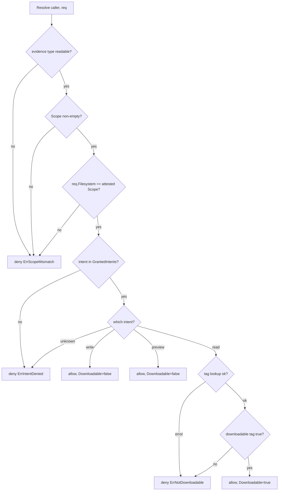
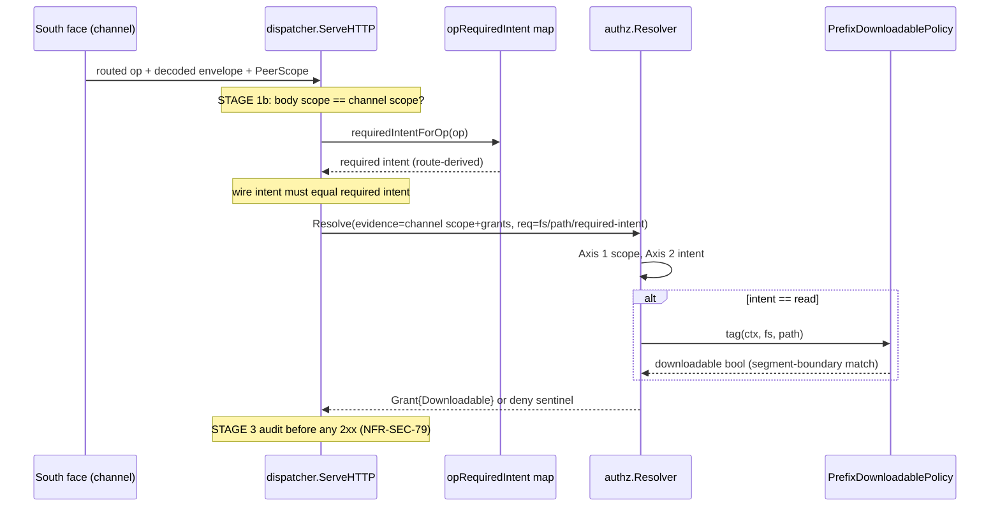

# Three-axis authorization model

This document describes how `ocu-filestored` decides whether a request is
allowed: the authorization design, the code that implements it, and the
properties the implementation is proven to hold. It is the architecture and
implementation layer — *how it is built and why*. For *how to operate* the
broker (flags, the `-downloadable-prefixes` configuration surface, runbook
procedures) see [`docs/operations.md`](../operations.md),
[`docs/configuration.md`](../configuration.md), and
[`docs/engines.md`](../engines.md). For the property/verification tooling and
how to run it see [`docs/testing.md`](../testing.md).

The broker is component-04 of the architecture. The decisions below satisfy
NFR-SEC-43 (host-attested scope, never a caller-supplied claim), NFR-SEC-49
(deny-by-default intent grants), and NFR-SEC-73 (downloadable resolved at
read, broker-side, never the wire flag).

## The question, in one sentence

> May *this caller* act on *this path* in *this scope* with *this intent*, and
> if the intent is a read, does the resulting artifact leave the broker?

Authorization re-derives the answer **per request**. Nothing is stamped at
write time and replayed at read time; nothing the caller puts on the wire is
trusted as identity. The resolver is a pure policy function over two inputs —
face-established caller evidence and a per-request question — plus one
broker-side lookup for the read-egress axis.

## The three axes

The decision is the conjunction of three independent positive checks. The
canonical inputs are `authz.CallerEvidence` and `authz.Request`; the verdict
is `authz.Grant` (see `internal/authz/authz.go`).

| Axis | Question | Source of truth | Deny sentinel |
|------|----------|-----------------|---------------|
| **1. Scope** | Is the requested `filesystem_id` the one this session is attested to hold? | `CallerEvidence.Scope` (host-attested), compared against `Request.Filesystem` | `ErrScopeMismatch` |
| **2. Intent** | Is the requested intent in this caller's explicit grant set? | `CallerEvidence.GrantedIntents` | `ErrIntentDenied` |
| **3. Downloadable** | (read only) Does this path resolve as egress-eligible under the operator's policy? | broker-side `StoredTagFunc` lookup | `ErrNotDownloadable` |

### Axis 1 — scope is host-attested, the wire value is only a hint

`CallerEvidence.Scope` is the `filesystem_id` the **face** established at
accept time — the connection-bound identity, not anything in the request body.
`authz.Resolver.Resolve` (`internal/authz/resolver.go`) compares the
request's `Filesystem` field against that attested scope and denies any
disagreement:

```go
// resolver.go, Resolve — Axis 1
if ev.Scope == "" {
    return Grant{}, ErrScopeMismatch
}
if req.Filesystem != ev.Scope {
    return Grant{}, ErrScopeMismatch
}
```

Two things are load-bearing here:

- **An empty attested scope authorizes nothing.** An empty `Scope` is a face
  bug, never a grant. Denying it explicitly before the equality check stops a
  request that *also* carries an empty `filesystem_id` from satisfying the
  `req.Filesystem == ev.Scope` comparison by coincidence (`"" == ""`). This is
  the fail-closed reading of equal-empty values.
- **The request value is never authoritative.** The `Request.Filesystem`
  field is a hint the resolver may compare against, never an identity it may
  adopt (NFR-SEC-43). A caller cannot widen its scope by naming another
  filesystem in the request — the mismatch denies.

The south face enforces this twice. Before the resolver is even consulted, the
dispatcher cross-checks the decoded body scope against the channel scope
(`internal/southface/dispatch.go`, STAGE 1b):

```go
// dispatch.go, ServeHTTP — STAGE 1b
if env.FilesystemID != ps.FilesystemID {
    denyOp(mapDeny(denyScopeMismatch), "request scope does not match the session channel")
    return
}
```

and then builds the resolver's caller evidence **from the channel scope**, not
the body (STAGE 2):

```go
// dispatch.go, ServeHTTP — STAGE 2
evidence := CallerEvidence{Scope: ps.FilesystemID, GrantedIntents: ps.GrantedIntents}
```

So even if STAGE 1b were bypassed, the resolver's Axis 1 would still deny a
body scope that disagreed with the attested channel scope. The two checks are
defence in depth around the same invariant.

### Axis 2 — intent must be in the caller's explicit grant set

`CallerEvidence.GrantedIntents` is the exhaustive set of intents the caller may
request. An intent absent from that slice is denied regardless of every other
field (NFR-SEC-49). The check is a linear membership test with no default-allow
fallthrough:

```go
// resolver.go, Resolve — Axis 2
if !intentGranted(ev.GrantedIntents, req.Intent) {
    return Grant{}, ErrIntentDenied
}
```

```go
// resolver.go — intentGranted
func intentGranted(grants []Intent, intent Intent) bool {
    for _, g := range grants {
        if g == intent {
            return true
        }
    }
    return false
}
```

A `nil` or empty grant set grants nothing — deny-by-default is simply the
natural result of an empty membership test, not a special case. The three
intent values are `IntentRead`, `IntentWrite`, and `IntentPreview`
(`internal/authz/authz.go`).

The intent the resolver receives is **derived from the route op**, never from
the wire `authorization_metadata.intent`. See [Binding to the route op](#binding-to-the-route-op-the-intent-the-resolver-sees)
below — this is the AUTHZ-01 binding and it is what makes a read-only grant
structurally unable to reach a mutation handler.

### Axis 3 — downloadable is resolved at read, broker-side, from operator policy

The third axis answers only one question, and only for reads: does the byte
path *out of the broker* exist for this object? It is the egress-eligibility
axis (NFR-SEC-73). Three rules define it:

1. **It is resolved at read, never stamped at write.** A write request never
   produces a downloadable grant; the bit is computed fresh on each read from
   the current operator policy, so re-tagging a prefix takes effect on the
   next read with no rewrite of stored objects.
2. **It is broker-side, never the wire flag.** The resolver computes the bit
   from a `StoredTagFunc` the broker controls. There is no path by which a
   client-supplied `downloadable` field reaches a grant.
3. **Preview is structurally non-downloadable.** `IntentPreview` never even
   consults the lookup.

The intent switch in `Resolve` is the whole of Axis 3:

```go
// resolver.go, Resolve — Axis 3
switch req.Intent {
case IntentRead:
    dl, err := r.tag(ctx, req.Filesystem, req.Path)
    if err != nil {
        return Grant{}, ErrNotDownloadable // fail-closed
    }
    if !dl {
        return Grant{}, ErrNotDownloadable
    }
    return Grant{Downloadable: true}, nil // the ONLY line that grants the bit
case IntentWrite:
    return Grant{Downloadable: false}, nil
case IntentPreview:
    return Grant{Downloadable: false}, nil // tag never consulted
default:
    return Grant{}, ErrIntentDenied // unknown intent — never default-allow
}
```

Note the failure handling: a non-nil error from the tag lookup is treated as a
deny (`ErrNotDownloadable`), never as "assume allowed". `StoredTagFunc` is
documented as fail-closed for exactly this reason
(`internal/authz/resolver.go`). The single line `return Grant{Downloadable:
true}, nil` is the only place in the package that ever sets the downloadable
bit.

`Resolve` rejects an unreadable evidence type up front — an evidence value the
resolver cannot type-assert is denied, never trusted:

```go
// resolver.go, Resolve — top of function
ev, ok := caller.(CallerEvidence)
if !ok {
    return Grant{}, ErrScopeMismatch
}
```

And `New` panics if constructed without a tag function, surfacing a wiring
mistake at construction instead of as a latent nil-dereference on the read
path:

```go
// resolver.go, New
func New(tag StoredTagFunc) Resolver {
    if tag == nil {
        panic("authz: New requires a non-nil StoredTagFunc")
    }
    return &policyResolver{tag: tag}
}
```

## Deny-by-default — the control flow has no default-allow branch

The resolver is written as a flat, ordered sequence of positive checks. Every
allow path is the *fall-through after* an explicit positive match on each axis;
there is no branch that returns an allow without first matching. The two
`default:` cases in the code — the unreadable-evidence assertion and the
unknown-intent switch arm — both **deny**. Deny is the structural default; an
allow has to be earned three times.



## The downloadable policy — segment-boundary prefix matching

The `StoredTagFunc` the production broker uses is built by
`broker.NewPrefixDownloadablePolicy` (`internal/broker/downloadable.go`). It is
the operator-configured per-prefix policy: a path is downloadable **only** when
it lies under one of the configured prefixes, matched on path-segment
boundaries.

Construction normalizes the configured prefix list once: it trims whitespace,
drops empty entries, and strips a trailing slash from every prefix except the
bare root `/` (so `/pub/` and `/pub` behave identically). The bare root is kept
as a sentinel that matches nothing on its own — a deployment that wants its
whole scope downloadable configures the explicit prefixes it wants, it does not
pass a bare `/`.

The match itself is `pathUnderPrefix`:

```go
// downloadable.go — pathUnderPrefix
func pathUnderPrefix(path, prefix string) bool {
    if path == prefix {
        return true
    }
    return strings.HasPrefix(path, prefix+"/")
}
```

The `+"/"` is the load-bearing detail. A naive `strings.HasPrefix(path,
prefix)` would treat `/pubX` as being under `/pub` — a prefix-string match that
crosses a path component and would leak a sibling directory into the
downloadable set. Matching against `prefix + "/"` (plus the exact-equality
case) confines the match to the segment boundary:

| Configured prefix | Path | Downloadable? | Why |
|-------------------|------|---------------|-----|
| `/pub` | `/pub` | yes | exact equality |
| `/pub` | `/pub/report.pdf` | yes | under the boundary `/pub/` |
| `/pub` | `/pub/a/b/c` | yes | under the boundary `/pub/` |
| `/pub` | `/pubX` | **no** | `/pubX` is a sibling, not under `/pub/` |
| `/pub` | `/pubX/y` | **no** | sibling subtree |
| (none) | anything | **no** | empty prefix set = nothing downloadable |
| `/pub` | `` (empty) | **no** | empty path cannot be matched, fail-closed |

The whole policy is fail-closed by construction:

- An **empty prefix set** makes every object non-downloadable. That is the
  default deployment posture — a broker started without `-downloadable-prefixes`
  emits no egress-eligible artifacts at all.
- An **empty or unmatched path** returns `false`, never a guess. An unmatched
  object is *readable-in-session-but-denied-egress*: the resolver maps the
  `false` to `ErrNotDownloadable` on `intent=read`, so the in-session read may
  still proceed through other paths while the byte path *out* is refused.

The configured prefixes come from the `-downloadable-prefixes` flag
(comma-separated; empty means nothing downloadable). The composition wiring is
in `cmd/ocu-filestored/main.go`:

```go
resolver := authz.New(broker.NewPrefixDownloadablePolicy(cfg.dlPrefixes))
```

For the operator-facing description of that flag and its environment-variable
form, see [`docs/configuration.md`](../configuration.md) and
[`docs/operations.md`](../operations.md).

## Binding to the route op — the intent the resolver sees

The intent the resolver receives is the AUTHZ-01 binding: it is derived from
the **routed operation**, never from the wire. The south-face dispatcher holds
a closed map from op to required intent (`internal/southface/envelope.go`,
`opRequiredIntent` / `requiredIntentForOp`). Every read-class op (list, read,
metadata lookups, download) maps to `IntentRead`; every namespace or content
mutation maps to `IntentWrite`. No op maps to `IntentPreview` on the south
face — preview is the north-face render axis and is never a legal south-face
wire intent.

In `dispatch.go` STAGE 2 the dispatcher:

1. Looks up the required intent for the routed op. An op absent from the closed
   map is a wiring fault and fails closed (`denyInternal`).
2. Refuses any wire `authorization_metadata.intent` that disagrees with the
   op's required intent (`errRouteOpMismatch`) — *before* the resolver is
   consulted.
3. Passes the **route-derived** intent (not the wire value) into the resolver.

```go
// dispatch.go, ServeHTTP — STAGE 2
requiredIntent, ok := requiredIntentForOp(op)
if !ok {
    denyOp(mapDeny(denyInternal), "no required intent bound to operation")
    return
}
if env.AuthorizationMetadata.Intent != requiredIntent {
    denyOp(mapDeny(denyClassForDecodeErr(errRouteOpMismatch)), "authorization intent does not match the operation")
    return
}
evidence := CallerEvidence{Scope: ps.FilesystemID, GrantedIntents: ps.GrantedIntents}
req := ResolveRequest{
    Filesystem: env.FilesystemID,
    Path:       env.Path,
    Intent:     requiredIntent,
}
grant, err := d.resolver.Resolve(r.Context(), evidence, req)
```

This is why a session whose grant set lacks `IntentWrite` can never reach a
mutating handler by declaring `intent=read` on a mutation route: the route op
determines the intent, the resolver checks that intent against the grant set,
and the mutation route's intent (`IntentWrite`) is simply not in a read-only
session's grants. The wire intent field is corroborated against the route but
is never the value that decides authorization.



## How the verdict is consumed downstream

The resolver answers policy only. After STAGE 2 returns a `Grant`, the
dispatcher:

- builds the broker-resolved-truth audit event — including
  `Downloadable: grant.Downloadable` — and mandates it through the audit gate
  **before any 2xx** (STAGE 3, NFR-SEC-79). The downloadable disposition is
  thus part of the durable record, resolved at read.
- runs the per-op handler (STAGE 4). Path resolution inside the prefix
  (traversal and symlink rejection, NFR-SEC-25) and backend signing belong to
  the object-store client, not the resolver — the resolver never sees an
  absolute or backend-shaped handle.

A deny sentinel from the resolver flows through the single deny mapper. The
real `authz` sentinels are remapped onto the south-face mirrors by the
composition adapter so the spine classifies each deny correctly
(`internal/broker/broker.go`, `mapResolverErr`):

```go
// broker.go — mapResolverErr
case errors.Is(err, authz.ErrScopeMismatch):    return southface.ErrScopeMismatch
case errors.Is(err, authz.ErrIntentDenied):     return southface.ErrIntentDenied
case errors.Is(err, authz.ErrNotDownloadable):  return southface.ErrNotDownloadable
```

## Composition — one resolver, two seams

The south-face spine depends only on its own consumer-side `Resolver`,
`ResolveRequest`, `Grant`, and `CallerEvidence` mirror types
(`internal/southface/interfaces.go`); it imports no internal seam package. The
composition layer binds the real `authz.Resolver` to that consumer interface
through a thin per-call adapter that narrows the plain-string south-face shapes
to the `authz` named types and remaps the deny sentinels
(`internal/broker/broker.go`, `resolverAdapter` / `NewResolver`).

`cmd/ocu-filestored/main.go` is where the single resolver is constructed and
wired:

```go
resolver := authz.New(broker.NewPrefixDownloadablePolicy(cfg.dlPrefixes))
// ...
Resolver: broker.NewResolver(resolver),
```

There is exactly one resolver instance, one downloadable-policy source, and
one place — the spine — that builds caller evidence from the channel scope.

## Property guarantees

The authorization invariants are pinned by property tests in
`internal/authz/resolver_prop_test.go` (run with the rest of the suite per
[`docs/testing.md`](../testing.md)). They assert the design holds for arbitrary
inputs, including off-enum intent strings, not just hand-picked cases.

### `TestPropDenyByDefault` — allow implies an explicit match on every axis

For arbitrary `(evidence, request)` pairs — mixing the three enum intents with
arbitrary strings so the off-enum default-deny arm is exercised — whenever
`Resolve` returns no error, the test re-derives that:

- the attested scope was non-empty,
- `req.Filesystem == ev.Scope`, and
- the request intent was in the grant set.

And whenever `Resolve` denies, the error is *exactly one* of the three
sentinels (`ErrScopeMismatch`, `ErrIntentDenied`, `ErrNotDownloadable`) and the
returned grant has `Downloadable == false`. In other words: **deny ⇔ the
absence of an explicit grant**, and a deny never leaks a downloadable bit.

### `TestPropPreviewNotDownloadable` — preview never downloads

With a non-empty scope, a matching request, an `IntentPreview` grant, and a
stored tag function that returns `true` for everything, `Resolve` allows the
preview but the grant is `Downloadable == false`. Preview is structurally
non-downloadable regardless of how permissive the operator policy is
(NFR-SEC-73). The same structure holds for write — `TestWriteNotDownloadable`
in `resolver_test.go` pins that a write grant never carries the bit.

### `TestPropScopeHintNoWiden` — the wire hint never widens scope

Granting **every** intent and using a **permissive** tag, the test draws an
evidence scope (biased toward the empty string so the equal-empty deny is
exercised every batch) and a separate request scope. Whenever they differ — or
the attested scope is empty — `Resolve` denies with `ErrScopeMismatch`. A
request can never widen its scope through the `Filesystem` hint, and equal-empty
values never authorize (NFR-SEC-43).

### Summary of the guaranteed properties

| Property | Pinned by |
|----------|-----------|
| deny ⇔ no explicit grant on every axis | `TestPropDenyByDefault` |
| every deny carries one sentinel, `Downloadable=false` | `TestPropDenyByDefault` |
| preview never yields a downloadable grant | `TestPropPreviewNotDownloadable` |
| write never yields a downloadable grant | `TestWriteNotDownloadable` |
| downloadable derived at read, not write | resolver Axis 3 switch + `TestDownloadableFromTag` |
| caller hint never widens scope; equal-empty never authorizes | `TestPropScopeHintNoWiden` |
| unknown evidence / unknown intent denies (no default-allow) | `TestUnknownEvidenceTypeDenies`, `TestUnknownIntentDenied` |
| segment-boundary prefix match (`/pub` ≠ `/pubX`) | `internal/broker/downloadable_test.go` |

## NFR cross-reference

- **NFR-SEC-43** — scope is host-attested by the face; the request
  `filesystem_id` is a hint, never an identity. Axis 1 in `resolver.go`,
  enforced again at dispatch STAGE 1b, proven by `TestPropScopeHintNoWiden`.
- **NFR-SEC-49** — deny-by-default intent grants; an intent absent from the
  grant set is denied. Axis 2 in `resolver.go`, the route-op→intent binding in
  `dispatch.go`/`envelope.go`, proven by `TestPropDenyByDefault`.
- **NFR-SEC-73** — downloadable resolved at read, broker-side, never the wire
  flag; preview structurally non-downloadable. Axis 3 in `resolver.go`, the
  policy in `downloadable.go`, proven by `TestPropPreviewNotDownloadable` and
  `TestDownloadableFromTag`.
