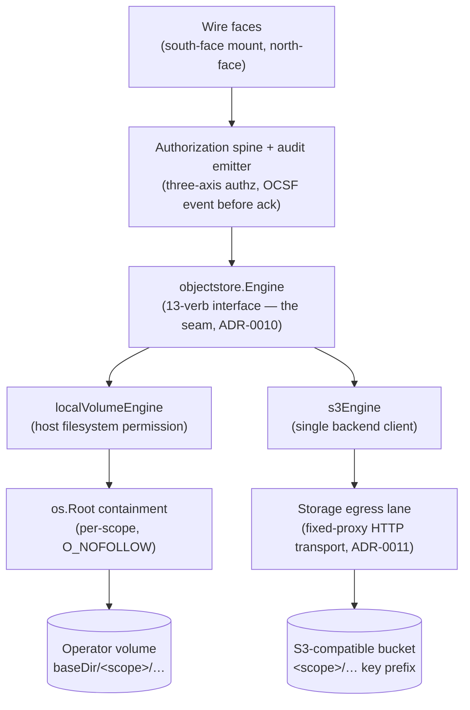

# 03 — The pluggable storage engine seam

This document is the architecture and implementation layer for the broker's
backend storage seam: how the engine abstraction is built, what the two
shipped engines actually do, and why each design choice is made. It describes
the code under `internal/objectstore/`.

For *operating* the engines — flags, env vars, the signal contract, runbooks —
see the operator documents instead:

- [docs/engines.md](../engines.md) — choosing and configuring an engine.
- [docs/configuration.md](../configuration.md) — the full flag/env surface.
- [docs/operations.md](../operations.md) — signal contract, audit-latch runbook.
- [docs/testing.md](../testing.md) — how to run the conformance suite locally.

This document does not repeat operator selection guidance; it explains the
internals those documents drive.

---

## 1. The seam in one picture

The broker has exactly one component that speaks the backend storage protocol
and signs backend requests (NFR-SEC-25). Everything above the seam — the wire
faces, the authorization spine, the audit emitter — calls a single internal Go
interface, `objectstore.Engine`. Everything below the seam is the engine's
private concern: a host filesystem permission for the local-volume engine, or
a network credential and the storage egress lane for the S3 engine.



The seam is total: no path above it joins a backend address, and no path
below it makes an authorization decision. Authorization is re-derived
broker-side per request, above the seam; the engine trusts the host-attested
`ScopeID` it is handed and never parses a scope out of a caller-supplied path
(NFR-SEC-43).

---

## 2. `Engine` — the verb set (`objectstore.go`)

`Engine` (`internal/objectstore/objectstore.go`) is the pluggable backend
adapter named by ADR-0010. ADR-0010 mandates two engine kinds present from day
one; both are implemented and both pass the same conformance suite (section 7).
`EngineKind` is a closed enum (`LocalVolume`, `S3`) and `ParseEngine` wraps
`ErrUnknownEngine` on any other value — there is no silent default engine.

The interface has 13 methods: one identity method, two lifecycle verbs, and
ten data verbs.

| Group | Verbs |
|---|---|
| Identity | `Kind` |
| Lifecycle | `ProvisionScope`, `TeardownScope` |
| Read / metadata | `List`, `Stat`, `ReadRange` |
| Directory mutation | `MakeDir`, `MoveDir`, `RemoveDir` |
| File mutation | `WriteStream`, `CopyFile`, `MoveFile`, `RemoveFile` |

Every verb takes exactly one `ScopeID`. There is no cross-scope copy or move
at this interface by construction: a request naming a scope the caller does
not hold is `scope_mismatch` territory above the seam (NFR-SEC-43), so it
never reaches the engine. The wire `File` shape and the contract's verb
mapping are the wire layer's job; `FileInfo` is the minimal internal struct
(name, size, mod-time, is-dir) that `Stat`/`List` return, and it is
deliberately *not* the wire model.

### 2.1 What flows across the seam — paths and scopes

The trust split is the load-bearing rule of the seam:

- `ScopeID` is **host-attested and trusted**. The engine derives the scope
  directory or key prefix from it. `validateScopeID` (in `pathresolver.go`) is
  defense-in-depth on the join, not a trust change: it refuses an empty,
  `.`/`..`, separator-bearing, NUL-bearing, or non-clean id so that, e.g.,
  `TeardownScope(ScopeID(".."))` can never resolve to the parent of `baseDir`
  and erase every scope at once.
- The caller-supplied **path is never trusted**. Every verb runs it through
  `ValidatePath` (lexical stage) and then the engine's containment stage
  before any backend call. Callers may pre-validate; the engine never assumes
  they did.

### 2.2 The context contract

The interface doc block pins one context contract that both engines honor:

- Every verb checks `ctx` at entry, so a caller who cancels before the verb
  starts gets an immediate abort with no side effect.
- Every verb surfaces `ctx.Err()` through its returned error
  (`errors.Is`-matchable through the verb's wrap), even when the underlying
  SDK or syscall wraps it.
- Long-running verbs abort *promptly* mid-operation, not only at entry. The
  streaming verbs (`WriteStream`, `CopyFile`, `ReadRange`) check between byte
  copies; the recursive erase/remove verbs (`ProvisionScope`,
  `TeardownScope`, `RemoveDir`) check between directory entries so a teardown
  of a huge scope can be interrupted rather than blocking until the whole tree
  is walked.
- An aborted write never leaves a partial object visible at the destination.

### 2.3 The idempotency contract

The interface doc block also pins per-verb idempotency, scoped to the retry
case where a caller saw an *ambiguous* failure (an error, but it cannot know
whether the backend applied the operation):

- `ProvisionScope`, `TeardownScope`, `Stat`, `List`, `ReadRange`, `MakeDir`,
  `RemoveFile`, `RemoveDir`, `CopyFile` are **idempotent** — safe to
  re-invoke; the re-invocation converges on the same end state. (`MakeDir` on
  an existing directory and `RemoveFile` on a removed file return their usual
  exists / not-exist errors, which the caller treats as the convergence
  signal.)
- `WriteStream` is **not re-invokable with the same reader** — the stream is
  consumed; a retry needs a fresh reader from the source of truth.
- `MoveFile` and `MoveDir` are re-invokable only until the source delete
  commits. Both engines order **copy → verify → delete** so a retry after any
  failure never loses bytes: a surviving duplicate is the acceptable failure
  mode, never a lost object.

The conformance test `IdempotentReinvoke` exercises every row of this table
against both engines.

### 2.4 The sentinel vocabulary

The seam's error contract is a small set of `errors.Is`-matchable sentinels
so callers above the seam classify failures identically regardless of engine.
The lexical/shape sentinels (`ErrInvalidPath`, `ErrInvalidScopeID`) live in
`pathresolver.go`; the rest are in `objectstore.go`:

| Sentinel | Meaning |
|---|---|
| `ErrUnknownEngine` | configured engine name is not a known kind |
| `ErrInvalidPath` | lexical path rejection (NUL, URL scheme, absolute, `..`, empty, depth bomb) |
| `ErrInvalidScopeID` | scope id is not a single clean path element |
| `ErrAlreadyExists` | destination exists and the caller did not set overwrite |
| `ErrNotADirectory` | a scope/list path exists but is not a directory |
| `ErrInvalidRange` | `ReadRange` got a negative offset or length |
| `ErrTransient` | retryable backend failure after the engine's bounded retries |
| `ErrThrottled` | backend load-shed after the engine's paced retries |

Stdlib sentinels are reused where they already carry the right meaning:
`fs.ErrNotExist` for a missing object/parent, `fs.ErrExist` for a `MakeDir`
collision, `syscall.ENOTEMPTY` for removing a non-empty directory through the
file-remove verb, and `syscall.EINVAL` for a directory move into its own
subtree. The S3 engine deliberately mirrors these exact shapes (section 6) so
the two engines are interchangeable to the deny spine.

---

## 3. Path resolution and containment (`pathresolver.go`)

Path safety is split into a lexical stage and a containment stage. Both run
before any backend call.

### 3.1 Lexical stage — `ValidatePath`

`ValidatePath` is a pure function (no filesystem access), so every lexical
rejection happens before any syscall or backend request (PATH-01,
NFR-SEC-25). Its rejection classes, in order:

1. **NUL byte** — checked first, because `filepath.Clean` and
   `filepath.IsLocal` both pass NUL through; relying on them would defer the
   rejection to the syscall layer.
2. **URL-shaped handle** (`scheme://…`) — checked before `filepath.Clean`,
   which collapses `//` to `/` and would hide the scheme. This blocks
   smuggling a backend address (e.g. `s3://bucket/key`) through the path field.
   The detector (`hasURLScheme`) is a lexical RFC-3986 scheme matcher only.
3. **After `filepath.Clean`** — anything not `filepath.IsLocal` (absolute
   paths, `..` escapes), plus any input that cleans to `.`. The `== "."` check
   matters because `filepath.Clean("")` returns `.`, which *is* local, so
   `IsLocal` alone would miss the empty path; a data path must name an object
   *inside* the scope, never the scope root.
4. **Component count** above `maxPathComponents` (255) — a depth bomb is
   refused lexically before any verb walks or creates it (NFR-SEC-46).

Percent-encoded sequences and unicode dot-lookalikes are *not* decoded here —
they are literal filename bytes, not traversal. Any wire-format decoding is
the wire layer's job and must precede `ValidatePath`.

### 3.2 Containment stage — `ScopeRoot` / `os.Root`

`ScopeRoot` wraps a Go `os.Root` opened on `baseDir/<scope>`. `os.Root`
enforces symlink containment at open time by resolving each path component
with `O_NOFOLLOW` from the root file descriptor: any resolution that escapes
the scope surfaces as a structural error (`*fs.PathError`, or `*os.LinkError`
for renames) rather than reaching outside the prefix (PATH-01, NFR-SEC-25).
The invariant is *no escape outside the prefix*, not *no symlinks*: a symlink
that stays inside the scope is followed.

`ScopeRoot` does not authorize and implements no file verb — the engine
builds verbs on it. `os.Root` does not block `/proc`, bind mounts, or device
files reachable *inside* the prefix; that is the host posture and the broker's
seccomp profile's job (NFR-SEC-02), explicitly out of this package's scope.

The local-volume engine uses `os.Root` for every data verb. The S3 engine has
no filesystem to confine, so it enforces the same boundary lexically on a flat
keyspace (section 6.1): the single key-join site guarantees every key lands
strictly under the `<scope>/` prefix.

### 3.3 `isPathEscape` — one escape class from two wrapper shapes

`os.Root` surfaces a containment escape as a `*fs.PathError` for the openat
family (Open, Stat, Mkdir, Remove, …) but as a `*os.LinkError` for the
renameat family (Rename). `isPathEscape` collapses both into one
caller-visible escape class so mapping code can never miss a rename escape by
checking only `*fs.PathError`. The lexical `ErrInvalidPath` is deliberately
*not* in this class — lexical rejection is mapped separately.

---

## 4. The local-volume engine (`engine_local.go`)

The local-volume engine is the minimal-shelf reference: a host filesystem
permission, no network leg, zero external dependencies. The egress-transit
rule (ADR-0011) does not apply to it because it opens no network leg.

### 4.1 Per-call containment root

`NewLocalVolumeEngine(baseDir)` returns an engine whose scopes live at
`baseDir/<scope>`. Every data verb opens a `ScopeRoot` for the call
(`openScope`) and closes it on return. Per-call open is deliberate: it is
leak-free without fd lifecycle tracking, and fd ceilings belong to the
session-ceiling layer, not this engine. A cached-root variant could replace
`openScope` later without touching any verb. No verb ever joins `baseDir` with
caller input — the only trusted derivation is `baseDir + ScopeID` in
`scopePath`, used exclusively by the lifecycle verbs.

### 4.2 The guest-path guard and the staging area

Every data verb runs the caller path through `guestPath`, which is
`ValidatePath` plus one reservation: the first path component may not name the
broker-internal staging area `.ocu-staging`. That directory lives at the scope
root, holds in-flight temp writes, and is **guest-invisible**: it is filtered
out of `List` of the scope root, and unaddressable through any data verb.
Deeper components named `.ocu-staging` are *not* reserved — the staging area
exists only at the root.

### 4.3 Atomic write — `writeTempAndCommit`

`WriteStream` and `CopyFile` share one atomic-write tail
(`writeTempAndCommit`). The bytes stream into a process-unique temp name
inside `.ocu-staging`, are `fsync`-ed, and then commit into place. Because the
staging area and the destination live in the same scope directory tree on one
filesystem, the rename/link commit is atomic. On any error the temp is
removed; on success no temp remains (the conformance `PartialNeverVisible` and
`CtxCancel_NothingVisible` tests assert this on both engines).

Two details harden the commit:

- **Unguessable temp name.** The suffix is eight bytes from the OS CSPRNG
  (`crypto/rand`), giving 2⁶⁴ names. A predictable temp name is a symlink-race
  vector: a guest who can predict the next temp name could pre-place a symlink
  and redirect the write. (The random suffix also prevents temp-name collision
  under concurrent writes to the same destination.)
- **Atomic no-replace via `link(2)`.** With `overwrite=false` the temp is
  hard-`link`-ed under the destination name; `link` fails `EEXIST` if the
  destination exists, making the no-replace decision atomic at the kernel —
  there is no stat-then-rename TOCTOU window for a concurrent writer to slip
  into. With `overwrite=true` the temp `rename`s into place, replacing any
  existing destination. The early `Stat` in `WriteStream`/`CopyFile` is a
  fast-path reject only (it spares the byte copy); correctness rests on the
  link commit, not on the `Stat`.

`ctxReader` wraps the source so every `Read` consults `ctx.Err()` first — a
long copy aborts within one chunk of cancellation, and the surfaced error *is*
`ctx.Err()`.

### 4.4 Atomic move — `renameWithin`

`MoveFile` and `MoveDir` share `renameWithin`. Both ends validate lexically,
then `os.Root` confines both ends (an escaping end becomes `*os.LinkError`,
normalized by `isPathEscape`).

- `overwrite=true` is a plain `os.Root.Rename`.
- `overwrite=false` for a **file** is the same atomic `link`-then-unlink as
  the write commit: `link` fails `EEXIST` on collision (mapped to
  `ErrAlreadyExists`), then the source is unlinked; if the unlink fails after
  the link landed, the link is rolled back so the move is never half-applied.
- `overwrite=false` for a **directory** cannot use `link` (directories are not
  hard-linkable), so it keeps a pre-check + rename. `rename(2)` onto a
  non-empty directory still refuses at the OS layer, leaving only an
  empty-directory destination replaceable in that residual window. The wire
  `moveDirectory` op carries no overwrite knob and always runs
  `overwrite=false`.

### 4.5 Recursive remove — `removeAllUnderRoot`

`RemoveDir` recurses through `removeAllUnderRoot`, which reads each directory
level through `sr.root.FS()` and removes entries bottom-up with
`sr.root.Remove`, so containment is enforced by the same `os.Root` every other
verb uses — no removal can escape the scope. It checks `ctx.Err()` before each
level and each entry (the prompt-cancellation contract). A symlink or
non-directory is removed directly, never descended, so the sweep cannot
traverse a link. A missing path is a no-op, matching `RemoveAll` semantics.

### 4.6 `ReadRange`

`ReadRange` refuses a negative offset or length with `ErrInvalidRange` *before
any open* — the same refusal the S3 engine gives, so the same hostile
`{offset,length}` cannot succeed on one engine and error on the other. It
seeks to the offset and `io.Copy`s through `io.LimitReader(f, length)` wrapped
in a `ctxReader`. A window past EOF short-reads to EOF without error (the
`LimitReader` absorbs the EOF); an offset at or past EOF yields zero bytes. No
whole-object buffering.

### 4.7 Erase-before-reuse and the crash path (NFR-SEC-54)

Both lifecycle verbs deliver SEC-54 erase-before-reuse, and both refuse a
symlinked or non-directory scope entry *before* any removal — `os.RemoveAll`
on a symlink would erase the link target's contents, which may live outside
`baseDir`.

- `TeardownScope` removes the scope directory's contents
  (`removeAllCtx` — a cancellation-aware `os.RemoveAll` that, like
  `removeAllUnderRoot`, refuses to descend a symlink) and recreates the scope
  empty, so a re-grant of the same `filesystem_id` reads `fs.ErrNotExist` for
  every prior path. A best-effort parent `fsync` makes the recreated entry
  durable (meaningful on Linux, a no-op on darwin; a sync failure never fails
  the teardown).
- `ProvisionScope` is **erase-at-provision**: a scope directory left behind by
  a daemon that crashed mid-session — whose `TeardownScope` never ran — is
  erased before serving, so a restart never re-serves prior-session bytes. The
  same sweep removes any orphaned partial write in the staging area, which is
  then recreated empty. `OpenScopeRoot` refuses an absent directory, so
  `ProvisionScope` must run before any data verb on a fresh scope.

The SEC-54 boundary is stated explicitly in the code: this is an OS-level
remove+recreate, **not** a cryptographic erase. The substrate is operator
disk and freed blocks may persist until overwritten. Crypto-erase (a
per-session DEK) is the deferred full-shelf arm.

---

## 5. The S3 engine (`engine_s3.go`)

The S3 engine is ADR-0010's second kind and the deployment's sole
backend-protocol speaker (NFR-SEC-25). It implements all 13 verbs against an
S3-compatible backend. Its design exists to make a flat, eventually-some-edges
object keyspace present the *same* semantics as a POSIX filesystem to the
layers above the seam — and to close the edge cases that a naive port would
leave open.

### 5.1 Construction and resilience posture

`NewS3Engine(S3Config)` requires a bucket, a region, and a credentials
provider. There is **no ambient credential fallback** — the intake seam
(`CredentialSource`) is the only feeder, so the credential never arrives from
an environment chain (NFR-SEC-25). The constructor pins:

- **Adaptive retry mode** (client-rate-limited backoff with jitter that honors
  backend pacing) capped at `s3MaxRetryAttempts` (5). The adaptive pacer
  spaces attempts; the cap stops the spin.
- **`WhenRequired` checksums** whenever a custom endpoint is configured. A
  non-empty `Endpoint` marks an S3-compatible backend (e.g. MinIO, RGW) where
  default checksum trailers can be handled differently and a mismatch would
  masquerade as data corruption.
- **Bounded per-stream memory** (NFR-SEC-46): the part size and the
  single-PUT cutoff bound memory to one reused part buffer; a cutoff above the
  part size is clamped down (never grown), because the single-PUT decision is
  made on the first part buffer and a larger cutoff could never bind.

The `HTTPClient` field is the injected dial path: when the storage lane is
composed (section 8) this is the lane transport and the only way the engine
reaches the network. `nil` selects the SDK default client and is permitted for
direct test rigs only.

### 5.2 The single key-join site — `objectKey`

`objectKey` is the **sole** site where any S3 key is built. The trusted scope
id is shape-checked (`validateScopeID`), the untrusted path goes through the
full lexical + S3 validator (`s3ValidatePath`), and the joined key
`<scope>/<clean>` is capped at the backend's 1024-byte limit. The result is
always strictly inside the scope's `<scope>/` prefix — that is the containment
boundary on a flat keyspace, the S3 analogue of `os.Root`. The scope root
(`.`) is not a valid object key; callers handle it before reaching
`objectKey`.

### 5.3 `s3ValidatePath` — the S3 key layer

`s3ValidatePath` reuses `ValidatePath` (never forks it) and then layers the S3
key rules on the cleaned form: valid UTF-8, no control (`Cc`) or format (`Cf`)
characters, and **NFC normalization required**. Rejecting non-NFC input is
what makes normalization-collisions impossible by construction: a key that
would collide with an existing key only after NFC normalization is refused at
intake rather than silently merged onto the existing object. A backslash is a
literal name byte, never a separator — replacing it would silently merge two
distinct names, the same merge class the NFC rule refuses.

### 5.4 The directory convention

S3 has no directories. The engine uses one convention, never mixed: a
zero-byte **directory marker** key with a trailing slash (`dirMarkerKey`).
Markers are written by `MakeDir`, excluded from listings and from the
not-empty check, and swept with everything else at teardown. A directory is
considered to exist if its marker is present *or* any key lives under its
prefix — so a directory with children but a lost marker is still a directory
(`dirExists`, and the `Stat` fallback chain).

---

## 6. S3 edge cases closed

This section is the inventory of edges the S3 engine handles so that it is
behaviorally indistinguishable from the local engine across the seam.

### 6.1 Listing and stat fidelity

- `List` uses `ListObjectsV2` with `Prefix` + `Delimiter="/"`, **fully
  paginated** via `ContinuationToken`. `CommonPrefixes` are subdirectories,
  `Contents` are files, and the directory's own marker is excluded. A
  page-1-only listing is the classic under-report bug; the loop closes it.
- A non-existent directory (no marker, no keys) refuses `fs.ErrNotExist`,
  mirroring the local engine; the scope root always lists (possibly empty,
  because prefixes are virtual and provisioning creates no key).
- Listing a path that is a **file** returns `ErrNotADirectory`, not
  not-found — matching the local engine's `ENOTDIR` class for the same edge
  (`List` HEADs the plain key when nothing lived under the `<key>/` prefix to
  distinguish a file from a truly absent path).
- `Stat` resolves in three steps: the plain object key; on 404, the directory
  marker; on 404 again, a one-key prefix probe (a directory with children but
  a lost marker is still a directory).

### 6.2 Streaming writes — single-PUT or multipart, bounded memory

`WriteStream` fills one reused part buffer (`partSize`) once. If the stream
ends inside that first buffer at or under the single-PUT cutoff, it goes up as
a single `PutObject` with a known `Content-Length`; anything larger streams as
a multipart upload whose every part except the last is the full part size by
construction. SHA-256 is computed in the same single pass (via an
`io.TeeReader`) and stored as the `ocu-sha256` object tag — never by buffering
the whole object (that would break SEC-46). Crossing the `s3MaxParts` (10000)
ceiling aborts the upload and refuses with the typed `errS3TooManyParts`.

The multipart ETag is an MD5-of-MD5s composite and is **never** used as a
content hash; the `ocu-sha256` tag is the content digest used for copy/move
verification. The digest is a tag rather than create-time metadata because the
digest of a multipart stream is only known after the last part, while object
metadata is immutable from `CreateMultipartUpload` on.

### 6.3 No-replace via `If-None-Match` (compare-and-swap create)

`overwrite=false` is enforced as a per-request conditional, never a
read-then-write check:

- single-PUT: `IfNoneMatch: "*"` on `PutObject`;
- multipart: `IfNoneMatch: "*"` on `CompleteMultipartUpload`;
- `MakeDir`: `IfNoneMatch: "*"` on the marker `PutObject`, so two concurrent
  `MakeDir`s race to exactly one winner.

The backend's `PreconditionFailed` / HTTP 412 maps to `ErrAlreadyExists`. The
conformance `NoReplaceRace_Prop` property proves that N concurrent
`overwrite=false` writers to one path yield exactly one success, every loser
`ErrAlreadyExists`, and the surviving bytes are the winner's — on *both*
engines.

### 6.4 Partial-write invisibility and the abort backstop

A multipart object only exists after `CompleteMultipartUpload`, so a failed or
cancelled multipart write is never visible at the destination. The deferred
abort fires on every error and cancellation path (using `noCancelCtx`, a
context detached from the operation's own cancellation but bounded by its own
timeout, so cleanup runs even when the operation's ctx was the thing
cancelled). After a successful upload a HEAD verifies the size; a mismatch
deletes the object and errors — a torn write is never left visible.

`completeMultipart` carries one more hardening (decision 8): `Complete` is not
safely retryable after success — a retry of a `Complete` whose first response
was lost surfaces `NoSuchUpload`. That `NoSuchUpload` is verified via HEAD:
when the key exists with the expected size, the earlier `Complete` already
landed and this is success, not failure.

### 6.5 Range reads — 416 vs 206, reopen-on-failure

`ReadRange` issues exactly one `bytes=start-end` range per GET (the backend
ignores multi-range and would return the whole object with a 200). The two
EOF edges are handled distinctly:

- An offset **at or past EOF** surfaces as the backend's 416
  (`InvalidRange`) and returns zero bytes with `nil` error — the contract's
  past-EOF short read.
- A window merely **extending past EOF** is clamped by the backend and the
  short 206 streams through unchanged.

A negative offset or length refuses `ErrInvalidRange` before any GET. A
mid-stream body failure re-issues the range from the last good offset
(`reopenWindow`) with bounded attempts (`s3ReadReopenAttempts`, 3) — never a
whole-transfer restart, never byte-discard seek emulation — before surfacing
`ErrTransient`. If a reopen mid-transfer itself hits 416, the object shrank
under the read (it was replaced) and the delivered bytes are torn, so the read
fails `ErrTransient` (object changed mid-read). A zero-length window issues no
GET but still HEADs the key, because the local engine opens the file before
copying zero bytes and the missing-object refusal must agree across engines.

### 6.6 Copy and move — verify before delete

`CopyFile` guards same-object first (src and dst resolving to one key never
proceeds — a move built on this copy would otherwise delete its own source),
re-runs the full validator and the parent-directory check on the destination
(a copy destination is not a containment hole), and picks the copy strategy by
source size:

- `overwrite=true` under `s3MaxCopyObjectSize` (5 GiB): a plain `CopyObject`.
- everything else — every `overwrite=false` copy (atomic no-replace via the
  conditional `Complete`) and any copy above the threshold (a plain
  `CopyObject` over 5 GiB is refused by the backend) — a multipart copy via
  `UploadPartCopy`. A zero-byte source with `overwrite=false` is the one
  special case (an empty multipart copy cannot exist): an empty conditional
  `PutObject` carrying the source's tags.

The `ocu-sha256` tag travels with the copy on every path. `MoveFile` is
**copy → verify → delete-source**: `verifyCopy` asserts the destination
carries the same size and — when the source has a digest tag — the same
digest; a failed verification deletes the bad copy and leaves the source
untouched. A crash at any point leaves a duplicate, never a loss.

### 6.7 `MoveDir` and the subtree guard

`MoveDir` is a paginated walk of the source prefix with per-object
copy-then-delete (markers included). It is **not atomic** — an observer can
see both trees mid-move — and this is the one documented divergence from the
local engine's single-`rename` move (section 7); ordering guarantees bytes are
never lost. Every destination key re-runs the full validator via the joined
relative path — a move is not a containment hole.

A move of a directory into its **own subtree** is refused with `syscall.EINVAL`
before any destructive step. Without the guard, keys moved in on one page would
reappear under the still-matching source prefix on later listing pages — an
unbounded re-copy/re-delete sweep on attacker-influenced names. The
trailing-slash join (`strings.HasPrefix(dstKey+"/", srcKey+"/")`) makes `a/b`
inside `a` match while the sibling-prefix `ab` does not. The local engine's
`rename(2)` refuses this same case with `EINVAL`, so both engines present one
semantics; the conformance `MoveDirIntoOwnSubtree_Refused` test pins the
EINVAL parity, the non-destructiveness, and the sibling-prefix non-match.

### 6.8 Removal — POSIX `remove(2)` parity

`RemoveDir` is the paginated batch-delete sweep over the prefix (marker
included); a missing directory is a no-op. `RemoveFile` mirrors `remove(2)`:
an existing object is deleted; otherwise a directory probe decides — an
**empty** directory's marker delete *is* the empty-dir remove (success), a
directory **with children** refuses `*fs.PathError{Err: ENOTEMPTY}` (the local
engine's non-empty shape), and a genuinely missing path refuses
`fs.ErrNotExist`. The conformance `RemoveFile_DirParity` test pins this matrix
on both engines.

### 6.9 Erase-before-reuse on a flat, possibly-versioned keyspace (SEC-54)

Both `ProvisionScope` and `TeardownScope` call the shared `eraseScope` sweep,
the S3 analogue of the local engine's erase-at-provision/teardown. The sweep
has three parts:

1. **Versioning probe** (`bucketVersioned`, cached once per engine; a failed
   probe is not cached). Enabled *or suspended* versioning both keep historical
   versions a true erase must sweep.
2. **Object/version deletion.**
   - On an **unversioned** bucket: `deleteByPrefix` — fully paginated
     `ListObjectsV2`, `DeleteObjects` in ≤1000-key batches, with the per-key
     `Errors` array of every batch inspected (a 200 can carry partial
     failures). Failures aggregate to a count and the sweep continues; it
     never aborts on the first error.
   - On a **versioned** bucket: `deleteAllVersions` — fully paginated
     `ListObjectVersions`, deleting every version *and* delete-marker by
     explicit `VersionId`. A plain delete on a versioned bucket only writes a
     delete-marker; the bytes remain readable via version requests and keep
     billing, so the version-aware path is mandatory. If version listing is
     **denied**, the sweep refuses with the typed `errS3VersionSweepDenied`
     rather than report clean while bytes remain — SEC-54 fail-closed.
3. **Multipart abort** (`abortScopeMPUs`): every in-progress multipart upload
   under the prefix is aborted (paginated). Orphaned parts never show in
   listings, bill silently, and would survive a key-only sweep. The listing is
   bucket-wide with a client-side prefix filter, because some S3-compatible
   backends return an upload for a directory-style prefix only when it equals
   the full object key — a prefix-scoped listing would silently under-report
   and the sweep would lie.

### 6.10 Retry and throttle classification — `mapS3Err`

Every verb routes its SDK error through `mapS3Err`, the single backend-error
mapper. Context cancellation passes through first, so the context contract
survives the SDK's wrapping. Then:

| Backend signal | Mapped to |
|---|---|
| `NoSuchKey`/`NoSuchBucket`/`NotFound`/`404` | `fs.ErrNotExist` |
| `PreconditionFailed` / HTTP 412 | `ErrAlreadyExists` |
| `SlowDown`/`ServiceUnavailable`/`Throttling*`/`RequestLimitExceeded`/`TooManyRequests`, HTTP 503/429 | `ErrThrottled` |
| `RequestTimeout`/`InternalError`, HTTP 5xx, transport timeout/`net.OpError`, truncated response | `ErrTransient` |
| `AccessDenied` / HTTP 403 | `errS3AccessDenied` (terminal, never retried) |
| `RequestTimeTooSkewed` | `errS3ClockSkew` (terminal — retrying cannot fix a clock) |

The terminal classes (`errS3AccessDenied`, `errS3ClockSkew`) are named so the
operator can act: access-denied is usually a storage-lane or bucket-policy
misconfiguration, not a transient condition; clock-skew is a host-clock fix.
No credential byte ever appears in any returned error.

---

## 7. The conformance suite — proving parity (`conformance_test.go`)

The two engines exist behind one interface only if they are
*behaviorally* identical above the seam. The conformance suite is the proof:
**one** behavioral contract, parameterized over a `confFactory`, run against
every engine.

- `TestConformance_LocalVolume` runs the suite against a local engine in a
  per-test `t.TempDir()`.
- `TestConformance_S3` runs the *same* `runConformance` body against a live
  S3 backend when `OCU_S3_TEST_ENDPOINT` is set. It **never** runs against a
  mock — the gate skips loudly with the exact rig invocation when the
  environment is unset (see [docs/testing.md](../testing.md) for the rig).

The suite's spine is **sentinel parity**: every refusal is asserted with
`errors.Is` against the objectstore sentinels (or the stdlib `fs` sentinels
both engines mirror), never string matching. The same hostile inputs
(traversal, NUL, URL handles, non-NFC, depth bombs, negative ranges) are
driven through both engines and must produce the same class. The
`Containment_Prop` and `NoReplaceRace_Prop` cases are `rapid` property tests;
`Containment_Prop` additionally consults a per-engine backend-truth probe
(`outside`) to prove no hostile write ever landed outside the scope boundary —
for the local engine, no path outside the scope dir; for S3, no key outside
the `<scope>/` prefix.

Each engine also carries a `confTarget` factory that provisions a fresh scope
per subtest (so cases never bleed) and, for S3, registers a teardown sweep as
cleanup.

### 7.1 Documented divergences

The suite names the *exact* points where the engines legitimately differ, each
carried by a subtest so the divergence is asserted, not assumed:

- **`MoveDir` atomicity** (`Divergence_MoveDirAtomicity`): the local engine's
  `MoveDir` is a single `rename(2)`; the S3 engine's is a paginated
  per-object copy+delete and is not atomic (copy-before-delete ordering means
  bytes are never lost). The S3 leg skips with the divergence stated.
- **Compare-and-swap UPDATE non-applicability**
  (`Divergence_CASUpdateNotApplicable`): the `Engine` interface's
  `overwrite bool` exposes create-if-absent only (covered by
  `Overwrite_Refused` and `NoReplaceRace_Prop`), not a conditional-update
  precondition. The streamed-digest infrastructure exists engine-side; the
  update-precondition *verb* is intentionally absent.
- **ModTime granularity**: the S3 backend reports second-granularity
  modification times in listings; the local engine reports nanoseconds. No
  subtest asserts sub-second ModTime ordering.

---

## 8. The storage egress lane (`lane.go`, ADR-0011)

A network engine's backend leg must transit the storage-dedicated egress lane;
a direct backend dial bypassing it is refused (NFR-SEC-16, NFR-SEC-85). The
lane is built into the engine's HTTP transport rather than relying on ambient
configuration.

`NewLaneTransport(laneURL, caBundlePath)` builds the S3 client's `*http.Client`
with the lane as a **fixed proxy**. The properties that make it a lane and not
merely a proxy setting:

- **The proxy is fixed at construction.** `http.ProxyFromEnvironment` is never
  consulted, so an `HTTPS_PROXY`/`HTTP_PROXY`/`NO_PROXY` environment variable
  can neither redirect the backend leg nor bypass the lane.
- **TLS is strict, fail-closed.** There is no `InsecureSkipVerify` path
  anywhere in this repo (the lane test pins the built transport; the SAST gate
  watches the tree). `MinVersion` is TLS 1.2.
- **An inspecting lane proxy's CA arrives only via an explicit PEM bundle**
  that *appends* to a clone of the system pool — the system roots stay
  trusted, nothing is replaced. A missing or unparseable bundle refuses
  startup with `ErrLaneConfig`; it never silently falls back.
- **Bounded transport timeouts** (dial, TLS handshake, idle, expect-continue)
  ensure a wedged lane or backend can never hang a dial or handshake
  indefinitely; verb-level deadlines stay with the caller's `ctx`.

`NewDevDirectTransport` builds the same strict-TLS bounded transport with
**no** proxy — a direct backend dial. It exists for development rigs only and
violates the ADR-0011 deployment posture; the daemon's flag surface forces the
operator to say `-storage-lane-dev-direct` explicitly to reach it (see
[docs/operations.md](../operations.md)). In the deployed posture the lane
transport is the engine's `HTTPClient`, and it is the only way the engine
reaches the network.

```mermaid
sequenceDiagram
    participant V as s3Engine verb
    participant C as s3.Client
    participant T as Lane transport (fixed proxy)
    participant L as Storage egress lane
    participant B as Backend bucket

    V->>C: PutObject / GetObject / …
    C->>T: HTTP request (credential signed in-package)
    Note over T: Proxy fixed at construction;<br/>env proxy vars ignored;<br/>strict TLS, bounded timeouts
    T->>L: CONNECT via lane proxy
    L->>B: backend request
    B-->>L: response
    L-->>T: response
    T-->>C: response
    C-->>V: result / SDK error → mapS3Err
```

---

## 9. How the seam satisfies the broker's invariants

| Design point | NFR row(s) |
|---|---|
| One backend client; no ambient credential; credential never leaves the package | NFR-SEC-25 |
| S3 backend leg transits the fixed-proxy storage lane; env proxy ignored; no `InsecureSkipVerify`; direct dial only behind a loud dev flag | NFR-SEC-16, NFR-SEC-85, ADR-0011 |
| Lexical + containment path resolution; `ScopeID` trusted, path never; single key-join site | NFR-SEC-25, NFR-SEC-43 |
| Depth-bomb cap; bounded per-stream memory (one reused part buffer) | NFR-SEC-46 |
| Erase-before-reuse and erase-at-provision on both engines; version-aware S3 sweep, fail-closed on denied version listing; MPU abort backstop | NFR-SEC-54 |
| Two engines from day one behind one interface, proven equal by the conformance suite | ADR-0010 |

The seam is intentionally minimal: the smallest interface that lets the layers
above never know which engine is underneath, and the smallest set of internal
guarantees (containment, atomic commit, erase, sentinel parity) that make that
ignorance safe.
