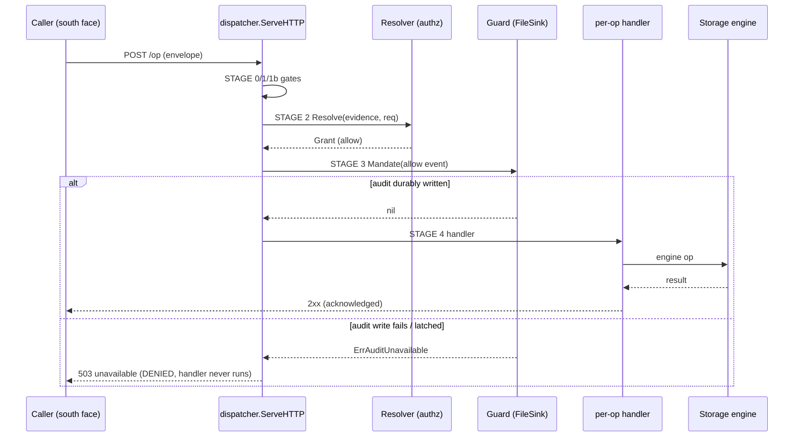
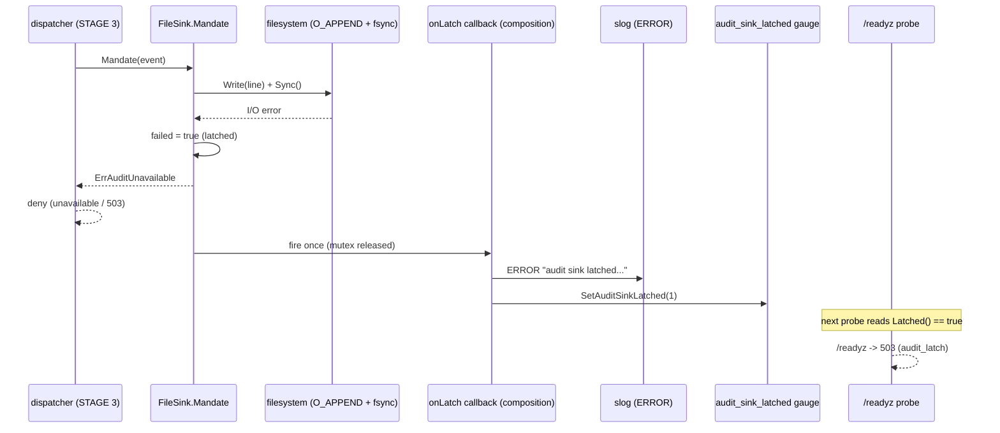
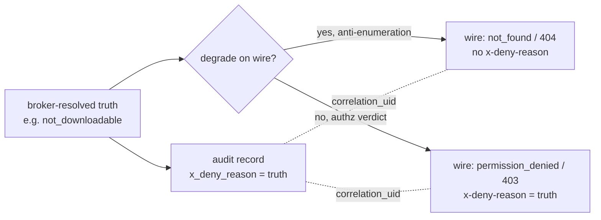

# Audit subsystem — fail-closed, hash-chained OCSF File System Activity

This document is the **architecture / design / implementation** layer for the
broker's audit subsystem: how it is built and why. For how to **operate** it
(latch recovery runbook, log rotation, `/readyz` and `/metrics` probes, offline
chain verification) see the operator docs and cross-links at the end:
[`docs/operations.md`](../operations.md), [`docs/testing.md`](../testing.md),
[`docs/configuration.md`](../configuration.md).

The subsystem implements **NFR-SEC-79**: every file activity on either face
emits an OCSF File System Activity event into a durable, tamper-evident pipeline
**before** the operation is acknowledged, and an audit-write failure **denies**
the operation. The broker is component-04 of the architecture; the package that
owns this is `internal/auditgate`, consumed through a seam by the south-face
dispatcher (`internal/southface`).

## Component map

| Concern | Source | Key symbols |
| --- | --- | --- |
| The audit mandate seam | `internal/auditgate/auditgate.go` | `Guard`, `Guard.Mandate`, `ErrAuditUnavailable` |
| The durable sink | `internal/auditgate/filesink.go` | `FileSink`, `NewFileSink`, `Mandate`, `Latched`, `SetOnLatch`, `Close`, `Verify`, `chainScan` |
| The OCSF event shape | `internal/auditgate/event.go` | `FileActivityEvent`, `ActorSubject`, `Outcome`, `Metadata`, `ActivityID`, `DispositionID` |
| Audit-before-ack ordering (unary) | `internal/southface/dispatch.go` | `ServeHTTP` STAGE 3, `auditEvent`, `denyAuditEvent`, `activityForOp`, `objectHandleForOp` |
| Audit-before-ack ordering (streaming) | `internal/southface/stream_handler.go` | `streamAuditEvent`, the upload allow/deny Mandate |
| Spine-event → OCSF mapping | `internal/southface/audit_event.go` | `mapAuditEvent` |
| Audit-truth vs wire-reason split (D8) | `internal/southface/deny.go` | `DenyVerdict`, `mapDeny`, `mapDenyDegraded` |
| Latch made observable | `cmd/ocu-filestored/main.go`, `internal/telemetry/health.go`, `internal/telemetry/metrics.go` | `sink.SetOnLatch`, the `audit_latch` `ReadyProbe`, `SetAuditSinkLatched`, the `audit_sink_latched` gauge |

## The seam: `Guard.Mandate`

The whole subsystem hangs off one method (`auditgate.go`):

```go
type Guard interface {
        Mandate(ctx context.Context, event any) error
}
```

`Mandate` returns `nil` **only after** the event is durably accepted by the
pipeline. Any failure is `ErrAuditUnavailable`, and the caller must refuse the
guarded operation — callers map it to a 503-class (`unavailable`) response and
never proceed without the record. The error is matched with `errors.Is`.

Two deliberate seam properties:

- **The event parameter is `any`.** Callers depend on the `Guard` *behaviour*,
  not a concrete record type. The dispatcher carries its own
  broker-resolved-truth `auditEvent` struct and maps it to the real
  `auditgate.FileActivityEvent` at the boundary (`mapAuditEvent`). `FileSink`
  type-asserts `event.(FileActivityEvent)` and **fails closed** on a mismatch —
  a wrong type is `ErrAuditUnavailable`, not a panic.
- **The caller is never the authoritative author of its own audit event.** Both
  faces author the same OCSF class under host-attested identity. The actor
  fields on the record come from the connection's attested channel identity, not
  from a caller-supplied claim.

## The audit-before-ack invariant

The south-face dispatcher runs a **locked** fail-closed pipeline in `ServeHTTP`
(`dispatch.go`). The stage order is load-bearing and documented in the method
header; the audit mandate is **STAGE 3**, ahead of the per-op handler (STAGE 4)
and ahead of any 2xx:

```
STAGE 0  header gate (mint request id, route, version, content-type,
         channel scope, declared-size pre-buffer, ops/s throttle)
STAGE 1  strict envelope decode (through the MaxBytesReader backstop)
STAGE 1b channel-scope cross-check on the decoded body (D2)
STAGE 2  authz (Resolver.Resolve with channel-derived caller evidence)
STAGE 3  audit Mandate BEFORE any 2xx (NFR-SEC-79)
STAGE 4  per-op handler
```

At STAGE 3 the dispatcher builds the per-op, broker-resolved-truth **allow**
event (`auditEvent`), stamps the request correlation id on it, and calls
`d.guard.Mandate`. If `Mandate` returns an error, the request is denied through
the same deny mapper every refusal uses (`denyClassForErr` →
`denyAuditDown` → `unavailable`/503) and the handler is **never invoked**:

```go
// dispatch.go, STAGE 3
allowEvent := d.auditEvent(op, ps, req, grant, bodyBytes)
allowEvent.RequestID = reqID
mandateErr := d.guard.Mandate(r.Context(), mapAuditEvent(allowEvent))
if mandateErr != nil {
        denyOp(mapDeny(denyClassForErr(mandateErr)), "audit gate unavailable")
        return
}
```

### Sequence — Mandate before ack (unary)



### A second event for handler-stage refusals

A request can clear STAGE 3 (allow recorded) yet be refused **inside** the
handler — for example a non-recursive `removeDirectory` on a non-empty
directory, or a `not_downloadable` read. The durable chain's most recent record
would then assert *allow* for an operation that did not take effect. To keep the
record truthful, the dispatcher exposes a `mandateDeny` hook to handlers
(`dispatch.go`): it emits a **second** audit event — a per-op **deny** event
carrying the broker-resolved truth as `x_deny_reason` — **before** the wire
deny. If that deny-Mandate itself fails, the verdict degrades to `audit_down`
(`unavailable`, no `x-deny-reason`), because a recorded allow with no recorded
deny must not be paired with a wire response that claims a different reason.

### Streaming faces obey the same rule

The streaming upload/download path (`stream_handler.go`) commits HTTP 200 early
(framed-trailer protocol) but still honours audit-before-**ack-of-data**: it
Mandates the **allow** event *before any chunk* (`streamAuditEvent` → `Mandate`)
and frames an `unavailable` trailer if the gate is down. Stream refusals emit
the deny event before the framed verdict, with the same `audit_down` degrade if
the deny-Mandate fails.

### Panics are audited too

The panic-containment wrapper (`panic_recovery.go`, `recoverDispatch`) sits
**outside** the locked pipeline. On any panic it makes a **best-effort** audit
Mandate for an internal-deny event before writing a structured wire deny — never
a naked connection drop — so even a crashed request leaves an audit trace where
the gate permits.

## The OCSF File System Activity event

`event.go` freezes the record shape: `FileActivityEvent`, OCSF **class_uid
1001**, **category_uid 1**. The required field set and JSON names are pinned by
`contracts/storage/file-artifact-api.schema.json` (`FileActivityEvent`); a few
fields are OCU base-event / chain extensions called out below.

| Field (JSON) | Meaning | Notes |
| --- | --- | --- |
| `class_uid` | `1001` constant | OCSF File System Activity |
| `category_uid` | `1` constant | OCSF System Activity category |
| `activity_id` | OCSF activity enum | `1` create/upload, `2` read/list/download, `4` delete, `14` preview-render (preview unimplemented this build) |
| `time` | epoch ms | **Stamped by `Mandate` from the broker clock — a caller-supplied value never reaches the record (NFR-SEC-48)** |
| `metadata` | `{version, product}` | OCSF base_event; `Mandate` fills `1.1.0` / `ocu-filestore` when unset |
| `actor` | `{user_uid, session_uid, process_pid}` | Host-attested identity; `process_pid` is the kernel-attested peer pid (SO_PEERCRED), omitted when none |
| `filesystem_id` | scope id | The channel-bound scope |
| `object_handle` | `{filesystem_id, path}` handle | For move/copy this is the **destination** (produced object) per `objectHandleForOp` |
| `byte_count` | bytes | Declared size on uploads; `0` on metadata-only ops |
| `intent` | `read` / `write` / `preview` | Derived from the route op, never the wire hint |
| `downloadable` | bool | **Resolved at read, never stamped at write (NFR-SEC-73)** |
| `outcome` | `{disposition_id, x_deny_reason?}` | `disposition_id` is the string enum `allow`/`deny`; `x_deny_reason` present iff deny |
| `prev_hash` | lowercase-hex SHA-256 | The chain link; **set by `Mandate`** (AUD-02) |
| `correlation_uid` | request id | OCU extension (T2-18); `omitempty` so a zero value does not alter the chain input |

Two structural rules the code enforces and that callers must respect:

1. **Field declaration order is the JSON marshal order and therefore the
   hash-chain input.** `event.go` says it explicitly for both
   `FileActivityEvent` and `ActorSubject`: **append new fields, never reorder**.
   `mapAuditEvent` (`audit_event.go`) constructs the literal in declaration
   order for the same reason. Reordering would silently break the chain across a
   version boundary.
2. **`Mandate` owns `time`, `metadata`, and `prev_hash`.** `mapAuditEvent`
   leaves those three zero on purpose; the spine never sets them.

### The correlation id (T2-18)

A single 32-char lowercase-hex id is minted at dispatch **STAGE 0**
(`newCorrelationID`, `crypto/rand`) and threaded through three telemetry
surfaces for one request:

- the **`x-request-id`** response header (on every response, allow and deny),
- the **structured log** lines (the request-scoped logger carries it), and
- the **audit record** (`correlation_uid`).

It is high-cardinality and **never used as a metric label** (T2-2). The split in
D8 (below) relies on it: when the wire reason is degraded away from the audited
truth, the same id joins the truthful audit record to the degraded wire
response.

## The hash chain — tamper evidence

`FileSink` is an append-only JSONL file where each record links the prior
record's hash (`filesink.go`).

- The **genesis link** is `SHA-256("ocu-audit-genesis-v1")` (`genesisInput`,
  `genesisHash`). A named sentinel lets an offline verifier confirm the genesis
  independently.
- Each record's `prev_hash` is the lowercase-hex SHA-256 of the **exact bytes of
  the previously written line, including its trailing newline**.
- `Mandate` advances the in-memory chain head **only after** the durable write
  succeeds: `s.prevLineHash = sha256.Sum256(line)` is the last statement, where
  `line` is the marshalled record plus `'\n'`.

`chainScan` walks a JSONL stream recomputing the chain from genesis. Each
complete line (`bufio.Reader.ReadBytes('\n')` keeps the delimiter, so no
reassembly is needed) is checked: its `prev_hash` must equal the hex of the
running hash, else the scan errors **naming the broken line**. An unparseable
complete line is likewise a named error. This gives tamper-evidence: editing,
removing, or inserting any non-final record breaks a recorded continuation.

`Verify(path)` (`filesink.go`) is the offline entry point — it opens the file
and runs `chainScan`, returning `nil` for a missing/empty/intact file and a
naming error on any tamper. **Scope caveat documented in the code:** the chain
alone does not protect the *most recent* record (no successor records its hash),
so removing the final complete line or mutating its body with `prev_hash` left
intact is undetectable to this scan. Closing that window needs an external
anchor and is full-shelf scope; until then `Verify` proves the integrity of
every record **except the last**. The operator-facing use of `Verify` is in
[`docs/operations.md` → Hash-chain verification](../operations.md).

### Startup re-scan and torn-tail handling

`NewFileSink` treats an existing non-empty file as **untrusted input**:

- A **new or empty** file starts the chain from genesis. Creation does a
  two-fsync: the file, then the parent directory, so the new directory entry is
  durable (POSIX). Directory-fsync `EINVAL`/`ENOTSUP` are tolerated
  (filesystems that refuse fsync on a directory fd); any other error fails
  construction.
- An **existing** file is verified from genesis via `chainScan`. A broken chain
  (mismatched `prev_hash` or unparseable line) **fails the constructor closed**
  — the broker refuses to start serving on a tampered audit file. The last
  complete line's hash is adopted as the chain head so the next `Mandate`
  continues the chain.
- A **trailing partial line with no newline** is a torn write whose record was
  never acked (`Sync` never returned). `chainScan` reports its byte length;
  `NewFileSink` truncates exactly those un-acked bytes and fsyncs, so the next
  record cannot merge into the torn fragment. Every acked
  (synced, newline-terminated) record stays (AUD-02).

## Durability — `O_APPEND` + fsync

`NewFileSink` opens with `os.O_APPEND|os.O_CREATE|os.O_WRONLY` at mode `0o600`.
`Mandate` writes the record **directly to the file seam, never through a
buffered writer** (a buffered writer could hold bytes a file `Sync` does not
flush), then calls `Sync()`. Only after both succeed does it return `nil` and
advance the chain head. The seam is the `writeSyncer` interface (`io.Writer` +
`Sync`); the real `*os.File` satisfies it, and tests substitute a faulting
implementation to drive the latch.

`Close` is idempotent and is for orderly shutdown: every acked record is already
on stable storage (each `Mandate` fsyncs before returning), so closing loses no
acked data; an in-flight `Mandate` completes under the same mutex first. After
`Close` the sink owns no descriptor and a `Mandate` on it is denied fail-closed
(the `closed` flag is checked alongside `failed`) rather than writing to a nil
seam — distinct from a corruption latch, which is what the next section covers.

`Mandate` consults the request context **only before taking the lock** (a cheap
early-out for an already-disconnected client). Once the append begins the write
is intentionally **uninterruptible**: an `os.File.Sync` cannot be cancelled, and
abandoning a write mid-flight would risk exactly the torn-write chain divergence
the design forbids.

## The fail-closed latch

A **write or sync error latches the sink permanently failed** for the rest of
its lifetime. After such a fault, file state and in-memory chain state can no
longer be trusted to agree — a partial write leaves a fragment a later append
would merge into, and a failed `Sync` may still have reached the platter — so
every subsequent `Mandate` is refused **without writing**:

```go
// filesink.go, Mandate (sync-failure branch, abridged)
if err := s.w.Sync(); err != nil {
        cb := s.onLatch
        s.failed = true
        s.onLatch = nil          // fire at most once
        s.mu.Unlock()
        if cb != nil { cb() }    // observation-only, outside the lock
        s.mu.Lock()              // reacquire for the deferred Unlock
        return ErrAuditUnavailable
}
```

Because every `Mandate` after the latch returns `ErrAuditUnavailable` and the
dispatcher maps that to a deny, **the latch turns the broker into a 100%-deny
machine.** That is the intended fail-closed posture: rather than ack operations
into an unverifiable chain (turning a fault detectable at the next restart into
records silently lost to `Verify`), the broker refuses everything. The latch
**never resets** — recovery is a **daemon restart**, which runs `NewFileSink`
and re-scans the chain. The operator recovery procedure is in
[`docs/operations.md` → Audit-latch recovery runbook](../operations.md).

`Latched()` reports the state (mutex-guarded, concurrency-safe). `SetOnLatch`
registers an **observation-only** callback fired **exactly once** on the
healthy→latched transition; it runs **after** `failed` is set and **after the
mutex is released**, so the callback can never deadlock or re-enter `Mandate`.

### Sequence — the latch tripping and being surfaced



### Making the latch observable (composition, T2-3 / T-14-10)

The latch is surfaced through three independent signals wired in
`cmd/ocu-filestored/main.go`:

1. **An `ERROR` log line.** `sink.SetOnLatch` registers a callback that emits
   `l.Error("audit sink latched; broker serving 100% denies until restart", ...)`.
2. **The `audit_sink_latched` gauge.** The same callback calls
   `m.SetAuditSinkLatched(1)`. The gauge (`internal/telemetry/metrics.go`) is a
   binary gauge — `0` healthy, `1` latched — exposed on `/metrics` for scraping
   alerting that survives a missed log line.
3. **`/readyz`.** The composition registers an `audit_latch` `ReadyProbe`
   (`internal/telemetry/health.go`) whose `Check` returns an error when
   `sink.Latched()` is true. A failing probe drives `/readyz` to **503** with
   the probe **name only** in the body (T-14-09 — never an error message, path,
   or payload). `/healthz` stays **200** (pure liveness): the process is alive,
   it is just refusing traffic, so an orchestrator must gate on `/readyz`.

A second readiness probe, `engine_root`, runs a bounded `List(scope, ".")` so a
broken storage root also fails `/readyz`; it is independent of the audit latch.
Endpoint behaviour for operators is documented in
[`docs/operations.md` → Health and metrics endpoints](../operations.md).

## D8 — audited truth vs wire reason

The audited `x_deny_reason` is the **broker-resolved truth**; the wire reason
**may degrade** for anti-enumeration. The single source of truth for every
refusal is the deny mapper (`deny.go`), whose output `DenyVerdict` carries both
faces of the decision:

- `AuditReason` — the broker-resolved truth, from the shared deny-class
  vocabulary (`internal/denyclass`). This is what lands in the audit record's
  `outcome.x_deny_reason`.
- `WireCode` / `WireStatus` — what the caller sees; **may differ** from the
  truth.
- `WireHeader` — gates the `x-deny-reason` *response header* to **authorization
  verdicts only** (`permission_denied`, `unauthenticated`); everything else
  withholds it.
- `CorrelationID` — set to the per-request id when truth and wire diverge so the
  audited record and the degraded wire response are joinable.

`mapDeny(class)` produces a verdict whose wire reason **equals** the truth (no
degrade). `mapDenyDegraded(auditReason, wireClass)` is the explicit split: the
audit record keeps `auditReason`, the wire takes `wireClass`'s code/status/header
gating. The canonical use is anti-enumeration: a refusal whose truthful reason
would leak the existence of an object is recorded truthfully but degraded on the
wire to `not_found`, with the correlation id (the request id, T2-18) the only
link between the two. An unknown class fails closed to `internal`/500 with no
header.



This is why the durable chain and the wire response can disagree by design and
still be consistent: the audit record never lies, the wire may tell the caller
less, and one id ties them together. The wire deny vocabulary, header gating,
and HTTP-status mapping are exercised in the south-face deny tests; the chain,
torn-tail, latch, and property tests live in `internal/auditgate/*_test.go`
(`filesink_test.go`, `filesink_iofault_test.go`, `filesink_prop_test.go`). See
[`docs/testing.md`](../testing.md) for how to run them.

## NFR rows this design satisfies

- **NFR-SEC-79** — audit-before-ack on both faces; an audit-write failure denies
  the operation (fail-closed); the permanent latch and its `/readyz` + gauge +
  ERROR-log surfacing.
- **NFR-SEC-48** — `Mandate` stamps `time` from the broker clock; a
  caller-supplied time never reaches the record.
- **NFR-SEC-73** — `downloadable` is resolved at read and carried on the record,
  never stamped at write.
- **T2-18** — the single request correlation id joining audit record,
  `x-request-id` header, and log lines.
- **T2-2 / T2-3 / T-14-09 / T-14-10** — the correlation id is never a metric
  label; the latch is observable via the binary `audit_sink_latched` gauge and
  the `audit_latch` readiness probe; the `/readyz` body carries probe names
  only.
- **AUD-02** — newline-terminated, fsync-acked records define the chain;
  un-acked torn tails are dropped at startup.
