# 05 — Daemon and scope lifecycle

This document is the architecture/implementation layer for how `ocu-filestored`
starts, serves, and stops, and for the safety properties that hold across every
exit path — clean stop, listener fault, and crash. It explains *how the daemon
is built and why*; the operator-facing *how to run it* lives in
[`../operations.md`](../operations.md) (signal contract runbook, audit-latch
recovery, health endpoints) and [`../configuration.md`](../configuration.md)
(the flag/env surface). Where a behaviour is also documented operationally, this
file links to it rather than restating it.

The storage broker is component-04 of the system architecture. The lifecycle
design exists to satisfy a specific set of security NFRs at process boundaries:

- **NFR-SEC-54** — erase-before-reuse: a scope's bytes must never survive into a
  later session, on *any* exit including a crash.
- **NFR-SEC-60** — admission before bind: a non-admitted profile/tenancy/
  credential triple must be refused before a socket is opened.
- **NFR-SEC-46 / NFR-SEC-78** — per-session ceilings and pre-buffer size
  rejection: one session exhausting a resource must not degrade another, and an
  over-ceiling declared body is rejected before a byte is read.
- **NFR-SEC-79** — fail-closed audit: an unwritable audit sink refuses to serve.

Every claim below is grounded in the current source; the implementing
`file:function` is cited inline.

---

## 1. Startup composition order

The daemon is a single process composing a fixed chain of seams. The order is
load-bearing — each stage either refuses (fail-closed) before the next stage
acquires anything externally visible, or constructs a seam the later stages
depend on. The chain, in execution order:

```
flag parse + env fallback   (run, main.go)
        │
        ▼
validate                    (validate, main.go)  ── refuse bad flags pre-bind
        │
        ▼
logger + metrics + ops listener construction
        │
        ▼
single-instance audit-sink flock   (flock.Acquire)  ── refuse 2nd daemon
        │
        ▼
compose:
   engine-kind dial inputs (s3 transport + credential source)
        │
        ▼
   ADMISSION  (admission.Admit / AdmitBrokerMode)  ── NFR-SEC-60, refuse pre-bind
        │
        ▼
   engine  →  resolver  →  audit sink  →  ceilings registry
        │
        ▼
   ProvisionScope  (erase-at-provision)            ── NFR-SEC-54 crash path
        │
        ▼
   southface.Serve  (build the per-session TLS HTTPS/HTTP-2 server)
        │
        ▼
serveUntilSignal           (main.go)  ── serve until a signal or listener fault
```

### 1.1 Parse, env-fallback, validate — all before any socket

`run` ([`cmd/ocu-filestored/main.go`](../../cmd/ocu-filestored/main.go)) parses
the frozen flag surface, then `applyEnvFallbacks` applies `OCU_FILESTORE_*`
environment variables for any flag the caller did not set explicitly (an
explicit flag always wins; see [`../configuration.md`](../configuration.md) for
the precedence rule and the credential-bearing exclusions). `validate` then
checks the whole surface and returns a typed error for any defect *before the
logger is even built and long before any socket is bound*:

- `-log-level` is validated first (`observ.ParseLevel`), so an unknown level
  token refuses with a clear error rather than crashing later.
- `-ops-listen` is validated next (`telemetry.ValidateOpsListenAddr`): a
  non-loopback address is refused fail-closed, with no socket opened.
- The engine-conditional required-flag matrix (`validate`, `switch kind`)
  requires each engine's own backing-store flags and *refuses the other
  kind's* — a silently inert backing-store flag would lie about what the daemon
  serves.
- The ceiling knobs are validated here too: `-broker-max-file-size` must be
  `> 0`, `-ops-per-second` must be `> 0`, and `-ops-burst` must be `>= 1` (a
  sub-one burst can never hold a token and would wedge the bucket).
- The storage-lane refusal matrix (ADR-0011, NFR-SEC-16) is the *last* gate:
  `-engine s3` without `-storage-lane` and without the explicit
  `-storage-lane-dev-direct` dev override refuses with `errStorageLaneRequired`.
  Ordering it last means that refusal provably means "flags valid, lane posture
  missing".

`-version` and `-health-check` short-circuit before `validate` so a binary can
be interrogated, and a container can self-probe, without supplying the full
serving flag set. The `-health-check` self-probe (`runHealthCheck`) dials its
own `/healthz` over `-ops-listen` — the distroless image has no shell or curl,
so the `HEALTHCHECK` exec's the daemon binary itself (see
[`../operations.md`](../operations.md), self-probe healthcheck).

### 1.2 Logger, metrics, ops listener

Only after `validate` succeeds is the structured JSON logger built
(`observ.NewLogger`) — it is the first real infrastructure, and everything from
here emits structured JSON. The broker metric set (`telemetry.NewBrokerMetrics`)
is built next and threaded into both the dispatcher (for `ops_total` and stage
latencies) and the ops listener (`/metrics`).

The ops listener is *constructed* here but its `Serve` goroutine is **not**
launched yet. This is deliberate: `compose` registers `/healthz` and `/readyz`
on the listener's mux later, and `http.ServeMux` requires `Handle` before
`Serve`. Launching `Serve` at construction would open a window where a probe
hits an unregistered route and gets a 404. `run` therefore starts the listener
goroutine only *after* `compose` returns (`go opsListener.Serve()`).

### 1.3 Single-instance audit-sink flock — before bind

Before `compose`, `run` acquires one exclusive non-blocking `flock(2)` keyed on
the audit-sink resource. This is the single-instance guard; see
[§4](#4-single-instance-guard) for the full topology rationale. The sink's
parent directory is created and pinned to `0700` (`os.MkdirAll` honours umask, so
`os.Chmod` pins the mode unconditionally) before the lock file is opened, because
the lock file is created first and must not sit in a world-traversable directory.

### 1.4 compose — admission, then the seams

`compose` ([`cmd/ocu-filestored/main.go`](../../cmd/ocu-filestored/main.go))
builds the engine-kind dial inputs first. For the s3 engine this means the
storage-lane transport (or the loud dev-direct rig client) and the credential
source; the admitted credential *kind* then flows from
`source.Kind()` — never hard-wired. For the local-volume engine the credential
kind stays the hard-wired host-local kind: it exercises a filesystem
permission, not a backend credential.

**Admission runs before any seam that binds or dials externally** (`admission.
Admit` then `admission.AdmitBrokerMode`). A non-admitted profile/tenancy/
credential triple returns the refusal here, before the socket is bound
(NFR-SEC-60). The minimal shelf admits only the single-tenant `trusted_operator`
profile with a host-local credential.

On admit, `compose` constructs the seams in order: the engine
(`NewLocalVolumeEngine` or `NewS3Engine`), the three-axis resolver
(`authz.New`), the fail-closed audit sink (`auditgate.NewFileSink` — an
unwritable sink returns an error here and refuses to serve, NFR-SEC-79), and the
per-session ceilings registry (`ceilings.NewRegistry`). The audit sink's
on-latch callback is wired to flip the `audit_sink_latched` gauge and emit an
ERROR line the moment the fail-closed latch trips.

It then provisions the scope (`eng.ProvisionScope`, [§3.1](#31-provision--erase-
at-provision)) under a bounded one-minute context, and finally calls
`southface.Serve`, which builds the per-session south-face TLS HTTPS/HTTP-2
server — loading the certificate/key at construction and wiring the
credential-scope source — ready to bind `-south-bind` on the first `Serve` call
([§2](#2-the-south-face-server)). The guest reaches that listener outbound
through the Egress trust-edge (guest → edge → service), an HTTPS `service_url`
dial on every tier; the host-dials-guest unix-socket/vsock ladder carries the
exec/control channel only, never storage (ADR-0014 §Decision).

The returned `Server` is wrapped in a `teardownServer` so that `Close` also runs
the scope erase and releases the ceilings entry ([§3.2](#32-teardown--erase-
before-reuse-on-every-exit)).

### 1.5 Bounded lifecycle contexts

The two engine lifecycle calls never run under a bare `context.Background()`.
`provisionTimeout` (1 minute) bounds `ProvisionScope`; `teardownTimeout`
(10 minutes) bounds `TeardownScope`. A teardown sweep on a network engine
paginates listings and batches deletes over a whole scope, so its bound is
generous but finite — a hung backend can never wedge startup or teardown
indefinitely.

---

## 2. The south-face server

The south face is a per-session TLS HTTPS/HTTP-2 server bound to exactly one
filesystem scope. It is built by `newTLSServer`
([`internal/southface/tlsserver.go`](../../internal/southface/tlsserver.go)) and
returned by `southface.Serve`. The guest does not dial a host-private socket: it
reaches this listener **outbound through the Egress trust-edge** (guest → edge →
service), an HTTPS `service_url` dial that holds on every sandbox tier because
every tier gives the guest a network stack (ADR-0014 §Decision). The
host-dials-guest unix-socket/vsock ladder carries the exec/control channel only,
never storage (ADR-0014 §Decision); nothing on the storage path binds a unix
socket, so the south face depends on no Linux-only socket option and runs on any
platform Go's `crypto/tls` supports.

Construction is fail-loud and happens before the first byte serves:

1. Refuse an empty bind address or an absent certificate/key pair
   (`errTLSConfig`) — a half-configured listener never binds.
2. Load the certificate/key from `-tls-cert` / `-tls-key` at construction
   (`tls.LoadX509KeyPair`). A defect refuses startup here, never as a lazy
   failure on the first request; the wrapped error carries the paths, never a
   key byte.
3. Pin `MinVersion` TLS 1.2 and advertise `h2` then `http/1.1` via ALPN, so the
   server negotiates HTTP/2 where the peer supports it and still serves a peer
   that only speaks HTTP/1.1.
4. Wrap the REST router (the locked dispatch spine behind
   `POST <service_url>/v1/filestore/fs/<operation>`) as the server handler. The
   listener is not opened until `Serve` calls `net.Listen("tcp", -south-bind)`
   followed by `ServeTLS`.

### 2.1 The credential-scope source

Identity no longer arrives as a kernel peer credential. The Egress edge
validates and strips the guest's weak session JWT, exchanges it for the real
filestore credential, and injects that credential on the request's
`Authorization: Bearer` header; the service receives only the injected
credential (spec §Owned state, the credential flow). The **single**
identity-extraction point is the credential-scope source
([`internal/southface/credscope.go`](../../internal/southface/credscope.go)): on
every admitted request it derives the credential-bound `filesystem_id` scope —
and the carried intent grant set — from that bearer, and stashes it into the
same `PeerScope` the dispatch spine's STAGE-0 already reads. Nothing downstream
re-derives identity; a handler reached without a scope (a wiring fault, or a
request carrying no usable bearer) fails closed — an audit actor never defaults
to uid 0.

Scope is the engine's decision, re-derived per request: the request's top-level
`filesystem_id` is a hint cross-checked against the credential-bound scope, never
the identity (NFR-SEC-43). A foreign `filesystem_id` is rejected with HTTP 403
PermissionDenied; a missing or expired credential is 401 (spec invariant 4). The
service mints and signs nothing — the edge owns weak-JWT validation and the
credential exchange (invariant 3). The actor `uid`/`pid` carried into the audit
record are credential-derived-or-zero: a REST transport has no kernel peer, so a
field is omitted when the credential carries none.

### 2.2 Transient accept survival

A burst of concurrent connections can exhaust the process file-descriptor table.
`ServeTLS`'s accept loop classifies a transient accept error (`EMFILE` too many
open fds, `ENFILE` system file table full, a peer reset mid-handshake) as
temporary and backs off with a capped exponential delay rather than returning
the error, which would shut the server down; a successful accept resets the
backoff, and a closed-listener error (`net.ErrClosed`) means shutdown and exits
the loop. This keeps the daemon alive through transient fd exhaustion (RES-08)
rather than self-terminating on a load spike.

### 2.3 Connection timeouts

The server sets `ReadHeaderTimeout` (10 s) to bound a peer that connects and
never finishes its request headers, and `IdleTimeout` (2 min) to reap idle
keep-alive connections (NFR-SEC-46). `ReadTimeout` and `WriteTimeout` are
deliberately **unset**: a connection-wide cap would kill a legitimately long
chunked upload (spec invariant 6 — a large transfer crosses as chunked
multipart) or download. A stall is bounded instead inside the data-plane
handlers, which re-arm a per-iteration read or write deadline before every body
read or flush (`http.NewResponseController`), so a slow-but-progressing transfer
keeps extending its deadline while a true stall trips it and aborts the
operation fail-closed.

---

## 3. Scope lifecycle — erase-before-reuse

The broker is an *ephemeral* workspace: it never takes on durable retention of
customer bytes. A filesystem scope is provisioned at session grant and erased at
session end, on every exit path. This is NFR-SEC-54. The local-volume engine
implements it in
[`internal/objectstore/engine_local.go`](../../internal/objectstore/engine_local.go);
the s3 engine mirrors the same contract (see [`../engines.md`](../engines.md),
erase-before-reuse).

### 3.1 Provision — erase at provision

`ProvisionScope` does **not** assume a clean slate. If a scope directory already
exists — left behind by a daemon that crashed mid-session, whose `TeardownScope`
never ran — it is erased *before serving*:

1. `validateScopeID` rejects an ill-shaped id.
2. `os.Lstat` the scope dir. A symlinked scope entry refuses *before any
   removal* (erasing through a link could destroy a target outside the base
   dir); a non-directory entry refuses.
3. An existing directory is erased wholesale (`removeAllCtx`, a
   cancellation-aware `RemoveAll` that checks `ctx.Err()` before descending each
   level, so erasing a huge scope is promptly interruptible).
4. The directory is recreated at `0700`, and the guest-invisible staging area
   (`.ocu-staging`) is recreated empty.

This is the **crash path**: erase-at-provision guarantees a restart never
re-serves prior-session bytes, even when the previous process died before its
teardown ran.

### 3.2 Teardown — erase before reuse on every exit

`TeardownScope` erases *all* contents of the scope and recreates it empty: after
it returns, a re-grant of the same `filesystem_id` reads `fs.ErrNotExist` for
every prior path. The same symlink and non-directory refusals apply before any
removal. If the scope is already gone it is recreated so a re-grant is usable. A
best-effort parent `fsync` makes the recreated entry durable (meaningful on
Linux, a no-op on darwin); a sync failure never fails the teardown because the
erase already completed.

**SEC-54 boundary (documented honestly):** this is an OS-level remove+recreate,
**not** a cryptographic erase. The substrate is operator disk; freed blocks may
persist until overwritten by unrelated writes. Per-session crypto-erase (a DEK
that is destroyed) is the deferred full-shelf arm.

Teardown runs **unconditionally** on `Close`. `teardownServer.Close`
([`cmd/ocu-filestored/main.go`](../../cmd/ocu-filestored/main.go)) closes the
session first, then runs `TeardownScope` regardless of whether the session close
failed, then releases the ceilings entry. Both the close error and the teardown
error surface via `errors.Join` — a teardown error is never silently dropped
behind a session-close error, and vice versa.

### 3.3 The guest-invisible staging area

Every write streams into a process-unique temp name inside `.ocu-staging` at the
scope root, is fsync'd, then committed into place (`writeTempAndCommit`). The
staging area is **guest-invisible**: it never appears in a listing of the scope
root (`List` skips it), it is unaddressable through any data verb (`guestPath`
rejects it as a reserved name), and it is swept by both the Provision and
Teardown erases. The result for the crash path: a partial write left by a
crashed daemon never survives into a later session. The temp suffix comes from
the OS CSPRNG (`crypto/rand`) — a predictable suffix would be a symlink-race
vector — and the no-replace commit is an atomic `link(2)` (EEXIST decides the
race at the kernel, no stat-then-rename TOCTOU window).

---

## 4. Single-instance guard

The guard prevents two daemons from corrupting the shared audit hash chain. It
is implemented as one exclusive non-blocking `flock(2)`
([`internal/flock/flock.go`](../../internal/flock/flock.go)) acquired in `run`
before any socket bind.

### 4.1 Keyed on the per-scope audit sink

The lock is keyed on the **audit-sink** resource: the lock file is
`<audit-sink>.lock` (`auditLockSuffix`). The invariant that makes this
sufficient is **one daemon = one `filesystem_id` = one audit-sink**. Two daemons
on the same scope therefore share the same sink and collide on this lock — which
is exactly the corruption the guard exists to prevent: interleaved appends would
break the chain's hash linkage. A daemon pointed at a *different* sink takes a
*distinct* lock and is allowed to run.

`flock(2)` is available on both Linux and darwin. `LOCK_NB` makes the attempt
non-blocking: a held lock returns `ErrAlreadyRunning` immediately (`run` maps it
to `errAlreadyRunning`, logs the lock path, and refuses to start). The kernel
releases the lock on process exit **even on SIGKILL**, so there is no stale-lock
problem across crashes; `run` also defers `afl.Release()` for the clean path.

### 4.2 The topology fix — key on the scope, not the bind resource

The legitimate deployment topology is *N* daemons, one per `filesystem_id`
(per-tenant instantiation, NFR-SEC-76), each a distinct scope. The lock must not
over-restrict that topology: keying the guard on a resource the daemons share —
as a retired design that keyed on a shared bind directory once did — would
refuse the second through *N*th daemons even though they corrupt no common audit
chain. The per-scope audit-sink lock fully preserves the no-interleaved-chain
guarantee **without** imposing that restriction: distinct scopes have distinct
sinks, take distinct locks, and coexist. (The `flock` package still carries a
comment describing that retired shared-directory lock as an optional second
resource; the daemon takes only the audit-sink lock — the topology fix.)

---

## 5. Per-session ceilings

Per-session ceilings ([`internal/ceilings/ceilings.go`](../../internal/ceilings/ceilings.go))
keep one session's resource use from degrading another (NFR-SEC-46). The registry
stamps a `Config` onto each session, keyed by an opaque `SessionKey` derived from
the host-attested scope. Three limiters live under one mutex per session:

| Limiter | Mechanism | Refusal sentinel |
|---|---|---|
| ops/s throttle | lazy-refill `TokenBucket` (no goroutine, no ticker) | `ErrThrottleExceeded` |
| in-flight bytes | `ByteGauge` against a fixed ceiling | `ErrBytesExceeded` |
| open fds | counter against a fixed ceiling | `ErrFDExceeded` |

**Token bucket.** `TryConsume` replenishes tokens from elapsed wall time on each
call, capped at burst. Refill happens only for a *strictly positive* elapsed
interval, so a clock that stalls or runs backward never drains the bucket and
never over-admits. One token is subtracted only after confirming at least one is
present, so the count never goes negative. The clock is injected
(`Config.Clock`) — the package never reads the wall clock itself, so tests use a
fake with no sleeps.

**In-flight bytes.** `AcquireBytes` reserves `n` bytes; a negative `n` or an
over-ceiling `n` returns `ErrBytesExceeded` and reserves nothing (no partial
reservation). The overflow-safe guard is `n > ceiling-current`, never
`current+n > ceiling` (the addition form wraps near `math.MaxInt64`).

**Pre-buffer size reject.** `CheckDeclaredSize` rejects a declared inbound body
that exceeds the ceiling *before any body byte is read* (NFR-SEC-78). The
comparison is direct (`declared > ceiling`) — never reformulated as a
subtraction, which wraps for operands near `math.MaxInt64`.

### 5.1 Fail-loud configuration

A misconfigured limiter is a **loud wiring panic at construction**, never a
silent permanent throttle. `NewRegistry` validates fail-loud:

- `Config.Clock` must be non-nil.
- `OpsPerSecond` must be `> 0` and `OpsBurst` must be `>= 1` — a bucket that can
  never refill, or never holds a token, is unservable (a rate of 0 would drain a
  real bucket once and deny forever).
- `InFlightBytesCeiling` and `FDCeiling` must not be negative.

The release paths also fail loud: `ReleaseBytes` and `ReleaseFD` **panic** on a
broken acquire/release pairing (releasing more than is in flight, or releasing at
zero) rather than going silently negative — a programmer error surfaced
immediately, since the usual `defer`-release pattern would ignore an error
return.

In the daemon, the ops pair is operator-tunable (`-ops-per-second` /
`-ops-burst`, validated again in `validate`); the in-flight-bytes ceiling
(2 GiB) and fd ceiling (256) are fixed this phase — the single-tenant
`trusted_operator` shelf has one session class, so a per-deployment knob would
add a tuning surface with no operator to turn it. A `NewNopRegistry`
(non-enforcing via a structural flag, not a too-large magnitude) exists for
tests and wiring only and must never be deployed.

---

## 6. Graceful shutdown contract

`serveUntilSignal`
([`cmd/ocu-filestored/main.go`](../../cmd/ocu-filestored/main.go)) serves until
either `Serve` returns on its own (a listener fault) or `SIGTERM`/`SIGINT`
arrives via `signal.NotifyContext`. The operator-facing runbook is in
[`../operations.md`](../operations.md) (signal and shutdown contract); the
contract itself:

1. **Ready notification.** After launching the serve goroutine, `SdNotifyReady`
   sends `READY=1` to systemd; see [§7](#7-sd_notify).
2. **Signal received.** `stop()` is called *first* — this stops intercepting the
   signal, so a **second** `SIGTERM`/`SIGINT` during a wedged drain hits the
   default disposition and **hard-kills** the process instead of being
   swallowed. `SdNotifyStopping` then sends `STOPPING=1`.
3. **Bounded drain.** `srv.Close` runs the server's drain. Inside
   `tlsServer.Close` ([`internal/southface/tlsserver.go`](../../internal/southface/tlsserver.go)),
   `srv.Shutdown` is given a bounded `tlsShutdownDrainTimeout` (**25 s**) for
   in-flight operations to finish. If the drain expires, the straggling
   connections are **force-closed** (`srv.Close`) so teardown can always
   proceed; both the drain-expiry and the force-close errors surface via
   `errors.Join`. The 25 s bound sits deliberately under a typical service
   manager's 30 s stop-grace, so the drain, the force-close, **and** the scope
   erase all fit before a `SIGKILL`. A wedged peer can never hold the server
   open indefinitely, because the caller's teardown runs *after* `Close`
   returns.
4. **Teardown always runs.** `teardownServer.Close` runs `TeardownScope`
   (erase-before-reuse, NFR-SEC-54) **unconditionally** after the server close —
   a clean stop signal must never skip the erase — then releases the ceilings
   entry. The graceful drain leaves no host-side artifact to unlink: the TLS
   listener is a TCP socket the kernel reclaims on close, so the
   shutdown-before-serve path needs no explicit socket removal.
5. **errors.Join everywhere.** Every exit path combines the serve, close, and
   ops-listener results with `errors.Join`, so a teardown error is never
   silently dropped behind a serve error or vice versa.
6. **Audit-sink lock release.** Back in `run`, the deferred `afl.Release()`
   releases the single-instance lock after teardown completes.

### 6.1 The listener-fault path

If `Serve` returns *before* a signal (a listener fault), `serveUntilSignal` still
runs teardown: `srv.Close` (which runs the unconditional `TeardownScope`) and the
ops-listener shutdown, joining all results. The erase-before-reuse guarantee is
identical on this path — a fault is not an excuse to leave bytes behind.

---

## 7. sd_notify

systemd readiness integration ([`internal/telemetry/sdnotify.go`](../../internal/telemetry/sdnotify.go))
is **fail-soft and optional**. `SdNotifyReady` (`READY=1`) and
`SdNotifyStopping` (`STOPPING=1`) write a datagram to the `NOTIFY_SOCKET` unix
socket. If `NOTIFY_SOCKET` is unset or empty — the daemon is not systemd-managed,
or the integration is disabled — both are a silent no-op. Any dial or write error
is **logged at WARN and does not stop the daemon**: an optional integration must
never fail the serving path. The `-health-check` self-probe mode does not consult
`NOTIFY_SOCKET` at all. See [`../operations.md`](../operations.md) (sd_notify
integration) for the unit-file `Type=notify` wiring.

### 7.1 Relationship to /healthz and /readyz

`sd_notify` is the systemd readiness signal; orchestrator readiness is the ops
listener's `/healthz` (pure liveness, 200 whenever serving) and `/readyz`
(200 only when every probe passes), registered by
`RegisterOpsListenerHealthHandlers`
([`internal/telemetry/health.go`](../../internal/telemetry/health.go)). `compose`
wires two probes: `audit_latch` (reads `FileSink.Latched()` — a latched
fail-closed sink makes the broker not-ready) and `engine_root` (a bounded
`List(scope, ".")`). The probe registration happens inside `compose`, before the
listener's `Serve` goroutine starts, closing the Handle-before-Serve gap. The
`/readyz` 503 body lists only failing probe **names** — never a path, payload, or
error text. The endpoint reference for operators is in
[`../operations.md`](../operations.md) (health and metrics endpoints).

---

## 8. Daemon lifecycle state diagram

```mermaid
stateDiagram-v2
    [*] --> Validating: run(args)
    Validating --> Exit_NonAdmit: bad flag / non-loopback ops-listen / bad lane posture
    Validating --> Locking: flags valid

    Locking --> Exit_AlreadyRunning: audit-sink flock held (ErrAlreadyRunning)
    Locking --> Composing: lock acquired

    Composing --> Exit_NonAdmit: admission refused (NFR-SEC-60)
    Composing --> Exit_NonAdmit: audit sink unwritable (NFR-SEC-79)
    Composing --> Provisioned: seams built + ProvisionScope (erase-at-provision)

    Provisioned --> Serving: southface.Serve binds -south-bind TLS HTTPS/HTTP-2 listener; SdNotifyReady

    Serving --> Draining: SIGTERM / SIGINT
    Serving --> Draining: Serve returns (listener fault)

    Draining --> ForceClosing: drain exceeds shutdownDrainTimeout (25s)
    Draining --> TearingDown: in-flight ops finished within bound
    ForceClosing --> TearingDown: stragglers force-closed

    TearingDown --> Exit_Clean: TeardownScope erase-before-reuse (NFR-SEC-54) + ceilings release + flock release

    Serving --> [*]: 2nd SIGTERM/SIGINT during wedged drain (hard kill, default disposition)

    Exit_NonAdmit --> [*]
    Exit_AlreadyRunning --> [*]
    Exit_Clean --> [*]

    note right of TearingDown
        Teardown runs on EVERY exit path
        (signal OR listener fault).
        errors.Join surfaces both
        serve and teardown errors.
    end note

    note right of Provisioned
        Crash before TearingDown leaves
        the scope on disk; the NEXT start's
        ProvisionScope erases it before
        serving (crash path, NFR-SEC-54).
    end note
```



---

## 9. Cross-references

- [`../operations.md`](../operations.md) — operator runbook: signal/shutdown
  contract, audit-latch recovery, health/metrics endpoints, sd_notify unit
  wiring, the south-face TLS transport and credential custody (the
  edge-injected `Authorization: Bearer`, the `-south-bind`/`-tls-cert`/`-tls-key`
  surface).
- [`../configuration.md`](../configuration.md) — the flag/env surface and the
  flag→env precedence rule.
- [`../engines.md`](../engines.md) — engine selection, the erase-before-reuse
  guarantee per engine, the storage egress lane.
- [`../testing.md`](../testing.md) — which lifecycle tests skip on darwin
  (live-S3) and how to run the full suite.
