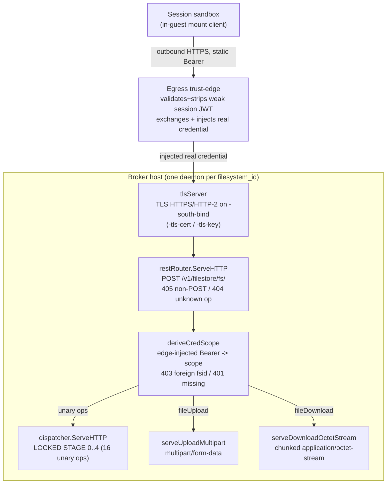

# South-face transport and wire surface

This document is the architecture/implementation layer for the broker's
**south face** — the face that terminates the file-operation RPC coming from a
session sandbox (the guest mount client). It describes *how the transport is
built and why*. For *how to operate it* see the operator docs and cross-links at
the end: [operations](../operations.md), [engines](../engines.md),
[configuration](../configuration.md), [testing](../testing.md).

Every claim below is grounded in the current source under
`internal/southface/`. File and function references are given inline as
`file:func` so the design and the code stay verifiable against each other. The
broker is component-04 of the system architecture; the NFR rows the design
satisfies are cited where relevant. The transport wire shapes (route, deny body,
credential custody, streaming framing) are sibling-proven and frozen pending the
#292 canon merge; they are enumerated, with grep-able code markers, in
[pending-phase7](../pending-phase7.md).

---

## 1. Transport at a glance

The south face speaks **REST-JSON over HTTP/2 on a TLS HTTPS listener**. There
is one listener, bound at `-south-bind` and presenting the certificate/key from
`-tls-cert`/`-tls-key` (`tlsserver.go:newTLSServer`). The guest does **not**
connect to a host Unix socket; the in-guest mount client dials the listener
**outbound** through the [Egress trust-edge](../operations.md) —
guest → edge → service direct HTTPS — exactly as the component spec draws the
guest leg (component-04 spec L21/L25; ADR-0014 L30/L34: the mount client holds
reused outbound TCP/443 connections to an HTTPS `service_url`, HTTP/2, REST-JSON,
with no AF_UNIX or vsock on the data path). The host-dials-guest unix-socket /
vsock ladder carries the exec/control channel only, never storage (ADR-0014
L34), so no host-private socket sits on the storage path. A single daemon
process serves a single tenant filesystem scope.

Because identity arrives on the request rather than from a kernel peer, the
transport is **platform-neutral**: it depends on no Linux-only socket option, so
the broker serves on Linux, macOS, or any platform Go's `crypto/tls` supports.

The wire surface is the file-ops contract from the architecture repo: operation
names and the authorization axes are pinned there; per-operation bodies marked
TBD stay TBD (this package never invents a body). The *transport and message-set
encoding* are component-spec choices: the concrete route, the deny body, the
credential custody, and the data-plane framing are sibling-proven and frozen
pending the #292 canon merge ([pending-phase7](../pending-phase7.md)), so the
implementation and the in-repo conformance target agree on the wire.

Three properties hold for every request, with no exceptions:

1. **Credential-derived scope is authoritative.** The session's `filesystem_id`
   and intent grant come from the real filestore credential the edge injected on
   the request's `Authorization: Bearer` after exchanging the guest's weak
   session JWT (component-04 spec L55; ADR-0019). Any `filesystem_id` in a
   request body is an *untrusted hint*, cross-checked against the
   credential-bound scope before any handler runs (NFR-SEC-43). A foreign
   `filesystem_id` is HTTP 403; a missing or expired credential is HTTP 401
   (component-04 spec L62, invariant 4).
2. **A request the broker cannot attribute to a scope is denied before any
   handler.** A missing, malformed, or rejected bearer is denied
   `unauthenticated` (HTTP 401) at the route layer with no engine call
   (`credscope.go:deriveCredScope`). The service mints and signs nothing; it
   forwards the injected credential to the engine unmodified (component-04 spec
   invariant 3).
3. **Audit precedes acknowledgement.** Every file activity is mandated to the
   audit gate before any success is written; an audit-write failure denies the
   operation, fail-closed (NFR-SEC-79). (The audit pipeline itself is out of
   scope for this transport document; the transport's contribution is the
   ordering — audit-before-ack — and carrying an audit-down result back to the
   caller as a deny status.)



---

## 2. One listener per scope, one daemon per scope

A daemon serves exactly one tenant filesystem scope. The credential-bound scope
is the host-attested binding a request is authorized against; it is the
transport-neutral analogue of the retired per-socket provision
(`credscope.go:CredentialScope`). The
[`CredentialScopeExtractor`](#3-the-edge-injected-credential-scope-component-04-spec-l55-l62) derives that
binding from the edge-injected bearer on each request: the `FilesystemID` the
credential authority bound the credential to, and the exhaustive
`GrantedIntents` set the credential carries.

Because one daemon serves one scope, there is no in-process multiplexing of
scopes and no shared transport across tenants. This is the transport-level
realization of per-tenant instantiation: one broker principal per tenant
filesystem scope (component-04 spec L94, NFR-SEC-76). The listener carries no
session-registry-of-sockets — a request carries its own credential, and the
credential names its scope.

The retired model bound the scope to a per-session Unix-domain socket keyed by
`<filesystem_id>.sock` and read it from an in-process socket registry. That
socket binding, its socket directory, and the stale-socket-removal-before-bind
dance are gone; per-tenant instantiation is unchanged, but the binding now
travels on the credential, not on a socket path.

---

## 3. The edge-injected credential scope (component-04 spec L55, L62)

The credential-scope source is `credscope.go`. It replaces the retired
unix-socket peer-credential gate as the per-request host-attested-scope origin,
and it populates the **same** `PeerScope` struct the dispatch spine's STAGE-0
already reads, so the spine and every handler algorithm run unchanged — only the
*source* of the scope changes.

The flow per request:

1. `credscope.go:bearerFromRequest` reads the `Authorization` header and strips
   the literal `Bearer ` scheme. An absent header, a wrong scheme, or an empty
   token after the scheme is `errMissingBearer`.
2. `credscope.go:deriveCredScope` passes the verbatim bearer to the wired
   `CredentialScopeExtractor`, which derives the credential-bound
   `FilesystemID`, the `GrantedIntents` set, and the audit actor `UID`/`PID`. The
   service does **not** JWKS-verify the bearer — the edge owns weak-JWT
   validation and has already validated and stripped the guest's weak session
   JWT before injecting the real credential (component-04 spec L55, invariant 3).
   No issuer/audience/algorithm is hardcoded here; the injected-credential shape
   is the credential authority's contract and binds later
   (`PENDING-PHASE-7(A5-credscope)`).
3. A missing, malformed, expired, or authority-rejected credential is denied
   `unauthenticated` — HTTP 401 — because the broker cannot attribute the request
   to any scope (component-04 spec L62, invariant 4).
4. The request's top-level `filesystem_id` is an untrusted hint, cross-checked
   against the credential-bound scope. A value that disagrees is a
   `scope_mismatch` deny — HTTP 403 `permission_denied` (component-04 spec L62,
   invariant 4; NFR-SEC-43).
5. Only a request whose credential binds a scope, and whose body
   `filesystem_id` matches that scope, reaches a handler. The resolved
   `PeerScope` carries the channel-bound `FilesystemID` and `GrantedIntents` plus
   the credential-derived actor `UID`/`PID`.

The scope check sits at the service/route layer over a thin engine: the engine
is keyed on the scope string and carries its own host-local backend credential
(component-04 spec invariant 3; the open-question's option (c), recorded in
[pending-phase7](../pending-phase7.md) "Notes on the credential model"). This
breaks no security property — NFR-SEC-25 holds, one backend credential and one
client — and the literal "the engine enforces `filesystem_id` scope" reads as
this service-layer check feeding a single-credential engine.

### The scope is the single identity origin

`peerScopeFromContext` and the credential extractor are the only ways a scope
enters a request. The two data-plane handlers and the unary spine each call
`deriveCredScope` / `peerScopeFromCredential` at STAGE 0; every handler — and
every audit record's actor — reads identity from the resolved `PeerScope`, never
from a request field. The `UID`/`PID` are credential-derived-or-zero: a REST
transport has no kernel peer, so the actor pid is omitted when the credential
carries none. An unwired credential source fails **closed** — the default
extractor rejects every request (`credscope.go:newBearerScopeExtractor`).

---

## 4. The HTTP server: TLS, HTTP/2, timeouts, graceful drain

The south-face server is the TLS HTTP/2 server in `tlsserver.go:tlsServer`,
built by `tlsserver.go:newTLSServer` and wired in `serve.go:Serve`:

- **TLS HTTPS, HTTP/2 preferred.** The TLS config pins `MinVersion` TLS 1.2 and
  advertises ALPN `h2` then `http/1.1`, so the server negotiates HTTP/2 with a
  guest that speaks it and still serves a guest that only speaks HTTP/1.1
  (`tlsserver.go:newTLSServer`). The certificate is loaded at construction — a
  bad cert/key refuses startup, never a lazy failure on the first request.
- **`ReadHeaderTimeout` = 10 s** bounds a peer that connects and never finishes
  its request headers (NFR-SEC-46). It also re-arms the per-request connection
  deadline so a handler-set body deadline (see the per-iteration stall deadline
  in §6) never poisons the next request on a kept-alive connection.
- **`IdleTimeout` = 2 min** reaps idle keep-alive connections.
- **`ReadTimeout` / `WriteTimeout` are intentionally unset** — a connection-wide
  cap would kill a legitimately long streamed upload or download. Stalled
  transfers are covered instead by the per-iteration read/write deadlines inside
  the data-plane handlers (§6).
- `ErrorLog` bridges the server's internal error log into the structured JSON
  stream via `observ.ErrorLog`.

`tlsserver.go:Serve` binds the TCP listener and runs `srv.ServeTLS`, collapsing
`http.ErrServerClosed` to `nil` so a clean shutdown is not an error.

`tlsserver.go:Close` performs a **bounded** graceful drain: in-flight operations
get up to `tlsShutdownDrainTimeout` (25 s) to finish, after which stragglers are
force-closed (`srv.Close()`); both errors surface via `errors.Join`. The bound
is deliberately under typical service-manager stop grace (30 s) so the drain, the
force-close, *and* the caller's erase-before-reuse teardown (NFR-SEC-54, which
runs after `Close` returns) all fit before a SIGKILL. A wedged peer can never
hold the daemon open indefinitely.

The exported constructor is `serve.go:Serve(Config) (Server, error)`. It
validates wiring fail-loud — a positive whole-object ceiling, non-nil seams, and
a non-nil `CredExtractor` (`serve.go:Serve`) — builds the dispatcher over the
injected seams, wraps it in the REST router (`router.go:newRESTRouter`), and
binds the TLS server (`tlsserver.go:newTLSServer`). `Server` is the frozen seam
(`southface.go`): `Serve()` / `Close()`.

---

## 5. The wire surface: 16 unary + 2 data-plane operations

The routable operation set is the 18-member `Op` enum in `southface.go`,
mirroring the file-ops contract enum. The closed set is also pinned in
`envelope.go:knownOps`; adding an op is a contract change in the architecture
repo first.

Every operation is `POST <service_url>/v1/filestore/fs/<operation>`: the route
base is `envelope.go:restBase` (`/v1/filestore/fs/`) and the operation name is
the trailing path segment (`PENDING-PHASE-7(A1-route)`). `router.go:restRouter`
resolves the route boundary: a path outside the base or naming an op outside the
frozen enum is **404** — an unknown op is indistinguishable from a missing object
(anti-enumeration); a non-POST to a known op is **405** with an `Allow: POST`
header (`router.go:ServeHTTP`, `router.go:routeOp`). A well-formed POST is
delegated by op transport class.

### 5.1 The 16 unary operations (`application/json` POST)

Sixteen of the eighteen ops are unary: a single JSON request body in, a single
JSON response body out. They are everything except `fileUpload` and
`fileDownload`:

`listDirectory`, `makeDirectory`, `moveDirectory`, `removeDirectory`,
`createFile`, `readFile`, `readMetadata`, `getFileMetadata`, `listFiles`,
`copyFile`, `moveFile`, `removeFile`, `importFiles`, `importZip`,
`migrateFilesystem`, `removeFilesystem`.

Per-operation request/response bodies are declared in `ops_bodies.go`. Each
handler strict-decodes its *whole* op body (`DisallowUnknownFields`) so an
unexpected field rejects. Notable shapes:

- The wire body carries `filesystem_id` as a **top-level** field, a sibling of
  `authorization_metadata`, never nested inside it; `authorization_metadata`
  carries exactly `{intent, downloadable}` (`PENDING-PHASE-7(A4-fsid-toplevel)`).
- `listDirectory` is the only request with pagination (`limit`/`cursor`/
  `recursive`, accept-when-present with safe defaults). Its response is the only
  non-trivial body: an `entries` union (each entry is exactly one of `file` or
  `directory`, `omitempty` dropping the unset branch) plus an opaque keyset
  `cursor` (empty on the last page).
- The six namespace/file mutation ops (`make`/`move`/`removeDirectory`,
  `copy`/`move`/`removeFile`) return the **bare ack** `{}` (`ackResponse`).
- `readFile` returns *metadata only* (`path/size/mtime/mime/uuid`); it carries
  **no** content field. Bulk bytes are `fileDownload`'s job. Its `range` is a
  half-open `[offset, offset+length)` window; an absent range is a full read.
- The read-time `authorization_metadata.downloadable` flag is **never trusted**
  on a read op — the broker re-derives `downloadable` from its own resolved
  grant (NFR-SEC-73, component-04 spec L63 invariant 5). It is never stamped at
  write.

The unary content-type is hard-equality `application/json`
(`envelope.go:checkContentType`, charset parameter tolerated). The spine's
routing view of the body is `envelope.go:unaryEnvelope`
(`filesystem_id`, `path`, `authorization_metadata`).

### 5.2 The 2 data-plane operations

Two ops carry bulk object bytes that must not be whole-buffered, so each has its
own REST framing and its own route-boundary entrypoint (`router.go:ServeHTTP`):

- **`fileUpload`** — `multipart/form-data` request
  (`PENDING-PHASE-7(A2-multipart)`), routed to
  `upload_multipart.go:serveUploadMultipart`.
- **`fileDownload`** — `application/json` request, chunked
  `application/octet-stream` response (`PENDING-PHASE-7(A2-octet)`), routed to
  `download_octetstream.go:serveDownloadOctetStream`.

This realizes invariant 6: a large transfer crosses as chunked multipart, never
one message (component-04 spec L64, NFR-SEC-46). Neither data-plane op rides any
framed-trailer streaming channel — that retired model is described as retired in
§6.

---

## 6. The data-plane framing: multipart upload, chunked octet-stream download

The two data-plane ops carry their bulk bytes in REST-native framing, never in a
single buffered message (component-04 spec L64 invariant 6,
`PENDING-PHASE-7(A2-multipart)` / `PENDING-PHASE-7(A2-octet)`).

### `fileUpload` — `multipart/form-data` (`upload_multipart.go`)

The request is a POST carrying two ordered parts
(`upload_multipart.go:handleFileUploadMultipart`):

1. a form **field** named `params` whose value is the upload-params JSON
   (`uploadParamsFrame`): `filesystem_id` top-level, `path`,
   `declared_size_bytes` **required**, `overwrite_existing` (`omitempty`,
   defaulting to false), and the write `authorization_metadata`;
2. a file **part** named `file` (filename `upload`) streaming the **raw** object
   bytes with no per-chunk envelope and no base64. The closing multipart
   boundary is the authoritative end of the part.

The handler reads the parts streaming (`r.MultipartReader()`, not the buffering
`ParseMultipartForm`). The body must yield **exactly** `declared_size_bytes`:
over-declaration aborts mid-stream before the excess reaches the engine, and
under-declaration aborts at the closing boundary — both `size_exceeded`, staging
nothing (the engine's temp+rename atomicity means a torn upload leaves no
object). The params field is size-bounded before decode
(`upload_multipart.go:readUploadParams`); the file part is never buffered.

### `fileDownload` — chunked `application/octet-stream`
(`download_octetstream.go`)

The request is a POST carrying a small JSON body: `filesystem_id` top-level, a
`uuid` (the object is addressed by broker-minted handle, not a path), an optional
`range{offset,length}` (omitted for a whole-object read), and the read
`authorization_metadata` (`download_octetstream.go:handleDownloadOctetStream`).
On success the **response** is HTTP 200 with `Content-Type:
application/octet-stream` whose body is the raw object bytes streamed chunked —
no JSON, no per-chunk envelope, no base64. Each engine write is flushed toward
the client as it arrives (`download_octetstream.go:flushingResponseWriter`), so
outbound memory stays bounded regardless of object size.

### Status is committed at the first byte, never before

This is the load-bearing data-plane rule. Both handlers resolve everything —
scope cross-check, authz, downloadable-at-read, the read window, and the
audit-before-ack ALLOW Mandate — **before** any byte and before any 200 header.
Every pre-byte refusal is therefore a real HTTP status (a clean
`restdeny.go:writeRESTDeny`), not a success body carrying a hidden verdict. Only
once the outcome is committed does a handler write its terminal status: HTTP 200
on a fully reassembled, size-matched upload, or HTTP 200 plus the octet-stream
body on a download whose first byte is about to flow. A mid-stream engine fault
*after* a download's 200 header is on the wire simply terminates the stream — the
status cannot change, and the client detects the short read.

A per-iteration stall deadline (`d.frameReadTimeout` on upload reads,
`d.frameWriteTimeout` on download flushes) is re-armed before *every* read/write
via `http.NewResponseController`, so a slow-but-progressing transfer keeps
extending its deadline while a stall trips it and aborts fail-closed
(NFR-SEC-46). Both handlers run their engine I/O behind an `io.Pipe` with panic
containment (`panic_recovery.go`): a panic in `WriteStream`/`ReadRange` is
recovered into an internal error, the pipe is closed to unblock the peer, and the
engine's temp+rename atomicity guarantees no torn object becomes visible.

> **Retired model.** The earlier south face streamed both data-plane ops over a
> Connect framed channel: a 5-byte frame envelope (a 1-byte flag plus a 4-byte
> big-endian length) carrying compact JSON, an `application/connect+json`
> content-type, an always-HTTP-200 stream with the verdict riding a `0x02`
> end-stream trailer, and a `Connect-Protocol-Version` header. That framing, that
> trailer-authoritative verdict, and that per-session Unix-socket transport are
> **retired** — replaced by the multipart-upload / octet-stream-download REST
> shapes above (ADR-0014 L34; [pending-phase7](../pending-phase7.md)).

```mermaid
sequenceDiagram
    participant G as Guest mount client
    participant E as Egress trust-edge
    participant S as serveUploadMultipart
    participant H as handleFileUploadMultipart
    participant N as Engine.WriteStream
    G->>E: outbound HTTPS POST /v1/filestore/fs/fileUpload (static Bearer)
    E->>S: inject real credential on Authorization: Bearer
    S->>S: deriveCredScope (403 foreign fsid / 401 missing), ops/s throttle
    S->>H: dispatch (PeerScope present)
    H->>H: read "params" field; declared_size_bytes required
    H->>H: scope cross-check (NFR-SEC-43), Resolve(write), pre-assembly size reject (SEC-46)
    H->>H: audit ALLOW Mandate BEFORE any byte (SEC-79)
    loop raw "file" part, ceiling-bounded reads
        H->>N: pw.Write(chunk)  (acc <= declared, byte ceiling)
    end
    H->>N: pw.Close() -> temp+rename commit
    H-->>G: HTTP 200 (empty body)
```

---

## 7. The data-plane handler contracts

`upload_multipart.go:serveUploadMultipart` and
`download_octetstream.go:serveDownloadOctetStream` each run the STAGE-0 prologue
— mint the per-request correlation id, stamp `x-request-id`, derive a
request-scoped logger, install the panic-recovery net, derive the `PeerScope`
from the edge-injected credential (or, on the unwired fallback path, from the
connection context), and apply the per-session ops/s throttle keyed on the
channel scope, never on a body field (NFR-SEC-46). Then each runs its handler.

### `fileUpload` (`upload_multipart.go:handleFileUploadMultipart`)

The contract, every clause load-bearing:

- Read the `params` part **first**. A missing part, a non-`params` first part, an
  oversize params value, or an undecodable/unknown-field params JSON is a hard
  reject (`malformed`).
- `declared_size_bytes` is **required**: `<= 0` denies `malformed`, no escape
  hatch.
- Cross-check the decoded `filesystem_id` against the credential-bound channel
  scope; key everything on the channel, never the params value (NFR-SEC-43). A
  mismatch is `scope_mismatch`.
- `canonicalizePath` the decoded path once before authz/audit/engine.
- `Resolve(intent=write)` from the channel scope; map resolver errors.
- **Pre-assembly size reject** (NFR-SEC-46): `checkDeclaredSize(declared,
  maxFileSize)` *before* opening the file part — zero file bytes are read on
  reject.
- **Audit ALLOW before any byte** (audit-before-ack, NFR-SEC-79); an audit-down
  error denies before any byte is read.
- Reassemble via a single `io.Pipe` → `engine.WriteStream(overwrite=
  params.OverwriteExisting)`. Size enforcement is two-directional: over- and
  under-declaration both abort `size_exceeded`, staging nothing. On abort the
  engine pipe is closed with a non-EOF sentinel (`errStreamAborted` /
  `errUploadOverDeclared`), never the raw `io.EOF` — `io.Copy` inside
  `WriteStream` treats a pipe read returning `io.EOF` as a clean end and would
  commit the partial bytes, so the sentinel forces `WriteStream` to fail and
  discard the temp (abort-discards-nothing).
- The fd ceiling brackets the open file part; the in-flight-byte ceiling brackets
  reassembly; both release on every exit path (NFR-SEC-46).
- **Every** refusal writes `restdeny.go:writeRESTDeny` (HTTP status +
  BoundedReason); success writes a single HTTP 200 with an empty body the client
  ignores.

### `fileDownload` (`download_octetstream.go:handleDownloadOctetStream`)

- Strict-decode the JSON request `{filesystem_id, uuid, optional
  range{offset,length}, authorization_metadata}`; an undecodable or
  unknown-field body is `malformed`.
- Cross-check `filesystem_id` against the channel scope.
- Resolve `uuid` → `(scope, path)` from the session-scoped object-id store. The
  `uuid` is a broker-minted handle from this session's listing/readFile emitter.
  An unknown uuid is `not_found`. A **cross-scope** uuid (stored scope ≠ channel
  scope) audits as `scope_mismatch` truth but **degrades to `not_found` (404) on
  the wire** — a valid uuid from another session cannot be used to enumerate
  scope membership (anti-enumeration).
- `Resolve(intent=read)` from the channel scope.
- **Downloadable resolved at read, broker-side** (NFR-SEC-73, component-04 spec
  L63 invariant 5): the wire flag is never consulted; a non-downloadable grant
  denies `permission_denied`.
- For a whole-object read (nil `range`), the object size is resolved by a `Stat`
  *before* the ALLOW Mandate, so a vanished object records one deny, not an
  allow-then-deny pair. A negative offset or length is `malformed`.
- **Audit ALLOW before the first byte** (NFR-SEC-79).
- Acquire the fd slot, commit HTTP 200 + `application/octet-stream`, then
  `io.Copy` the raw `engine.ReadRange` bytes into the flushing ResponseWriter. A
  mid-stream engine fault after the 200 header terminates the stream (the status
  is already on the wire).

---

## 8. The untrusted body `filesystem_id` (NFR-SEC-43)

The single most important authorization property of this transport is that the
`filesystem_id` carried in a request body is an **untrusted hint**. The
authoritative scope is the credential-bound `PeerScope.FilesystemID`, derived
from the edge-injected `Authorization: Bearer` (component-04 spec L55, L62). It
is a top-level body field, never nested inside `authorization_metadata`
(`PENDING-PHASE-7(A4-fsid-toplevel)`).

On the **unary** path (`dispatch.go:ServeHTTP`, STAGE 1b) the decoded body's
`filesystem_id` is cross-checked against the credential-bound scope after
STAGE-0 and before authz; the throttle in STAGE 0 is already keyed on the channel
scope, so nothing trusts the body before the cross-check. On each **data-plane**
path the cross-check is the first thing the handler does after decoding its
params ("key on the channel, never the body"). A mismatch is `scope_mismatch` —
HTTP 403 (component-04 spec L62, invariant 4).

Likewise the route op is the authoritative statement of what a request does. The
wire `authorization_metadata.intent` is an untrusted hint; the spine derives the
required intent from the closed `envelope.go:opRequiredIntent` map and refuses
any wire intent that disagrees (NFR-SEC-49). A session granted only `read` can
never reach a mutating handler by declaring `intent=read` on a mutation route.
`preview` is the north-face render axis and is never a legal south-face wire
intent.

---

## 9. The credential header

`Authorization: Bearer <credential>` is the only credential-bearing header the
service reads (`credscope.go:authHeaderName` / `bearerScheme`). The edge injects
the real filestore credential here on every admitted request after exchanging the
guest's weak session JWT (component-04 spec L55). The service does **not**
JWKS-verify the bearer — the edge owns weak-JWT validation; the service derives
the credential-bound scope and forwards the credential to the engine unmodified
(invariant 3). An absent header, a wrong scheme, or an empty token after the
scheme is denied `unauthenticated` (HTTP 401) before the body is parsed
(`credscope.go:bearerFromRequest`).

---

## 10. Error mapping summary

A deny is the **HTTP status (authoritative)** plus a `BoundedReason
{reason_code, message}` diagnostic body (`PENDING-PHASE-7(A3-deny)`). The status
is the only thing a caller keys behaviour on; the body is diagnostic only and
never drives the mapping. The `reason_code` is a pattern-validated open string
(`^[A-Z][A-Z0-9_]{1,63}$`), not a closed enum — the default vocabulary
(`SCOPE_MISMATCH`, `INTENT_DENIED`, `NOT_DOWNLOADABLE`, `LEASE_EXPIRED`,
`SIZE_EXCEEDED`, `NOT_FOUND`) is preferred for log consistency but any
pattern-valid token is legal; `message` is clamped to 256 bytes.

Every refusal — unary and data-plane alike — flows through one REST deny writer
(`restdeny.go:writeRESTDeny`). It carries the broker-resolved audit truth (the
durable record) and derives the wire status from the surviving deny mapping
(`deny.go:statusForWireCode`). The `x-deny-reason` header carries the audit truth
on authorization verdicts only (`permission_denied`/`unauthenticated`) and is
suppressed on an anti-enumeration-degraded verdict (cross-scope `uuid` →
`not_found`). Where the wire verdict degrades — for anti-enumeration, or for
audit-down (any deny whose deny-Mandate itself fails → `unavailable`/503) — the
metric records the same truth the audit record does.

| Condition | Audit truth (deny class) | HTTP status | BoundedReason `reason_code` |
| --- | --- | --- | --- |
| Missing / malformed / expired bearer | `lease_expired` | 401 | `UNAUTHENTICATED` |
| Wrong content-type (unary) | `malformed_envelope` | 400 | `INVALID_ARGUMENT` |
| Non-POST to a known op route | `malformed_envelope` | 405 (`Allow: POST`) | `INVALID_ARGUMENT` |
| Unknown op / path outside route base | `not_found` | 404 | `NOT_FOUND` |
| Body scope ≠ credential-bound scope | `scope_mismatch` | 403 | `PERMISSION_DENIED` |
| Wire intent ≠ route op intent | `malformed_envelope` | 400 | `INVALID_ARGUMENT` |
| Declared size > whole-object ceiling | `size_exceeded` | 400 | `INVALID_ARGUMENT` |
| Per-session rate / fd / byte ceiling | `throttle` | 429 | `RESOURCE_EXHAUSTED` |
| Non-downloadable grant at read | `not_downloadable` | 403 | `PERMISSION_DENIED` |
| Cross-scope `uuid` | `scope_mismatch` | 404 (degraded) | `NOT_FOUND` |
| Audit-Mandate failure | `audit_down` | 503 | `UNAVAILABLE` |

---

## 11. Cross-references

- **Operating the daemon** (`-south-bind`, `-tls-cert`/`-tls-key`, the egress
  reach, credential custody, ceilings configuration):
  [operations](../operations.md), [configuration](../configuration.md).
- **The frozen wire shapes** (route, multipart upload, octet-stream download,
  deny body, credential scope), with grep-able code markers:
  [pending-phase7](../pending-phase7.md).
- **Storage engines** behind `WriteStream`/`ReadRange`/`Stat`:
  [engines](../engines.md).
- **Verification methods** (the REST parity oracle, property tests on path
  resolution and the authz resolver, live e2e over a real TLS listener):
  [testing](../testing.md).
- **Source of truth** for operation names, authorization axes, and the response
  envelope: the file-ops contracts in the architecture repo; the broker's
  component spec is component-04, and the storage data leg's direction and
  reachability are pinned in ADR-0014.

Maintainer contact: developer@widemoat.ai
