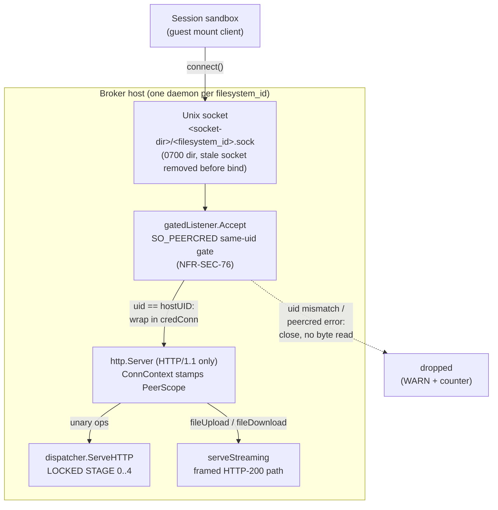
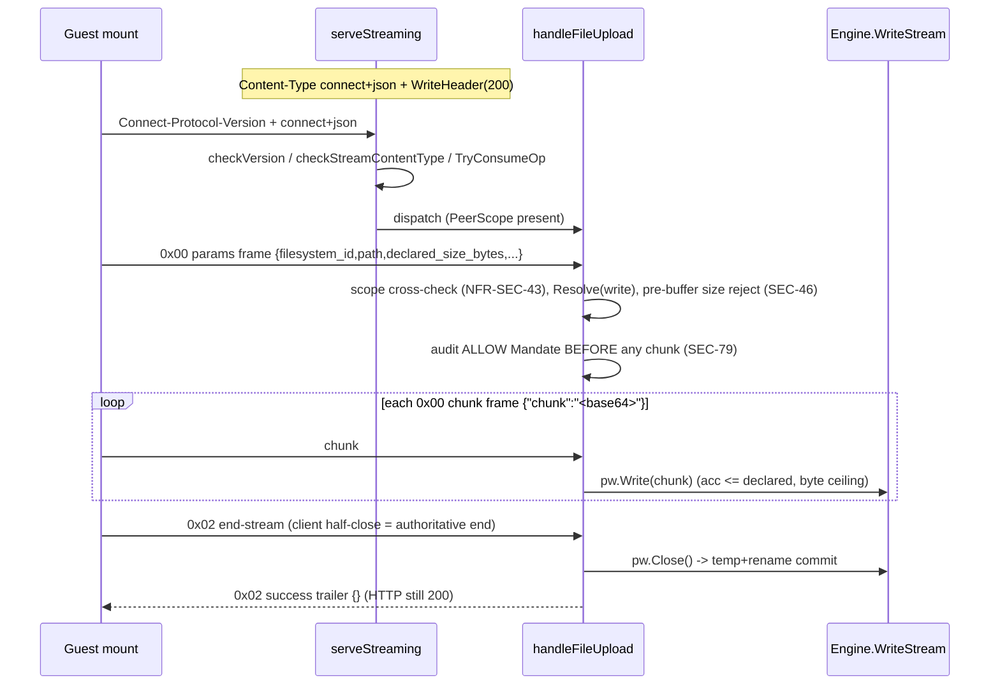

# South-face transport and wire surface

This document is the architecture/implementation layer for the broker's
**south face** — the face that terminates the file-operation RPC coming from a
session sandbox (the guest mount). It describes *how the transport is built and
why*. For *how to operate it* see the operator docs and cross-links at the end:
[operations](../operations.md), [engines](../engines.md),
[configuration](../configuration.md), [testing](../testing.md).

Every claim below is grounded in the current source under
`internal/southface/`. File and function references are given inline as
`file:func` so the design and the code stay verifiable against each other. The
broker is component-04 of the system architecture; the NFR rows the design
satisfies are cited where relevant.

---

## 1. Transport at a glance

The south face speaks **Connect-JSON over HTTP/1.1 on a per-session Unix-domain
socket**. There is exactly **one socket per `filesystem_id`**, and a single
daemon process serves a single scope on that socket.

The wire surface is the file-ops contract from the architecture repo: operation
names and the authorization axes are pinned there; per-operation bodies marked
TBD stay TBD (this package never invents a body). The *transport and message-set
encoding* are component-spec choices, not contract — and this concrete shape
(Connect-JSON / HTTP/1.1 / per-session Unix socket / the 5-byte stream frame)
has been escalated to canon as the proven pin, so the implementation and the
specification now agree on the wire.

Three properties hold for every request, with no exceptions:

1. **Channel-derived identity is authoritative.** The session's
   `filesystem_id` and intent grant are bound to the socket at provision time
   and stamped into the request context by the kernel-attested peer
   credentials. Any `filesystem_id` in a request body is an *untrusted hint*,
   cross-checked against the channel scope before any handler runs
   (NFR-SEC-43).
2. **Non-host peers are dropped before a single byte is read.** The accept gate
   reads the kernel-attested peer uid and closes any connection whose uid is
   not the broker's own, with no HTTP parse on the rejected socket
   (NFR-SEC-76).
3. **Audit precedes acknowledgement.** Every file activity is mandated to the
   audit gate before any success is written; an audit-write failure denies the
   operation, fail-closed (NFR-SEC-79). (The audit pipeline itself is out of
   scope for this transport document; the transport's contribution is the
   ordering — audit-before-ack — and the framed verdict that carries an
   audit-down result back to the caller.)



---

## 2. One socket per scope, one daemon per scope

A session's socket path is derived purely from its scope. `session.go:
socketPathForScope` joins the host-owned socket directory with
`<filesystem_id>.sock`. The scope is treated as a single filename component and
is refused if it could escape the directory: an empty scope, the exact `.` or
`..` components, or any scope carrying a path separator fails loud with
`errBadScopeName`. A scope that merely *embeds* `..` as a substring (for example
`tenant..eu`) is legitimate — with no separator it still joins to a single child
filename and cannot traverse upward.

`session.go:provisionSession` builds the per-session server:

- It ensures the socket directory exists at mode `0700` with an explicit
  `os.Chmod` after `os.MkdirAll`, so the host-owned mode is pinned regardless of
  the process umask.
- It removes any stale socket left by a crashed predecessor before binding, so a
  restart never fails to bind on a leftover socket file.
- It binds the scope into the in-process `SessionRegistry` keyed by the socket
  path, *before* the socket serves. A duplicate provision for the same socket
  path refuses with `ErrSessionExists` — a live channel is never silently
  rebound to a different scope.

The `SessionRegistry` (`session.go`) is the socket-path → scope-binding map. The
control plane provisions a binding before the socket serves; the listener reads
it once per accepted connection; `Release` removes it at teardown. The binding
(`SessionEntry`) carries the host-attested `FilesystemID` and the exhaustive
`GrantedIntents` set for the session.

Because one daemon serves exactly one scope on exactly one socket, there is no
in-process multiplexing of scopes and no shared socket across tenants. This is
the transport-level realization of per-tenant instantiation: one broker
principal per tenant filesystem scope.

---

## 3. The SO_PEERCRED same-uid accept gate (NFR-SEC-76)

The accept gate is `listener.go:gatedListener`, a `net.Listener` wrapper whose
`Accept` loop is the **one and only** place a connection's identity is
established. The flow per accepted connection:

1. `g.inner.Accept()` returns a raw connection. On a *temporary* accept error
   (`EMFILE`, `ENFILE`, `ECONNABORTED` — see `listener.go:isTemporaryAcceptErr`)
   the loop applies a capped exponential backoff
   (`acceptBackoffInitial` 5 ms .. `acceptBackoffCap` 1 s) and retries, rather
   than returning the error to `http.Server`, which would shut the server down
   under transient fd exhaustion. A successful accept resets the backoff.
2. `g.checkPeer(conn)` extracts the kernel-attested peer uid/pid. On Linux this
   is `peercred_linux.go:extractPeerCred`, which reads `SO_PEERCRED` via
   `syscall.GetsockoptUcred` on the socket fd. These credentials are supplied by
   the kernel at connect time, not by the peer, so they cannot be forged across
   the socket. (On darwin, `peercred_darwin.go:extractPeerCred` is a loud-skip
   stub returning `errPeerCredUnsupported`; Linux is the enforcement target and
   the Linux-gated tests skip elsewhere. The composition layer obtains the real
   checker from `serve.go:HostPeerChecker`; the gate is never reimplemented
   outside this package.)
3. If extraction fails, the gate fires the `onPeerDrop` callback with reason
   `"peercred_error"` and **closes the connection without reading a byte**.
4. If `uid != g.hostUID`, the gate fires `onPeerDrop` with reason
   `"uid_mismatch"` and **closes the connection without reading a byte**.
5. Only a connection whose uid matches the broker's host uid is admitted. It is
   wrapped in `listener.go:credConn` carrying the attested `(uid, pid)`, and the
   `onPeerAccept` callback fires.

The drop happens strictly before any HTTP parse: no header, no body, no route is
read off a rejected socket. This is the literal realization of "non-host peers
dropped before any frame is parsed" (NFR-SEC-76). The drop callback logs a WARN
with the reason, uid, and pid (`session.go:provisionSession` wires it via the
`observ` key constants) and increments a telemetry counter through the
`OnPeerDropped` composition hook; admitted connections increment a counter
through `OnPeerAccepted`. `southface` itself does not import the telemetry
package — the counters are injected callbacks (`serve.go:Config`).

### The gate is the single identity-extraction point

`credConn` is the carrier that lets the attested `(uid, pid)` survive from the
accept loop into `http.Server`'s `ConnContext` without a second extraction. In
`session.go:provisionSession`, `ConnContext` type-asserts the connection back to
`*credConn`:

- If the assertion fails, the connection did **not** come through the gate — a
  wiring fault. `ConnContext` carries no scope, and the dispatch spine fails
  closed (an audit actor must never default to uid 0).
- If the registry lookup for the socket path fails (the binding was released
  mid-flight), it again carries no scope and the spine fails closed.
- Otherwise it stamps a `listener.go:PeerScope` into the request context: the
  channel-bound `FilesystemID` and `GrantedIntents` from the registry, plus the
  gate-attested `UID`/`PID`. Every handler — and every audit record's actor —
  reads identity from this context via `listener.go:peerScopeFromContext`, never
  from a request field. The key is an unexported type
  (`listener.go:peerScopeKeyType`) so the value is unreachable from any other
  package.

---

## 4. The HTTP server: HTTP/1.1, timeouts, graceful drain

The per-session `http.Server` is built in `session.go:provisionSession`:

- **HTTP/1.1 only.** `srv.Protocols` is deliberately left unset; the south face
  does not negotiate HTTP/2. (Comment in source: "HTTP/1.1 only — do NOT set
  srv.Protocols.")
- **`ReadHeaderTimeout` = 10 s** bounds a peer that connects and never finishes
  its request headers (NFR-SEC-46). It also re-arms the connection deadline per
  request, so a handler-set body deadline (see the streaming per-frame deadline
  in §6) never poisons the next request on a keep-alive connection.
- **`IdleTimeout` = 2 min** reaps idle keep-alive connections.
- **`ReadTimeout` is intentionally unset** — a fixed whole-request read timeout
  would cap a legitimate chunked upload. Stalled bodies are covered instead by
  the per-frame read deadline inside the streaming handler (§6).
- `ErrorLog` routes the server's internal error log into the structured JSON
  stream via `observ.ErrorLog`.

`session.go:Serve` runs `srv.Serve(listener)` and collapses
`http.ErrServerClosed` to `nil` so a clean shutdown is not an error.

`session.go:Close` performs a **bounded** graceful drain: in-flight operations
get up to `shutdownDrainTimeout` (25 s) to finish, after which stragglers are
force-closed (`srv.Close()`); both errors surface via `errors.Join`. It then
releases the scope binding and unlinks the socket. The bound is deliberately
under typical service-manager stop grace (30 s) so the drain, the force-close,
*and* the caller's erase-before-reuse teardown (NFR-SEC-54, which runs after
`Close` returns) all fit before a SIGKILL. A wedged peer can never hold the
session open indefinitely.

The exported constructor is `serve.go:Serve(Config) (Server, error)`. It
validates wiring fail-loud — a positive whole-object ceiling
(`ErrBrokerMaxFileSizeUnset`) and non-nil seams (`ErrSeamMissing`) — builds the
dispatcher over the injected seams, sets the whole-object upload ceiling from
`Config.BrokerMaxFileSize` (the only place the dispatcher's `maxFileSize` is set
from a flag, distinct from the per-message `SizeCeiling`), and provisions the
session. `Server` is the frozen seam (`southface.go`): `Serve()` / `Close()`.

---

## 5. The wire surface: 16 unary + 2 streaming operations

The routable operation set is the 18-member `Op` enum in `southface.go`,
mirroring the file-ops contract enum. The closed set is also pinned in
`envelope.go:knownOps`; adding an op is a contract change in the architecture
repo first.

All operations target a Connect-style route: `envelope.go:servicePrefix` +
`<op>`, i.e. `/ocu.filestore.v1alpha.FilesystemService/<op>`. Routing is
`envelope.go:parseRoute`: a non-POST is `405 Method Not Allowed` (with an
`Allow: POST` header); a path outside the prefix or naming an unknown op is
`invalid_argument`.

### 5.1 The 16 unary operations (`application/json` POST)

Sixteen of the eighteen ops are unary: a single JSON request body in, a single
JSON response body out. They are everything except `fileUpload` and
`fileDownload`:

`listDirectory`, `makeDirectory`, `moveDirectory`, `removeDirectory`,
`createFile`, `readFile`, `readMetadata`, `getFileMetadata`, `listFiles`,
`copyFile`, `moveFile`, `removeFile`, `importFiles`, `importZip`,
`migrateFilesystem`, `removeFilesystem`.

Per-operation request/response bodies are declared in `ops_bodies.go`. Each
handler strict-decodes its *whole* op body (`DisallowUnknownFields`) so an
unexpected field rejects. Notable shapes:

- `listDirectory` is the only request with pagination (`limit`/`cursor`/
  `recursive`, accept-when-present with safe defaults). Its response is the only
  non-trivial body: an `entries` union (each entry is exactly one of `file` or
  `directory`, `omitempty` dropping the unset branch) plus an opaque keyset
  `cursor` (empty on the last page).
- The six namespace/file mutation ops (`make`/`move`/`removeDirectory`,
  `copy`/`move`/`removeFile`) return the **bare ack** `{}` (`ackResponse`).
- `readFile` returns *metadata only* (`path/size/mtime/mime/uuid`); it carries
  **no** content field. Bulk bytes are `fileDownload`'s job. Its `range` is a
  half-open `[offset, offset+length)` window; an absent range is a full read.
- The read-time `authorization_metadata.downloadable` flag is **never trusted**
  on a read op — the broker re-derives `downloadable` from its own resolved
  grant (NFR-SEC-73). It is never stamped at write.

The unary content-type is hard-equality `application/json`
(`envelope.go:checkContentType`, charset parameter tolerated). The spine's
routing view of the body is `envelope.go:unaryEnvelope`
(`filesystem_id`, `path`, `authorization_metadata`).

### 5.2 The 2 streaming operations (`application/connect+json`)

Two ops are streamed because their payload is bulk object bytes that must not be
whole-buffered:

- **`fileUpload`** — a **client-stream**: the guest sends one params frame then
  a sequence of chunk frames, half-closing to signal end.
- **`fileDownload`** — a **server-stream**: the guest sends one params frame, the
  broker streams content frames back then a terminal trailer.

`stream.go:isStreamingOp` flags these by op (it is *not* a content-type sniff).
The streaming content-type is `application/connect+json`
(`stream.go:connContentTypeStream`, charset tolerated). The unary content-type
check would reject the stream at the door, so the streaming path uses
`stream.go:checkStreamContentType` instead.

---

## 6. The 5-byte stream frame envelope

Both streaming ops frame their wire bytes with one codec (`stream.go`),
byte-identical to the guest framer it interoperates with:

```
 byte 0      bytes 1..4               bytes 5..             
+---------+--------------------------+----------------------+
|  flag   |  payload length (uint32  |  payload             |
|  (1 B)  |  big-endian)             |  (compact JSON)      |
+---------+--------------------------+----------------------+
```

- `frameHeaderLen` = **5** bytes: a 1-byte flag plus a 4-byte big-endian
  `uint32` length.
- `dataFlag` = **0x00**: a data frame (upload params/chunk; download content).
- `endStreamFlag` = **0x02**: the terminal end-stream frame carrying the
  verdict.
- The payload is **compact JSON**.

`stream.go:writeFrame` writes the header then the payload (a zero-length payload
writes only the header). `stream.go:readFrame` reads the 5-byte header, then —
**before allocating any payload buffer** — checks the declared length against
`maxInboundFrame` (4 MiB). A header whose length exceeds the cap returns
`errFrameTooLarge`, mapped to a `resource_exhausted` transport reject; this is
distinct from the *policy* size deny (`invalid_argument`/`size_exceeded`) applied
to `declared_size_bytes`. The early cap means a corrupt or desynced length field
can never drive a multi-GiB allocation. A short header or short payload returns
the `io.ReadFull` error (`io.EOF`/`io.ErrUnexpectedEOF`), which the handler
treats as a hard abort — a malformed frame is **never** skipped.

### Streams are always HTTP 200; the verdict rides the 0x02 trailer

This is the load-bearing transport rule for streaming. Once the streaming
STAGE-0 gate clears, `stream.go:serveStreaming` commits `Content-Type:
application/connect+json` and `WriteHeader(200)` *before the first frame*. From
that point **every** verdict — success or any refusal — is emitted as a framed
end-stream (0x02) trailer, never a unary HTTP error body. This is what lets the
guest's trailer-authoritative retry logic see the verdict in one place.

`stream.go:writeEndStream` writes the trailer:

- **Success**: a 0x02 frame with the literal body `{}`. The golden bytes are
  `02000000027b7d` (flag `02`, length `00000002`, body `7b7d` = `{}`), pinned
  byte-for-byte in `stream_test.go:TestEndStreamGolden`.
- **Error**: a 0x02 frame whose body marshals
  `{"error":{"code":...,"message":...}}` (`stream.go:endStreamResponse` /
  `connectError`). If the marshal somehow failed it falls back to a minimal
  `internal` error trailer rather than an empty success frame — fail-closed.

The codec golden frames are pinned in `stream_test.go`: the params and chunk
data-frame headers (`TestFrameGolden`), the full chunk frame
`00000000187b226368756e6b223a2251554a44524556475230673d227d` for chunk
`"ABCDEFGH"` (`TestFrameGoldenChunkExact` — the broker's `[]byte` base64 marshal
round-trips byte-identically to the guest framer), and both success and error
trailers.

### The one pre-frame exception

There is exactly one streaming fault that cannot be framed: a missing
`PeerScope` on the connection (a wiring fault — the gate never ran, or the
binding vanished). With no channel scope there is no session to frame against, so
`serveStreaming` writes a single unary `internal` error and returns. Every
*other* refusal — bad version header, wrong content-type, rate-throttle, and all
per-op denies — is a framed 0x02 trailer.



---

## 7. Streaming STAGE-0 and the handler contracts

`stream.go:serveStreaming` runs the streaming STAGE-0 gate. It mirrors the unary
STAGE-0 but differs in three deliberate ways:

1. it admits `application/connect+json`, not `application/json`;
2. it does **not** apply the unary `Content-Length` pre-buffer reject (a chunked
   body has no fixed length — size policy moves to `declared_size_bytes` after
   the params frame);
3. the ops/s throttle is keyed on the **channel** scope (`PeerScope`), never on
   any body field.

Per-session ceilings (ops/s, in-flight bytes, fd) are obtained via
`d.ceilings.Session(ps.FilesystemID)` and throttle fail-closed per session, not
broker-wide (NFR-SEC-46). The throttle/header denies before the handler record
`ops_total` directly, mirroring the unary deny choke point.

### `fileUpload` (`stream_handler.go:handleFileUpload`)

The contract, every clause load-bearing:

- Read **exactly one** params frame first (`readParamsFrame`); a read error or a
  leading 0x02 frame is a hard abort. Strict-decode the params
  (`uploadParamsFrame`).
- `declared_size_bytes` is **required**: `<= 0` denies `invalid_argument`, no
  escape hatch.
- Cross-check the decoded `filesystem_id` against the channel scope; key
  everything on the channel, never the params value (NFR-SEC-43). A mismatch is
  `permission_denied`.
- `Resolve(intent=write)` from the channel scope; map resolver errors.
- **Pre-buffer size reject** (NFR-SEC-46): `checkDeclaredSize(declared,
  maxFileSize)` *before* reading any chunk — zero chunk bytes are read on
  reject. The comparison is a single overflow-safe `>` (strict; a declaration
  exactly at the ceiling is admitted).
- **Audit ALLOW before any chunk** (audit-before-ack, NFR-SEC-79); an audit-down
  error denies before any chunk.
- Reassemble via a single `io.Pipe` → `engine.WriteStream(overwrite=
  params.OverwriteExisting)`. `overwrite_existing` defaults to false when absent.
- Size enforcement is two-directional: over-declaration (`acc > declared`)
  aborts at the ceiling; under-declaration (`acc != declared` at half-close)
  also aborts — both `size_exceeded`, staging nothing.
- The **client half-close** (a 0x02 frame) is the authoritative end of stream;
  the contract-named `numChunks` member is accepted-but-unread
  (`ops_bodies.go:uploadChunkFrame`) because the shipped guest framer does not
  send it and `declared_size_bytes` is the size authority.
- **Every** reject writes the 0x02 trailer *before* `pw.CloseWithError`/return.
  Crucially, the engine pipe is closed with a non-EOF sentinel
  (`stream.go:errStreamAborted`) on abort, never the raw `io.EOF` — `io.Copy`
  inside `WriteStream` treats a pipe read returning `io.EOF` as a clean
  end-of-stream and would commit the partial bytes, so the sentinel forces
  `WriteStream` to fail and discard the temp (abort-discards-nothing).

A per-frame read deadline (`d.frameReadTimeout`) is re-armed before *every* frame
read via `http.NewResponseController`, so a stalled peer's next read errors and
aborts through the hard-abort path instead of pinning a goroutine, an fd slot,
and acquired bytes forever (NFR-SEC-46). Chunk frames are strict-decoded
(`stream_handler.go:decodeChunkFrame`): unknown fields, trailing values, and an
absent/null `chunk` member all reject; a present empty `{"chunk":""}` is a legal
0-byte chunk.

### `fileDownload` (`stream_handler.go:handleFileDownload`)

- Read exactly one 0x00 params frame; strict-decode `fileDownloadRequest`.
- Cross-check `filesystem_id` against the channel scope.
- Resolve `uuid` → `(scope, path)` from the session-scoped object-id store. The
  `uuid` is a broker-minted handle from this session's listing/readFile emitter.
  An unknown uuid is `not_found`. A **cross-scope** uuid (stored scope ≠ channel
  scope) audits as `scope_mismatch` truth but **degrades to `not_found` on the
  wire** — a valid uuid from another session cannot be used to enumerate scope
  membership (anti-enumeration).
- `Resolve(intent=read)` from the channel scope.
- **Downloadable resolved at read, broker-side** (NFR-SEC-73): the wire flag is
  never consulted; a non-downloadable grant denies `permission_denied`.
- For a whole-object read (nil `range`), the object size is resolved by a `Stat`
  *before* the ALLOW Mandate, so a vanished object records one deny, not an
  allow-then-deny pair. A `range` length of `0` is an **empty** window (zero
  bytes), never read-to-EOF.
- **Audit ALLOW before the first data frame** (NFR-SEC-79).
- Stream bytes via `engine.ReadRange` in `downloadChunkSize` (256 KiB) chunks,
  each a 0x00 data frame `{"data":"<base64>"}` (`downloadDataFrame`). Finish with
  a 0x02 success trailer; a mid-stream engine fault terminates with a 0x02 error
  trailer. The stream is always HTTP 200.

Both streaming handlers run their engine I/O in a goroutine behind an `io.Pipe`
with panic containment (`panic_recovery.go`): a panic in `WriteStream`/
`ReadRange` is recovered into `errInternalPanic`, the pipe is closed to unblock
the peer, and the handler still emits a framed trailer — the engine's temp+rename
atomicity guarantees no torn object becomes visible.

---

## 8. The untrusted body `filesystem_id` (NFR-SEC-43)

The single most important authorization property of this transport is that the
`filesystem_id` carried in a request body is an **untrusted hint**. The
authoritative scope is the channel-derived `PeerScope.FilesystemID`, bound to the
socket at provision time and stamped by the kernel-attested gate.

On the **unary** path (`dispatch.go:ServeHTTP`, STAGE 1b) the decoded body's
`filesystem_id` is cross-checked against the channel scope after STAGE-0 and
before authz; the throttle in STAGE 0 is already keyed on the channel scope, so
nothing trusts the body before the cross-check. On the **streaming** path the
cross-check is the first thing each handler does after decoding its params frame
(`stream_handler.go`: "key on the channel, never the body").

Likewise the route op is the authoritative statement of what a request does. The
wire `authorization_metadata.intent` is an untrusted hint; the spine derives the
required intent from the closed `envelope.go:opRequiredIntent` map and refuses
any wire intent that disagrees (NFR-SEC-49). A session granted only `read` can
never reach a mutating handler by declaring `intent=read` on a mutation route.
`preview` is the north-face render axis and is never a legal south-face wire
intent.

---

## 9. The Connect protocol version header

`Connect-Protocol-Version: 1` is **required** on every request and its only
legal value is `"1"` (`envelope.go:connectProtocolVersionHeader` /
`connectProtocolVersion`). An absent or wrong value is `invalid_argument` before
the body is parsed — `envelope.go:checkVersion`, enforced in unary STAGE 0
(`dispatch.go:ServeHTTP`) and in the streaming STAGE-0 gate
(`stream.go:serveStreaming`).

---

## 10. Error mapping summary

Unary refusals flow through one deny mapper (`deny.go`): a `DenyVerdict` carries
the audit reason (the durable truth), the Connect `WireCode`, and the derived
HTTP status. The `x-deny-reason` header is gated to authorization verdicts only
(`permission_denied`/`unauthenticated`), pinned in
`golden_test.go:TestGoldenErrorBodyShape`. A unary error body is
`application/json {code, message}`.

Streaming refusals carry the *same* wire codes but in the 0x02 trailer body
rather than an HTTP status. The audited deny class is always the truth; where the
wire verdict degrades for anti-enumeration (cross-scope `uuid` → `not_found`) or
for audit-down (any deny whose deny-Mandate itself fails → `unavailable`), the
metric records the same truth the audit record does.

| Condition | Audit truth (deny class) | Wire code | Transport surface |
| --- | --- | --- | --- |
| Bad/missing `Connect-Protocol-Version` | `malformed` | `invalid_argument` | unary body / 0x02 trailer |
| Wrong content-type | `malformed` | `invalid_argument` | unary body / 0x02 trailer |
| Body scope ≠ channel scope | `scope_mismatch` | `permission_denied` | unary body / 0x02 trailer |
| Wire intent ≠ route op intent | `malformed` | `invalid_argument` | unary body |
| Declared size > whole-object ceiling | `size_exceeded` | `invalid_argument` | 0x02 trailer (upload) |
| Frame length > 4 MiB transport cap | `throttle` | `resource_exhausted` | 0x02 trailer |
| Per-session rate / fd / byte ceiling | `throttle` | `resource_exhausted` | unary body / 0x02 trailer |
| Non-downloadable grant at read | `not_downloadable` | `permission_denied` | 0x02 trailer (download) |
| Cross-scope `uuid` | `scope_mismatch` | `not_found` (degraded) | 0x02 trailer (download) |
| Audit-Mandate failure | `audit_down` | `unavailable` | unary body / 0x02 trailer |

---

## 11. Cross-references

- **Operating the daemon** (socket directory, host uid, service-manager
  integration, ceilings configuration): [operations](../operations.md),
  [configuration](../configuration.md).
- **Storage engines** behind `WriteStream`/`ReadRange`/`Stat`:
  [engines](../engines.md).
- **Verification methods** (golden frame fixtures, property tests on path
  resolution and the authz resolver, live e2e over a real socket):
  [testing](../testing.md).
- **Source of truth** for operation names, authorization axes, and the response
  envelope: the file-ops contracts in the architecture repo; the broker's
  component spec is component-04.

Maintainer contact: developer@widemoat.ai
