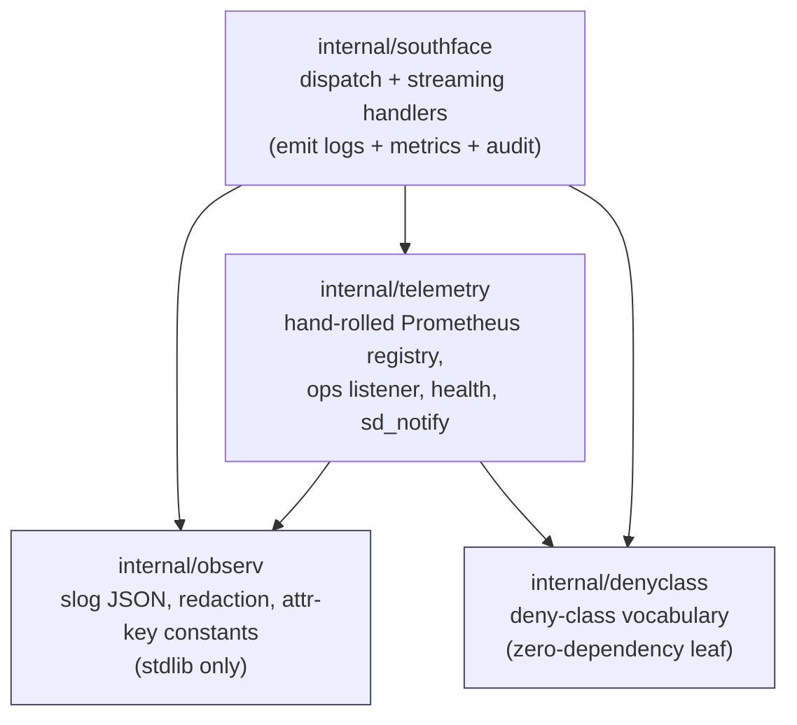
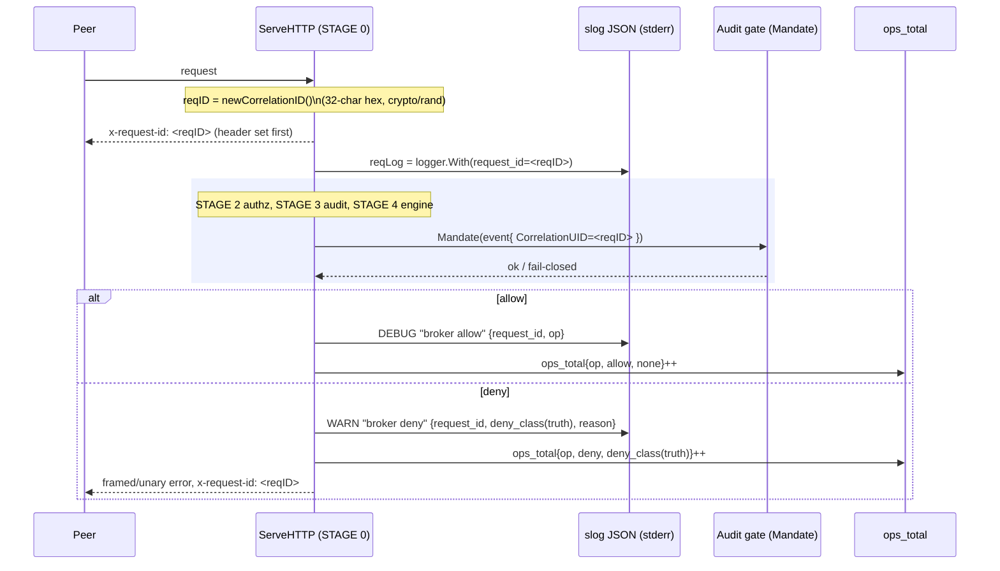

# Observability — logging, metrics, health, correlation

This document is the **design and implementation** reference for the broker's
observability surface: how the structured log stream, the metrics registry, the
health probes, and the per-request correlation id are built, why they are built
that way, and where in the source each behaviour lives. It is the architecture
layer; the **operator** layer — how to scrape `/metrics`, wire Kubernetes
probes, recover the audit latch, configure `sd_notify` — lives in
[docs/operations.md](../operations.md) (see *Health and metrics endpoints*,
*sd_notify integration*, *Structured logging*, and *Audit-latch recovery
runbook*). This file does not repeat operator procedures; it explains the
machinery they drive.

The broker is component-04 of the architecture. The observability design
satisfies the audit-fail-closed posture of **NFR-SEC-79** (the audit latch is
made observable without weakening it), keeps the metrics endpoint unauthenticated
yet safe via loopback-only binding, and never lets a credential, payload byte,
or workspace path leak into a log line or a metric label.

Three packages own the surface, layered to stay import-cycle-free:

`internal/observ` imports stdlib only and **must not** import any `internal/*`
package, so southface, telemetry, and the command layer can all depend on it
without a cycle (`internal/observ/logger.go`, package doc). `internal/telemetry`
is a leaf that depends only on `observ` and `denyclass`; it deliberately does
**not** import `southface` (which depends on it), and the op-name label enum is
a hand-kept mirror precisely to avoid that cycle (see
[Closed label enums](#closed-label-enums)).

---

## Logging

### Structured slog JSON

The broker logs structured JSON. `observ.NewLogger(w, level)` wraps
`slog.NewJSONHandler` so every record is a valid JSON object carrying the
standard `time`/`level`/`msg` keys plus whatever attributes the call site
attaches (`internal/observ/logger.go:NewLogger`). The destination writer is
the daemon's standard error; the operator runbook documents the stream's
destination and level flag (see operations.md *Structured logging*).

Log levels are parsed from four lowercase tokens — `debug`, `info`, `warn`,
`error` — by `observ.ParseLevel`. Any other input (including the empty string
and the uppercase forms) returns a typed error wrapping the offending token,
and this check runs during flag validation **before any socket is bound**
(`internal/observ/logger.go:ParseLevel`). The command layer matches that error
without importing the unexported sentinel via `observ.IsBadLogLevel`.

The HTTP servers (the loopback ops listener, and the south-face server in the
composition layer) route their internal `log.Print` chatter into the same JSON
stream through `observ.ErrorLog`, which bridges a `*log.Logger` onto the slog
handler at **WARN** (`internal/observ/logger.go:ErrorLog`). The level choice is
deliberate: the Go HTTP server emits `log.Print` for benign, recoverable
conditions (peer connection resets, superfluous `WriteHeader` calls, request-line
read timeouts) mixed with genuine faults, and gives no way to tell them apart at
that seam. Classifying all of it as ERROR would inflate the error rate and risk
false pages, so it lands at WARN; real broker faults are logged at ERROR by the
broker's own call sites.

### Reserved attribute keys

Every structured attribute is emitted under a constant from
`internal/observ/logger.go` — never a raw string literal — so key names stay
stable across refactors and the request-id threading is uniform across call
sites:

| Constant | JSON key | Meaning |
|----------|----------|---------|
| `KeyRequestID` | `request_id` | Per-request correlation id, set by dispatch at STAGE 0 |
| `KeyDenyClass` | `deny_class` | Broker-resolved deny truth on a deny WARN |
| `KeyPeerUID` | `peer_uid` | Kernel-attested peer uid at the accept gate |
| `KeyPeerPID` | `peer_pid` | Kernel-attested peer pid at the accept gate |
| `KeyScope` | `filesystem_id` | Session scope identifier |
| `KeyOp` | `op` | Broker operation name |
| `KeyReason` | `reason` | Human-readable, non-secret reason string |

### The redaction rule

No log line at any level may carry a credential value or a payload byte, and
a file path may appear **only** when the destination logger is enabled at DEBUG.
The rule is enforced two ways (`internal/observ/redact.go`):

**Credentials and payload bytes — enforced by absence.** The `observ` package
provides *no* helper that accepts a credential value or a raw payload `[]byte`.
The absence of such a helper is the enforcement: there is no sanctioned way to
hand a secret or a body slice to the logger. A call site that needs to record
"a credential was used" logs the credential kind or source, never the value.
This makes the JSON stream safe to forward to any log aggregator without a
secondary scrubbing pass.

**Paths — gated by the logger's own enablement.** The sole sanctioned
path-logging seam is `observ.PathAttr(ctx, l, key, path)`. It derives the
redaction decision from the destination logger itself, not from a
caller-supplied level argument:

- if `l.Handler().Enabled(ctx, slog.LevelDebug)` is true, the real path value
  is included;
- otherwise the attribute value is the fixed placeholder `[path-elided]`.

Because the gate reads the logger's own enablement, the placeholder choice can
never disagree with the level the record is actually emitted at: a path can be
surfaced only by logging through a handler enabled at DEBUG. A caller cannot
leak a path by mismatching a level argument, because there is no level argument
to mismatch. A path is gated rather than always-redacted because a path may
carry workspace structure an external aggregator should not receive; operators
debugging locally at DEBUG can still see it.

### Where deny and allow lines are emitted

The south face is the only producer of operation log lines. The single unary
deny choke point is `dispatcher.denyWith` / `denyWithLog`
(`internal/southface/dispatch.go`): both emit a WARN `"broker deny"` carrying
`deny_class` set to the broker-resolved `AuditReason` **truth** — never the
possibly-degraded wire reason — plus the non-secret `reason`. Operators see the
real reason even when the wire code degrades it for anti-enumeration. The
request-scoped variant `denyWithLog` is used everywhere a request id is in hand,
so deny lines correlate end-to-end (see [Correlation](#correlation)).

On the allow path, after STAGE 3 (audit) clears, dispatch emits a single
**DEBUG** `"broker allow"` line carrying `op`
(`internal/southface/dispatch.go:ServeHTTP`). It is DEBUG, not INFO, so a
successfully-mandated request does not add an info-level line per request; the
deny path is already covered by the WARN above.

The streaming handlers mirror this exactly. `denyTrailer` (upload) and
`denyDownloadTrailer` (download) each emit the same WARN `"broker deny"` with
`deny_class` + `reason` before framing the verdict
(`internal/southface/stream_handler.go`). A download engine fault additionally
logs an ERROR `"download engine fault"` carrying the error string (never a
payload byte) before terminating the stream.

---

## Metrics

### A hand-rolled Prometheus exposition

The metrics subsystem is a from-scratch Prometheus text-format implementation
in `internal/telemetry` — **zero new dependencies**, stdlib plus the
stdlib-only `observ`. It is small on purpose: the minimal-shelf build admits no
external metrics client. The pieces are:

- a concurrency-safe `Registry` of metric families with closed label-set
  validation (`internal/telemetry/registry.go`);
- `Counter`, `Gauge`, and `Histogram` types, each guarded by a `sync.Mutex`
  over a per-label-combination cell map;
- a `WriteTo(io.Writer)` renderer that emits Prometheus text format 0.0.4
  (`internal/telemetry/expo.go`).

`Registry.WriteTo` satisfies `io.WriterTo` including its error contract: on a
partial or aborted write it returns the bytes written so far and the first
non-nil write error, and stops emitting further families. It copies the family
slice under a read lock and then holds only per-family locks, so a scrape never
blocks a recording goroutine for long. Registration is **startup-only**: all
families are created before any goroutine records; the registry is read-only
thereafter (`internal/telemetry/registry.go`, `Registry` doc).

Histogram buckets are stored cumulatively at observe time —
`Histogram.Observe` increments every bucket whose upper bound is `>=` the value
— so `writeHistogram` emits each `le=<bound>` line directly without re-summing,
and the `+Inf` bucket equals the total count
(`internal/telemetry/registry.go:Observe`, `internal/telemetry/expo.go:writeHistogram`).
Output is deterministic: label keys are sorted, and cell keys are sorted, on
every render.

### The metric set

`telemetry.NewBrokerMetrics(version)` creates and registers the full set
(`internal/telemetry/metrics.go`):

| Metric | Type | Labels | Meaning |
|--------|------|--------|---------|
| `ops_total` | counter | `op`, `outcome`, `deny_class` | Every file operation dispatched, by op, allow/deny, and deny class |
| `stage_latency_seconds` | histogram | `stage` | Latency of the three locked dispatch stages |
| `peer_accepted_total` | counter | — | Connections admitted at the peer-cred accept gate |
| `peer_dropped_total` | counter | — | Connections rejected at the peer-cred accept gate |
| `ceilings_in_flight_bytes` | gauge | — | Current in-flight bytes for the active session |
| `ceilings_fd_in_use` | gauge | — | Current open file-descriptor count for the active session |
| `ceilings_ops_tokens` | gauge | — | Current ops/s token-bucket level for the active session |
| `audit_sink_latched` | gauge | — | `1` when the fail-closed audit sink has latched, `0` when healthy |
| `build_info` | gauge | `version` | Always `1`; carries the daemon build version |

`stage_latency_seconds` buckets are `1ms, 5ms, 10ms, 50ms, 100ms, 500ms, 1s,
5s, 10s` (`internal/telemetry/metrics.go:stageLatencyBuckets`). The three stage
labels are `authz`, `audit_mandate`, `engine` — the three timed locked stages
of dispatch.

The ceilings gauges are **unlabeled by design**: this single-tenant
`trusted_operator` shelf serves one session at a time, and labeling the gauges
by filesystem-id would introduce an unbounded-cardinality, PII-ish uuid label
(`internal/telemetry/metrics.go:NewBrokerMetrics`). The composition layer flips
them via `SetCeilings`.

### Closed label enums

The hand-rolled registry enforces **closed** label enums: every label key has a
fixed allowed value set, and `validateLabels` *panics* on a missing key, an
extra key, or an out-of-enum value (`internal/telemetry/registry.go:validateLabels`).
A panic here is the intended behaviour — it means a wiring bug, not a runtime
condition, and the property tests catch it before release. The point of closed
enums is to make unbounded-cardinality labels structurally impossible: no
free-form string (a path, a uuid, a request id) can ever become a label value.

The label-enum *provenance* differs by axis, and the difference is load-bearing:

- **`op`** is a hand-kept mirror. `telemetry/metrics.go` declares `knownOps` as
  a const slice mirrored from the south face's `Op` constants. Telemetry cannot
  import southface (that is the cycle southface→telemetry already occupies), so
  the slice is kept in sync by a documented rule and pinned by a test
  (`TestClosedLabelAllOpsAccepted`): every mirrored name must record without
  panicking.
- **`deny_class`** is **derived, never mirrored** — single-sourced from
  `internal/denyclass`. `knownDenyClasses = denyclass.All()`
  (`internal/telemetry/metrics.go`). The same `denyclass` vocabulary that the
  south face's deny table is keyed by is exactly the label enum the counter
  accepts, so there is no second list to drift. `denyclass.All()` is the full
  deny vocabulary preceded by the `none` allow sentinel
  (`internal/denyclass/denyclass.go`), so `none` is always a valid label for an
  allow outcome and a deny class is added in exactly one place.
- **`outcome`** is the closed pair `{allow, deny}`.
- **`stage`** is the closed set `{audit_mandate, engine, authz}`.

This single-sourcing is why the recording call sites carry **no `recover()`
crutch**. Every `AuditReason` a refusal can carry is, by construction, a member
of `denyclass`, which is exactly the `deny_class` enum `RecordOp` accepts — so a
panic from `RecordOp` would be a genuine label-drift wiring bug (e.g. a new `Op`
not added to `knownOps`) and **must** surface loudly in tests rather than be
swallowed into a silently-wrong counter. The dispatch comments at each call site
state this explicitly (`internal/southface/dispatch.go`, `denyOp` / `recordAllow`
/ the STAGE-4 outcome switch).

`build_info` is the one metric with a free-form label. Its `version` value comes
from the build system, not a closed enum, so `NewBuildInfo` bypasses the normal
`NewGauge` validation and stores the cell directly; `writeBuildInfo` escapes the
value on render (`internal/telemetry/registry.go:NewBuildInfo`,
`internal/telemetry/expo.go:writeBuildInfo`). The value never originates from a
request, so there is no cardinality risk.

### Recording — unary AND streaming coverage

`ops_total` is booked exactly once per dispatched operation, on **both** the
unary and the streaming paths.

**Unary** (`internal/southface/dispatch.go:ServeHTTP`). Once the route is known,
`denyOp` wraps the deny choke point and records `ops_total{op, outcome=deny,
deny_class=AuditReason}`. Faults *before* the route is known (unknown route, bad
method) have no op and use plain `denyWith`, recording nothing. On the allow
path, the STAGE-4 outcome switch books exactly one entry, gated on the handler's
reported outcome:

- `outcome.allowed` → `recordAllow(op)` books the single `outcome=allow,
  deny_class=none`;
- a handler that refused internally and already recorded its own deny through
  `mandateDeny` books nothing further;
- a handler that wrote the wire error directly (e.g. an undecodable op body)
  books its single `outcome=deny` here (metric only, never a second wire write).

This gating fixed a real prior bug where `recordAllow` fired unconditionally and
a handler that refused internally still booked a spurious second
`outcome=allow`.

**Streaming** (`internal/southface/stream_handler.go`). The two highest-volume
data-plane ops, `fileUpload` and `fileDownload`, book their verdict through
`dispatcher.recordOp` so every upload/download deny-rate and throughput row is
visible. STREAMING STAGE-0 denies (version, content-type, throttle) record
directly in `serveStreaming` before the handler runs. Inside the handlers, every
`denyTrailer` / `denyDownloadTrailer` records the deny with the **audited truth**
as the `deny_class` — for example a cross-scope download records
`scope_mismatch` even though the wire degrades to `not_found` (anti-enumeration),
so the metric carries the same truth the audit record does. The success path
books the single `allow, none` alongside the end-stream trailer. A deny-Mandate
failure degrades the recorded class to `audit_down` so `ops_total` always matches
the wire verdict.

### Stage latency

`dispatcher.observeStage(stage, elapsed)` records into `stage_latency_seconds`,
nil-guarded so tests without a registry are unaffected
(`internal/southface/dispatch.go:observeStage`). The unary path times each
locked stage by wrapping the existing call: `authz` around `Resolver.Resolve`,
`audit_mandate` around `Guard.Mandate`, `engine` around the handler call. The
streaming handlers time the `engine` window — the reassembly→`WriteStream`
commit for upload, the `ReadRange`→last-frame window for download — and observe
it at every terminal exit (`internal/southface/stream_handler.go`). The timers
are strictly additive observation; the locked STAGE 0→4 ordering is never
reordered to accommodate them.

---

## The ops listener — loopback-only

`/metrics`, `/healthz`, and `/readyz` are all served by one
`telemetry.OpsListener` (`internal/telemetry/opslistener.go`). The defining
property is that it is **loopback-only**: `/metrics` carries no authentication,
so the loopback guard *is* the access control. Binding the ops plane to a
routable interface without authentication would be a security defect, so the
listener refuses any non-loopback bind address fail-closed
(`errOpsListenNotLoopback`).

`isLoopbackAddr` is strict:

- the `:port` form (empty host) binds all interfaces and is **refused**;
- `localhost` is an allowed alias;
- an IP literal is accepted iff `ip.IsLoopback()`;
- a hostname is resolved and **every** resolved address must be loopback — a
  hostname whose first record is loopback but which also resolves to a routable
  interface is refused, because `net.Listen` might bind an address the check
  would otherwise never inspect. Any non-loopback or unparseable record rejects
  (fail-closed).

`ValidateOpsListenAddr` runs this check at flag-validation time *without* binding
a socket; `NewOpsListener` runs it again and binds nothing on failure. The
server carries conservative timeouts (`ReadHeaderTimeout` 5s, `Read`/`Write` 10s,
`Idle` 60s) and routes its own error log through `observ.ErrorLog` at WARN.

The `/metrics` handler accepts only GET/HEAD (else 405), sets the
`text/plain; version=0.0.4` content type, and calls `Registry.WriteTo(w)`. Once
`WriteTo` writes its first byte the HTTP status and headers are committed, so a
mid-scrape failure cannot change the status; the scraper detects the truncated
body and the missing samples. Such a failure is logged at DEBUG so a flapping
scrape connection does not spam the error stream
(`internal/telemetry/opslistener.go:NewOpsListener`).

The ops listener is **fail-safe**: `Serve` swallows `http.ErrServerClosed`
(expected on `Close`) and logs-and-drops any other error — a broken metrics
endpoint does not stop the broker. The operator runbook covers binding the
endpoint, the self-probe healthcheck mode, and Kubernetes probe wiring
(operations.md *Health and metrics endpoints*).

---

## Health probes

`/healthz` and `/readyz` are registered onto the same ops listener
(`internal/telemetry/health.go`). The split is the standard liveness/readiness
distinction, and it is deliberate.

`/healthz` (liveness) returns `200 ok` whenever the process is serving — pure
liveness, **independent** of the audit latch and engine state. An orchestrator
that cannot distinguish liveness from readiness must use `/readyz` for traffic
gating: restarting on a `/healthz` that tracked readiness would pointlessly kill
a process whose audit sink has latched (the latch is a deliberate fail-closed
posture, not a crash).

`/readyz` (readiness) returns `200 ok` only when **every** registered
`ReadyProbe` returns nil; if any probe fails it returns `503` with a plain-text
body listing the **name** of each failing probe, one per line. The body carries
probe names **only** — never the probe's error message text, never a path,
payload, or credential (`internal/telemetry/health.go:readyzHandler`). A nil or
empty probe slice is vacuously ready. Both routes accept only GET/HEAD (else
405). The composition layer builds the probe slice and calls
`RegisterOpsListenerHealthHandlers` before the listener starts.

### The audit latch made observable

The audit sink is fail-closed (NFR-SEC-79): when the append-only OCSF sink can
no longer durably record an event it **latches**, and the broker thereafter
serves 100% denies because no operation may be acknowledged before its audit
record lands. The observability surface makes that latch visible three ways
without weakening it:

1. **`/readyz` goes not-ready.** The composition layer registers a readiness
   probe over the sink's latch state, so a latched sink flips `/readyz` to 503
   and orchestrators stop routing traffic to a broker that can only deny.
2. **The `audit_sink_latched` gauge.** A binary gauge — `0` healthy, `1`
   latched — flipped by `SetAuditSinkLatched` from the sink's on-latch callback
   (`internal/telemetry/metrics.go:SetAuditSinkLatched`). Scrapers can alert on
   it directly.
3. **An ERROR log line.** The composition layer logs the latch at ERROR so the
   event is in the structured stream, not only inferable from a gauge.

This is the design intent of the gauge's help text: "1 when the fail-closed
audit sink has permanently latched (broker serving 100% denies); 0 when
healthy." The operator recovery procedure is in operations.md *Audit-latch
recovery runbook*.

---

## sd_notify (systemd Type=notify)

The daemon supports `systemd` readiness/stopping notification
(`internal/telemetry/sdnotify.go`). `SdNotifyReady` sends `READY=1` and
`SdNotifyStopping` sends `STOPPING=1` to the `NOTIFY_SOCKET` unix datagram
socket. Both are **fail-soft for an optional integration**: when `NOTIFY_SOCKET`
is unset or empty (the daemon is not managed by systemd, or the integration is
off) they return nil immediately — an absent socket is not an error. A dial or
write error is returned so the caller can log it without crashing. Under
`Type=notify` the unit is considered started only after `READY=1`, which the
daemon sends once it is actually serving; the operator runbook covers the unit
configuration (operations.md *sd_notify integration*).

---

## Correlation

A single per-request correlation id ties together the structured log lines, the
durable audit record, and the wire response for one request. There is **one** id
per request, never two — the same id is the log `request_id`, the
`x-request-id` response header, and the OCSF audit `correlation_uid`.

### Minting at STAGE 0

The id is minted at the very top of dispatch, before any body byte is read
(`internal/southface/dispatch.go:ServeHTTP`, STAGE 0):

1. `newCorrelationID()` returns a 32-char lowercase hex token from 16 bytes of
   `crypto/rand`; a failing kernel CSPRNG is unrecoverable and panics
   (`internal/southface/deny.go:newCorrelationID`).
2. The id is set on the `x-request-id` response header **immediately**, before
   any `WriteHeader` path, so it appears on every response — allow and deny,
   unary and streaming (`requestIDHeader = "x-request-id"`).
3. A request-scoped child logger is derived once:
   `reqLog := d.logger.With(slog.String(observ.KeyRequestID, reqID))`. Every log
   line emitted while handling the request then carries the same `request_id`
   without each call site passing it. The `observ` doc calls this out as the
   reason child loggers are derived via `With` — the request-id "drops in
   without rewriting call sites."

The id is **high-cardinality and is never a metric label.** The
`requestIDHeader` constant doc states it must never be used as a metric label,
and the STAGE-0 comment repeats it: the id links the log lines, the audit
record, and the wire response, but the closed-enum registry would reject it as a
label anyway. This is the firewall between correlation (high-cardinality, on the
log/header/audit) and aggregation (closed-enum, on the metrics).

### Threading end-to-end

The same `reqID` reaches each surface:

- **Log** — via the request-scoped `reqLog`; deny WARN and allow DEBUG lines all
  carry `request_id`. The streaming handlers receive `reqLog` through `streamCtx`
  so their WARN/ERROR lines carry it too
  (`internal/southface/stream_handler.go:streamCtx`).
- **Audit** — the spine stamps `RequestID = reqID` on every audit event it
  builds: the unary STAGE-3 allow event and the STAGE-4 `mandateDeny` event
  (`internal/southface/dispatch.go`), and every streaming allow/deny event
  (`internal/southface/stream_handler.go`). `mapAuditEvent` then copies it into
  the OCSF record as `CorrelationUID`
  (`internal/southface/audit_event.go:mapAuditEvent`).
- **Audit wire field** — `CorrelationUID` is an append-only OCSF extension,
  serialized as `correlation_uid` and `omitempty` so a synthesised event with no
  request context (e.g. a unit test) does not alter the hash-chain input
  (`internal/auditgate/event.go`).
- **Wire response** — the `x-request-id` header, set at STAGE 0.

### The audited-truth / wire-reason split uses the same id

When a deny's audited truth and its wire-visible reason differ for
anti-enumeration (e.g. a cross-scope reference audited as `scope_mismatch` but
returned as `not_found`), the `DenyVerdict.CorrelationID` is the join between the
audit record and the degraded wire response (`internal/southface/deny.go`,
`DenyVerdict` doc). It is **not** auto-minted by the mapper; the caller sets it
to the per-request `reqID` so the audit record, the `x-request-id` header, and
the log line all share **one** id rather than two — `mapDenyDegraded` documents
this explicitly, and `dispatch.go`'s `mandateDeny` sets `v.CorrelationID = reqID`
("T2-18: one id, not two"). A reviewer joining a degraded wire response back to
its audited truth uses the `x-request-id` header value to find the
`correlation_uid` in the durable chain.

---

## Cross-references

- [docs/operations.md](../operations.md) — scraping `/metrics`, Kubernetes
  probe configuration, the self-probe healthcheck, `sd_notify` unit wiring, the
  audit-latch recovery runbook, and the structured-logging operator notes.
- [docs/configuration.md](../configuration.md) — the flag/env surface, including
  the ops-listen bind address and the log-level flag this document's machinery
  consumes.
- [docs/engines.md](../engines.md) — engine selection (the `engine` stage timed
  by `stage_latency_seconds`).

For questions or issues: developer@widemoat.ai
