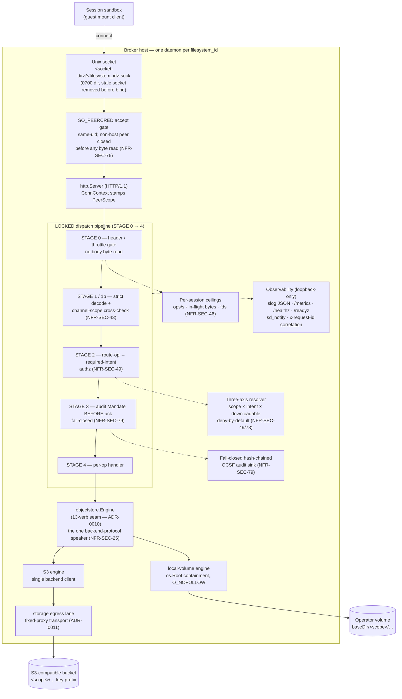

# Architecture — the ocu-filestore storage broker

This is the top-level architecture and implementation reference for
`ocu-filestored`, the storage broker. It is the **design layer**: *how the
broker is built and why*. The operator layer — *how to run it* — lives in the
sibling documents under `docs/` and is cross-linked here rather than repeated.

The broker is **component-04** of the Open Computer Use architecture. The
architecture and specifications are the source of truth and live in the
architecture repo; this repo implements them. The per-area documents below are
grounded in the current source under `internal/` and `cmd/`, with `file:func`
citations so the design and the code stay verifiable against each other.

---

## What the broker is

A **two-faced storage broker** that custodies the backend object-store
credential and re-derives file authorization for a guest session mount, so that
neither the guest nor any upstream component ever holds a backend key.

- **South face** — the face that terminates the file-operation RPC arriving
  from the session sandbox (the guest mount). It is **built and operational**:
  a per-session Unix-domain-socket server, a kernel-attested peer-credential
  accept gate, the locked dispatch pipeline, three-axis authorization, the
  fail-closed hash-chained audit sink, per-session ceilings, the engine seam,
  and graceful erase-before-reuse shutdown.
- **North face** — the external data-plane HTTP API (file/artifact API, SPA,
  preview). It is **deferred** per the roadmap: the contract is parsed but the
  face is inert and bound in no release. Where this document speaks of "both
  faces" it is stating the design contract the north face will also honour, not
  shipped north-face code.

**One credential, one client.** Exactly one component speaks the backend
storage protocol and signs backend requests. Everything above that seam — the
wire faces, the authorization spine, the audit emitter — calls a single
internal Go interface (`objectstore.Engine`). No second component holds the
credential, and no path above the seam joins a backend address.

**Ephemeral workspace.** The broker never takes on durable retention of
customer bytes. A scope is provisioned at session grant and erased at session
end on every exit path (clean stop, listener fault, crash). Long-term retention
belongs to the customer's own store; OCU keeps the audit record, not the files.

---

## System at a glance

The pipeline order is **load-bearing**: each stage establishes an invariant the
next stage relies on, and no stage trusts the request body until the body's
scope hint has been cross-checked against the host-attested channel identity.
Two cross-cutting wrappers sit *outside* the locked order and never modify it —
panic containment and metric/log instrumentation.

---

## The ten invariants in plain terms

These are the falsifiable rules the broker holds, from the component-04 spec.
Invariants 5–7 are north-face rules whose enforcement ships with the deferred
north face; the rest are enforced in the operational south-face build today.

1. **Prefix confinement.** No file-op resolves a path or handle outside the
   request's host-attested `filesystem_id` prefix; traversal, symlink,
   absolute-path, and URL-shaped handles are rejected before any backend call.
   *(NFR-SEC-25 — engine seam, path resolver.)*
2. **No direct backend addressing.** No caller names a backend object directly;
   the broker maps a verb/intent to a request signed with its own credential,
   and a caller-supplied scope id is a hint cross-checked against host-attested
   identity, never the identity itself. *(NFR-SEC-43 — channel-scope cross-check.)*
3. **Downloadable at read.** `downloadable` is resolved broker-side at read from
   the host-attested session, never from a client claim; `intent=preview` stays
   read-only and non-downloadable regardless of stored tag. *(NFR-SEC-73 — authz Axis 3.)*
4. **Three-axis deny-by-default authz.** Scope × intent × downloadable is
   re-derived broker-side per request, deny-by-default keyed on the
   authenticated caller; a read-only caller cannot reach a mutation. *(NFR-SEC-49.)*
5. **Pre-buffer ingest ceiling.** An inbound body above the configured ceiling
   is rejected pre-buffer, never partially staged; archive bodies are validated
   before extraction and content-classified on ingest. *(NFR-SEC-78/80/81 — north face; the south-face size ceilings ship today.)*
6. **Embed-token gate.** The north face accepts no request without a
   signature-valid, in-audience, unexpired embed token before any session
   state, then 401s with no anonymous fallback, requires CSRF on every mutating
   call, and sends `CSP: frame-ancestors` from the per-deployment allowlist.
   *(NFR-SEC-82/83/84 — north face, deferred.)*
7. **No upstream secret to the browser.** No OCU upstream secret crosses to the
   browser; the embed token is peer-minted and the backend credential never
   leaves the object-store client. *(NFR-SEC-82.)*
8. **Audit before acknowledge, fail-closed.** Every file activity on either face
   emits an OCSF File System Activity event into the hash-chained pipeline before
   the operation is acknowledged; an audit-write failure denies the operation.
   *(NFR-SEC-79.)*
9. **Per-tenant instantiation.** A multi-tenant deployment instantiates the
   broker per tenant — one broker principal per tenant filesystem scope; a
   multiplexed broker is admitted only on a single-tenant `trusted_operator`
   shelf. *(NFR-SEC-76 — one daemon, one scope, one socket.)*
10. **Credential admission.** A long-lived host-local backend credential is
    admitted only where `workload_trust_profile = trusted_operator` and the
    deployment is single-tenant; admission rejects any other profile or a
    multi-tenant deployment. *(NFR-SEC-60 — startup admission, before bind.)*

The shipped build is the **minimal shelf**: the single-tenant
`trusted_operator` profile with a host-local credential. All invariants are
designed to hold on both shelves; only the credential substrate and its blast
radius change between them.

---

## Reading order

| # | Document | What it covers |
|---|----------|----------------|
| 1 | [01-dispatch-pipeline.md](01-dispatch-pipeline.md) | The locked STAGE 0→4 south-face request spine: why the ordering is the security property, every stage, the deny vocabulary, the streaming framed-trailer path, and panic containment. |
| 2 | [02-authz.md](02-authz.md) | The three-axis authorization model (scope × intent × downloadable), the route-op→intent binding, the segment-boundary downloadable policy, and the property tests that pin deny-by-default. |
| 3 | [03-engine-seam.md](03-engine-seam.md) | The pluggable `objectstore.Engine` seam (ADR-0010): the 13-verb interface, the local-volume and S3 engines, path containment, atomic commit, erase-before-reuse, and the conformance suite proving parity. |
| 4 | [04-audit.md](04-audit.md) | The fail-closed, hash-chained OCSF audit subsystem: the `Mandate` seam, audit-before-ack, the OCSF event shape, the tamper-evident chain, the permanent latch, and the audit-truth-vs-wire-reason (D8) split. |
| 5 | [05-lifecycle.md](05-lifecycle.md) | Daemon and scope lifecycle: startup composition order, admission-before-bind, the accept loop, single-instance flock, per-session ceilings, graceful shutdown, and erase-before-reuse on every exit. |
| 6 | [06-transport.md](06-transport.md) | The south-face transport and wire surface: Connect-JSON over HTTP/1.1 on a per-session Unix socket, the peer-cred gate, the 16 unary + 2 streaming operations, the 5-byte stream frame, and the error mapping. |
| 7 | [07-observability.md](07-observability.md) | Logging, metrics, health, and correlation: structured slog JSON with redaction, the hand-rolled Prometheus registry with closed label enums, the loopback ops listener, the health probes, and the single request correlation id. |

### Operator documents (how to run it)

| Document | Contents |
|----------|----------|
| [../operations.md](../operations.md) | Operator runbook: flag/env table, exit codes, signal contract, audit-latch recovery, health/metrics endpoints, log rotation. |
| [../engines.md](../engines.md) | Local-volume vs S3 engine selection, IAM policy, MinIO/RGW path-style, the storage-lane requirement. |
| [../configuration.md](../configuration.md) | Flag → environment-variable reference (the complete mapping table and precedence rule). |
| [../testing.md](../testing.md) | Test-suite guide: the MinIO rig, the darwin escape hatch, the coverage floor, the property and conformance tests. |
| [../requirements.md](../requirements.md) | The invariants, defaults, and NFR rows distilled from the architecture canon for this build. |

---

## Proven posture

The build is production-grade for its declared scope (the single-tenant
`trusted_operator` minimal shelf), and the claims below are the ones the source
and CI actually back today:

- **Authorization is property-proven.** Deny-by-default, the no-widen scope
  hint, preview-never-downloadable, and segment-boundary prefix matching are
  pinned by property tests over arbitrary inputs, not hand-picked cases
  (`internal/authz/resolver_prop_test.go`, `internal/broker/downloadable_test.go`).
- **Engine parity is proven against a real backend.** One conformance contract
  runs against both engines; the S3 leg runs against a live S3-compatible
  backend (never a mock) and skips loudly when the rig is unset
  (`internal/objectstore/conformance_test.go`).
- **Audit is fail-closed and tamper-evident.** The hash chain is verified from
  genesis at startup; a write or sync failure latches the broker into 100%-deny
  until restart, surfaced through `/readyz`, a binary gauge, and an ERROR log.
- **Erase-before-reuse holds on every exit**, including the crash path
  (erase-at-provision), on both engines (version-aware on S3).
- **Strict CI from commit 1.** Secrets scan, naming denylist, SAST, SCA, the
  race detector, conventional-commits, and an 86% coverage floor gate every PR.
- **Supply chain.** SHA-pinned actions, SBOM, keyless `cosign` signing and SLSA
  build provenance on tagged releases, Dependabot, and `govulncheck`.

Stated honestly, this is **pre-release** and not yet v1.0: the north face is
deferred, multi-tenant admission is out of scope this shelf, and the
signing/SBOM/provenance jobs are wired but run on the first `v*` tag. See the
repository [README](../../README.md) *Status* section for the current
complete-vs-not-yet ledger.

---

Maintainer contact: developer@widemoat.ai
